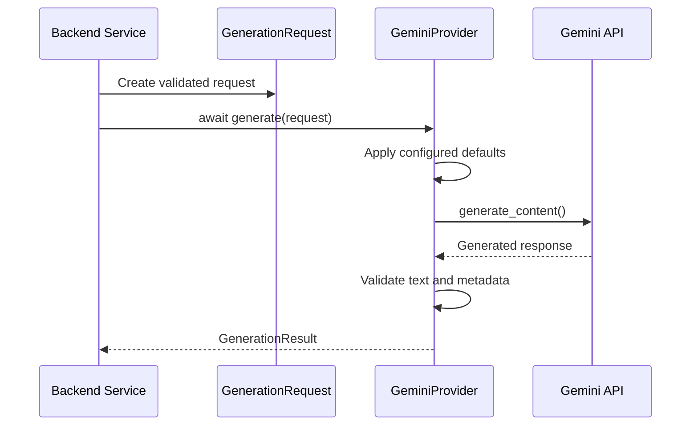
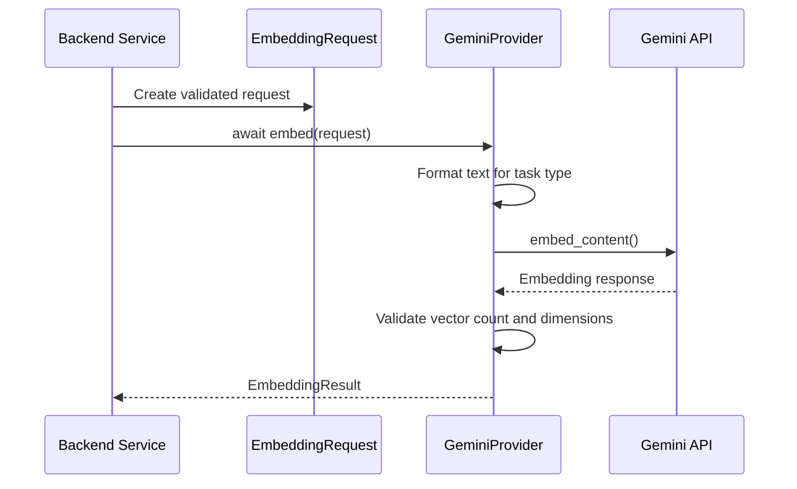

<!-- File: /docs/AI_PROVIDER.md -->

<!-- Purpose: Documents the backend AI provider architecture, configuration, safety controls, and controlled smoke-test workflow. -->

# AI Provider Architecture

## Overview

The backend AI layer provides provider-independent interfaces for text generation and embeddings.

The application currently uses Gemini as its configured AI provider. Backend services interact with shared request and result contracts instead of calling the Gemini SDK directly.

This separation allows the project to:

* Replace or add AI providers without rewriting application services.
* Test AI workflows without making live external requests.
* Apply consistent validation to generation and embedding operations.
* Prevent accidental API usage during normal tests.
* Keep provider credentials inside the ignored backend `.env` file.

## Current AI Provider

| Setting                             | Current value        |
| ----------------------------------- | -------------------- |
| Provider                            | Gemini               |
| Generation model                    | `gemini-3.6-flash`   |
| Embedding model                     | `gemini-embedding-2` |
| Embedding dimensions                | `768`                |
| Default generation temperature      | `0.2`                |
| Default maximum output tokens       | `256`                |
| Request timeout                     | `30` seconds         |
| Live smoke tests enabled by default | `false`              |

All values are environment-configurable.

The application must not hard-code API keys or private provider credentials in source files.

## Environment Variables

The following variables are documented in `backend/.env.example`:

```env
AI_PROVIDER=gemini

GEMINI_API_KEY=
GEMINI_GENERATION_MODEL=gemini-3.6-flash
GEMINI_EMBEDDING_MODEL=gemini-embedding-2
GEMINI_EMBEDDING_DIMENSIONS=768

GEMINI_GENERATION_TEMPERATURE=0.2
GEMINI_GENERATION_MAX_OUTPUT_TOKENS=256
GEMINI_REQUEST_TIMEOUT_SECONDS=30

AI_LIVE_SMOKE_TESTS_ENABLED=false
```

The real API key belongs only in:

```text
backend/.env
```

The private `.env` file must remain ignored by Git.

It must not be included in:

* Git commits
* Screenshots
* Documentation
* Chat messages
* Test fixtures
* Error messages
* Application logs

## AI Package Structure

```text
backend/app/ai/
├── __init__.py
├── contracts.py
├── errors.py
├── providers/
│   ├── __init__.py
│   └── gemini.py
└── smoke/
    ├── __init__.py
    ├── embedding.py
    └── generation.py
```

## Provider-Independent Contracts

The shared contracts are defined in:

```text
backend/app/ai/contracts.py
```

### Generation request

`GenerationRequest` contains:

* `prompt`
* Optional `system_instruction`
* Optional request-level `temperature`
* Optional request-level `max_output_tokens`

The request validates that:

* The prompt is not empty.
* Temperature is between `0` and `2`.
* Maximum output tokens are between `1` and `8192`.
* Surrounding whitespace is removed.

### Generation result

`GenerationResult` contains:

* Generated text
* Provider name
* Model name
* Optional input-token count
* Optional output-token count

The result rejects:

* Empty generated text
* Empty provider names
* Empty model names
* Negative token counts

### Embedding request

`EmbeddingRequest` contains:

* One or more input texts
* An embedding task type

Supported task types are:

```text
RETRIEVAL_DOCUMENT
RETRIEVAL_QUERY
```

The request rejects:

* An empty input collection
* Empty or whitespace-only text values

### Embedding result

`EmbeddingResult` contains:

* One or more embedding vectors
* Provider name
* Model name
* Declared vector dimensions

The result validates that:

* At least one vector exists.
* Every vector matches the declared dimensions.
* All vector values are finite numbers.
* Provider and model names are present.

## Provider Interfaces

Two runtime-checkable protocols define the required provider behavior.

### Generation provider

```python
async def generate(
    request: GenerationRequest,
) -> GenerationResult:
    ...
```

### Embedding provider

```python
async def embed(
    request: EmbeddingRequest,
) -> EmbeddingResult:
    ...
```

Backend services should depend on these interfaces instead of depending directly on `GeminiProvider`.

## Controlled AI Errors

Provider-independent errors are defined in:

```text
backend/app/ai/errors.py
```

The exception hierarchy is:

```text
AIProviderError
├── AIProviderConfigurationError
├── AIProviderRequestError
└── AIProviderResponseError
```

### Configuration error

Raised when required provider configuration is unavailable, such as a missing Gemini API key.

### Request error

Raised when an external provider request fails or is rejected.

The original SDK exception is retained as the internal exception cause, but callers receive a controlled application-level error.

### Response error

Raised when the provider returns an unusable response, including:

* Empty generated text
* Missing embedding vectors
* Unexpected vector counts
* Missing vector values
* Invalid vector dimensions
* Non-numeric embedding values

## Gemini Provider

The concrete Gemini implementation is located at:

```text
backend/app/ai/providers/gemini.py
```

`GeminiProvider` implements both shared provider protocols.

It supports:

* Asynchronous text generation
* Asynchronous document embeddings
* Asynchronous query embeddings
* Configurable model names
* Configurable output dimensions
* Configurable generation limits
* Configurable request timeout
* Token-usage metadata when provided by the SDK
* Controlled SDK exception handling
* Explicit SDK client cleanup

## Lazy Provider Initialization

Importing the FastAPI application does not automatically create a Gemini client.

A client is created only when `GeminiProvider` is instantiated.

This allows:

* The FastAPI application to start without an AI request.
* Offline tests to run without an API key.
* Provider tests to inject deterministic fake clients.
* Normal imports to avoid consuming API quota.

## Generation Flow



A request-level temperature or token limit overrides the configured default for that request only.

## Embedding Flow



Each input text is sent as a separate content item so that the provider expects one output vector for every input text.

### Document formatting

Retrieval documents are formatted using:

```text
title: none | text: DOCUMENT_TEXT
```

### Query formatting

Retrieval queries are formatted using:

```text
task: question answering | query: QUERY_TEXT
```

Document and query text must use their corresponding task types so retrieval vectors are generated consistently.

## Offline Testing

Normal AI tests use fake clients and do not call Gemini.

The related test files are:

```text
backend/tests/test_ai_config.py
backend/tests/test_ai_contracts.py
backend/tests/test_gemini_provider.py
```

The offline tests verify:

* AI setting defaults
* Setting validation
* Request and result validation
* Provider protocol compatibility
* Generation request construction
* Generation response parsing
* Embedding request construction
* Embedding response parsing
* Controlled request failures
* Controlled response failures
* SDK timeout configuration
* SDK client cleanup

The complete backend suite currently contains 58 passing tests.

## Live Smoke-Test Safety

Live smoke-test scripts are stored outside the normal test directory:

```text
backend/app/ai/smoke/embedding.py
backend/app/ai/smoke/generation.py
```

They are not automatically discovered by normal `pytest` execution.

A live request requires all of the following:

1. A configured `GEMINI_API_KEY`
2. `AI_LIVE_SMOKE_TESTS_ENABLED=true`
3. The `--confirm-live-call` command-line option

If any requirement is missing, the script exits without contacting the provider.

The live-test flag must return to:

```env
AI_LIVE_SMOKE_TESTS_ENABLED=false
```

immediately after a controlled smoke test.

## Embedding Smoke Test

The controlled embedding smoke test uses fixed, non-sensitive sample text.

Run it only after temporarily enabling live tests:

```powershell
python -m app.ai.smoke.embedding --confirm-live-call
```

The script verifies:

* Provider name
* Embedding model name
* Output dimensions
* Document vector count
* Query vector count
* Finite, non-zero vector norms
* Valid cosine similarity

The script prints metadata only.

It intentionally does not print:

* API keys
* Complete vectors
* User files
* Database content
* Uploaded study materials

## Generation Smoke Test

The controlled generation smoke test sends a fixed marker request:

```text
STUDY_AI_GENERATION_OK
```

Run it only after temporarily enabling live tests:

```powershell
python -m app.ai.smoke.generation --confirm-live-call
```

The script verifies:

* Provider name
* Generation model name
* Exact expected marker
* Controlled response length
* Token metadata when available

It does not send uploaded files, student information, database records, or other private project data.

## Safe Local Smoke-Test Procedure

Temporarily update the private `backend/.env`:

```env
AI_LIVE_SMOKE_TESTS_ENABLED=true
```

Verify the setting without printing the API key:

```powershell
python -c "from app.core.config import get_settings; s = get_settings(); print({'key_configured': bool(s.gemini_api_key), 'live_tests_enabled': s.ai_live_smoke_tests_enabled})"
```

Run only the intended smoke test with explicit confirmation.

After the test, immediately restore:

```env
AI_LIVE_SMOKE_TESTS_ENABLED=false
```

Verify again:

```powershell
python -c "from app.core.config import get_settings; s = get_settings(); print({'key_configured': bool(s.gemini_api_key), 'live_tests_enabled': s.ai_live_smoke_tests_enabled})"
```

## Standard Validation Commands

From the `backend` directory:

```powershell
python -m ruff check app tests
python -m pytest -q
python -m pip check
```

These commands must complete without making live Gemini requests.

## Current Phase Boundary

Phase 4B establishes the AI provider foundation only.

Completed capabilities include:

* Typed AI settings
* Generation and embedding contracts
* Provider protocols
* Controlled AI exceptions
* Gemini provider implementation
* Offline provider tests
* Controlled embedding smoke test
* Controlled generation smoke test

The following capabilities belong to later Phase 4 work:

* Study-material chunking
* Persisting embeddings
* Semantic retrieval
* Retrieval-augmented generation
* AI assistant API routes
* Citation construction
* Conversation persistence
* Prompt orchestration
* Student-facing assistant integration
