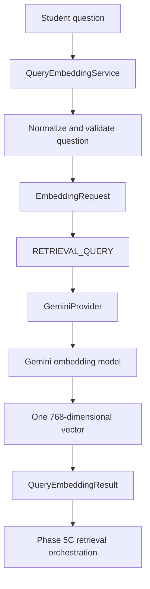

<!-- File: /docs/AI_QUERY_EMBEDDING.md -->

# AI Query Embedding Service

## Purpose

Phase 5B converts one student question into a validated query embedding for semantic retrieval.

The output will be passed to:

`public.search_study_file_ai_chunks`

Phase 5B does not perform retrieval or answer generation.

## Processing Flow



## Main Service

File:

`backend/app/services/query_embedding.py`

Public service:

`QueryEmbeddingService`

Public method:

`embed_query(question: str)`

The service:

1. Normalizes the student question.
2. Rejects empty or invalid input.
3. Creates exactly one `EmbeddingRequest`.
4. Uses `EmbeddingTaskType.RETRIEVAL_QUERY`.
5. Calls the configured Gemini provider.
6. Requires exactly one returned vector.
7. Requires the configured embedding model.
8. Requires exactly 768 dimensions.
9. Rejects non-numeric, non-finite, and zero vectors.
10. Returns a validated `QueryEmbeddingResult`.

## Gemini Query Format

Student questions use:

```text
task: question answering | query: <student question>
```

Stored document chunks use:

```text
title: none | text: <study-material chunk>
```

Questions use `retrieval_query`, while stored chunks use `retrieval_document`.

## Failure Codes

| Failure code | Meaning |
|---|---|
| `QUERY_VALIDATION_FAILED` | The question or returned embedding failed local validation. |
| `QUERY_EMBEDDING_FAILED` | Gemini failed to generate the query embedding. |

## FastAPI Dependency

`backend/app/api/query_embedding_dependency.py` creates one query service per request and guarantees provider cleanup.

No public RAG route is introduced during Phase 5B.

## Live Smoke Test

Script:

`backend/scripts/smoke_live_query_embedding.py`

The script is guarded by:

`AI_LIVE_SMOKE_TESTS_ENABLED`

Its safe default is `false`.

Run it from the backend directory using:

```powershell
python -m scripts.smoke_live_query_embedding
```

The smoke test validates:

- Gemini provider metadata
- `retrieval_query` task type
- Exactly 768 dimensions
- Finite values
- Nonzero vector
- Provider cleanup
- Safe output without credentials or raw vectors

## Tests

- `backend/tests/test_query_embedding.py`
- `backend/tests/test_query_embedding_integration.py`
- `backend/tests/test_live_query_embedding_smoke_script.py`

All normal tests use fake providers and make no external calls.

## Security Boundaries

- Gemini credentials remain in the backend.
- Raw vectors are not returned to the browser.
- The frontend does not call Gemini directly.
- The Supabase service-role key remains server-side.
- Live smoke testing is disabled by default.

## Phase 5C Handoff

Phase 5C will pass the validated query vector to:

`public.search_study_file_ai_chunks`

Phase 5C will handle retrieval filters, result validation, and no-context outcomes.
