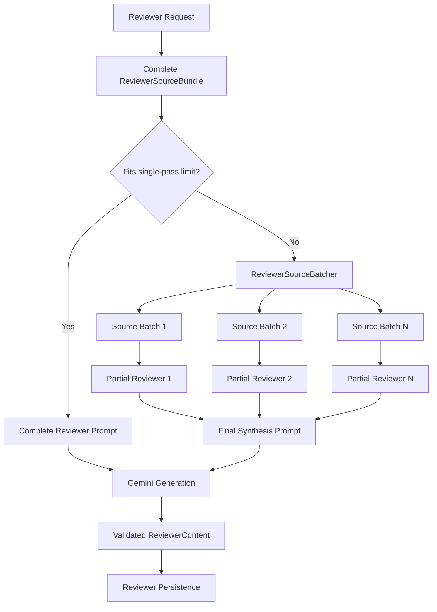

<!-- File: /docs/AI_REVIEWER_GENERATION.md -->
<!-- Purpose: Documents reviewer generation, batching, synthesis, validation, and source-preservation behavior. -->

# STUDY AI Reviewer Generation

Phase 6D extends the existing reviewer-generation pipeline so study material that exceeds the normal single-pass prompt limit can still be processed without silently truncating source content.

The existing source loader continues to load the complete authenticated source bundle. Large-material handling begins only inside the reviewer generation layer.

## Generation Strategy

Reviewer generation uses two paths:

```text
Source bundle at or below single-pass limit
→ Complete reviewer prompt
→ Gemini
→ Validated ReviewerContent
```

For oversized source bundles:

```text
Complete source bundle
→ ReviewerSourceBatcher
→ Ordered source batches
→ Partial reviewer generation
→ Final synthesis prompt
→ Gemini
→ Validated ReviewerContent
```

The default limits are:

| Limit                              |             Value |
| ---------------------------------- | ----------------: |
| Normal single-pass source limit    | 80,000 characters |
| Default large-material batch limit | 60,000 characters |
| Maximum configurable batch limit   | 80,000 characters |

The batcher splits only at existing source-chunk boundaries. It does not truncate a chunk, remove chunks, duplicate chunks, or change their original order.

## Large-Material Flow



Each partial batch prompt identifies itself as one ordered portion of a larger source collection. The model is instructed to use only concepts supported by that batch and not assume information from unseen batches.

The synthesis prompt receives the ordered validated partial reviewers and combines them into one final reviewer. It removes unnecessary repetition while preserving important distinctions between concepts.

## Compatibility With Existing Reviewer Generation

Materials within the normal source limit continue through the original single-pass reviewer flow.

This means Phase 6D does not change normal reviewer behavior simply because batching support exists.

Existing behaviors remain enforced:

* Short, medium, and long reviewer lengths
* Strict JSON response validation
* One controlled repair attempt for malformed output
* Provider identity validation
* Structured overview, topics, key points, and definitions
* File-level and subject-level scopes
* Authenticated ownership validation
* Complete source tracking
* Existing reviewer persistence

## Source Metadata

Even when generation uses multiple batches, the final `ReviewerGenerationResult` reports metadata for the complete original source bundle:

```text
source_character_count
source_chunk_count
source_file_count
```

The orchestration layer therefore continues to verify generation against the same complete source material loaded for the authenticated reviewer request.

Saved reviewer source metadata also continues to reference the original source chunks rather than the generated partial reviewers.

## Database Impact

Phase 6D introduces no new table, migration, or RLS policy.

It reuses:

```text
study_files
study_file_chunks
reviewers
```

The change is contained within the backend reviewer generation pipeline.

## Phase 6D Validation

Phase 6D added dedicated automated coverage for:

* Small-material single-pass compatibility
* Character-bounded source batching
* Stable batch indices
* Preservation of every source chunk
* Preservation of chunk order
* Oversized individual-chunk rejection
* Partial batch prompt generation
* Batch metadata
* Large-material partial generation
* Final reviewer synthesis
* Complete-source generation metadata

Backend regression validation after Phase 6D:

```text
727 passed
```

Reviewer-focused validation:

```text
106 passed
```

Phase 6D Ruff validation also passes.
