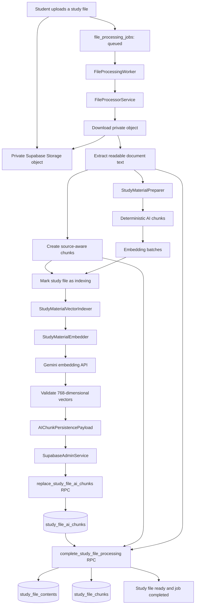

<!-- File: /docs/AI_VECTOR_PIPELINE.md -->

# AI Vector Indexing Pipeline

This document describes the implemented Phase 4D study-material vector-indexing pipeline.

## Implementation Status

| Area | Status |
|---|---|
| Study-material extraction | Implemented and tested |
| AI text preparation | Implemented and tested |
| Gemini document embeddings | Implemented and live-smoke tested |
| Supabase pgvector persistence | Implemented and live-smoke tested |
| File-processing integration | Implemented and tested |
| Retrieval-query embedding | Contract available; retrieval workflow planned |
| Similarity search API | Planned for the retrieval phase |
| RAG answer generation | Planned for the AI assistant phase |

Phase 4D implements the **indexing side** of retrieval-augmented generation. It turns uploaded study materials into validated vectors that later retrieval features can search.

## End-to-End Pipeline



## Processing-State Sequence

The database state sequence is:

```text
study_files: queued
file_processing_jobs: queued
        ?
study_files: reading
file_processing_jobs: processing
        ?
study_files: indexing
file_processing_jobs: processing
        ?
AI chunks and vectors persisted
        ?
study_files: ready
file_processing_jobs: completed
```

Vector persistence is allowed only while:

```text
study_files.processing_status = indexing
file_processing_jobs.status = processing
```

The existing completion RPC remains the final successful database operation.

## Main Components

| File | Responsibility |
|---|---|
| `/backend/app/ai/vector_persistence.py` | Validates AI chunks, metadata, vector dimensions, values, and RPC serialization |
| `/backend/app/services/study_material_embedder.py` | Executes embedding batches through the configured provider and validates returned vectors |
| `/backend/app/services/study_material_vector_indexer.py` | Orchestrates embedding, persistence-payload creation, and trusted storage |
| `/backend/app/services/file_processor.py` | Runs vector indexing after the file enters `indexing` and before final completion |
| `/backend/app/services/supabase_admin.py` | Calls the trusted vector-persistence RPC and validates its returned chunk count |
| `/backend/app/workers/file_processing_worker.py` | Constructs the production embedder and vector indexer |
| `/backend/scripts/smoke_live_file_vector_pipeline.py` | Runs one explicitly enabled live end-to-end smoke test |
| `/supabase/migrations/20260803020921_create_ai_chunk_vector_foundation.sql` | Creates pgvector storage, security rules, indexes, and the persistence RPC |

## AI Chunk and Vector Contract

Each persisted AI chunk contains:

| Field | Purpose |
|---|---|
| `study_file_id` | Identifies the uploaded material |
| `user_id` | Preserves ownership for RLS |
| `chunk_index` | Maintains deterministic ordering |
| `content` | Stores the normalized chunk text |
| `start_offset` | Stores the chunk's starting character position |
| `end_offset` | Stores the chunk's ending character position |
| `source_name` | Preserves the original filename |
| `embedding_model` | Records the model used to generate the vector |
| `embedding_dimensions` | Records the declared vector size |
| `embedding_task_type` | Records `retrieval_document` |
| `embedding` | Stores the PostgreSQL `vector(768)` value |
| `chunk_metadata` | Stores safe additional chunk information |

## Embedding Requirements

The current implementation requires:

```text
Model: gemini-embedding-2
Dimensions: 768
Document task type: retrieval_document
Query task type reserved for later retrieval: retrieval_query
```

The backend rejects:

- Missing vectors.
- Extra vectors.
- Incorrect vector lengths.
- Boolean vector values.
- Non-numeric values.
- `NaN`.
- Positive infinity.
- Negative infinity.
- Chunk-count mismatches.
- Noncontiguous chunk indexes.
- Incorrect material IDs.
- Invalid character offsets.

## Database Storage

The vector table is:

```text
public.study_file_ai_chunks
```

The trusted persistence function is:

```text
public.replace_study_file_ai_chunks(
    uuid,
    text,
    integer,
    integer,
    jsonb
)
```

The function:

1. Requires an actively indexing study file.
2. Requires an active processing job.
3. Validates the embedding model and dimensions.
4. Validates every JSON chunk.
5. Converts embedding arrays to `vector(768)`.
6. Upserts chunks by file ID and chunk index.
7. Deletes obsolete trailing chunks after reprocessing.
8. Returns the stored chunk count.

## Vector Index

The table uses an HNSW index with cosine-distance operations.

```text
Index type: HNSW
Distance strategy: cosine
Dimensions: 768
```

This prepares the database for later semantic-similarity search.

## Security

Authenticated application users:

- May read AI chunks that belong to their own study files.
- May not insert, update, or delete vector rows directly.
- May not execute the trusted vector-persistence RPC.

The backend service role:

- May call the trusted persistence RPC.
- May write AI chunks during controlled file processing.
- Must remain server-side.
- Must never be exposed to the browser.

The private file:

```text
backend/.env
```

must remain ignored and untracked.

## Controlled Failure Codes

| Failure code | Meaning |
|---|---|
| `PREPARATION_FAILED` | Extracted text could not be converted into valid AI chunks or the prepared data became inconsistent |
| `EMBEDDING_FAILED` | Gemini embedding execution or provider-response validation failed |
| `VECTOR_PERSISTENCE_FAILED` | The trusted vector RPC failed or returned an unexpected stored count |
| `EXTRACTION_FAILED` | The uploaded file could not be read or converted to text |
| `PROCESSING_SERVICE_ERROR` | A general trusted Supabase or Storage operation failed |

## Testing Strategy

Normal tests are offline.

They use:

- Stub embedding providers.
- Mocked Supabase RPC calls.
- In-memory processor dependencies.
- Migration-text contract tests.
- Invalid vector and metadata cases.
- Controlled failure simulations.

Normal tests must not:

- Call Gemini.
- Write to hosted Supabase.
- Print credentials.
- Require `AI_LIVE_SMOKE_TESTS_ENABLED=true`.

## Live Smoke Test

The live smoke test is explicitly gated by:

```env
AI_LIVE_SMOKE_TESTS_ENABLED=true
```

Run it only with a disposable queued file:

```powershell
cd backend

python -m scripts.smoke_live_file_vector_pipeline `
    --file-id <DISPOSABLE-STUDY-FILE-UUID>
```

A successful result must confirm:

```text
processing_status=ready
job_status=completed
RESULT=PASS
```

Afterward:

1. Verify vector rows and dimensions in Supabase.
2. Delete the disposable Storage object.
3. Delete the disposable study-file database record.
4. Set `AI_LIVE_SMOKE_TESTS_ENABLED=false`.
5. Rerun the complete offline test suite.

## Verification Checklist

A complete Phase 4D verification includes:

- Ruff passes for `app`, `tests`, and `scripts`.
- The complete Pytest suite passes.
- `pip check` reports no broken requirements.
- The vector migration is synchronized locally and remotely.
- Every stored vector has 768 dimensions.
- Chunk indexes are contiguous and begin at zero.
- AI chunk ownership matches study-file ownership.
- The live smoke flag is disabled after testing.
- `backend/.env` is ignored and untracked.
- No disposable smoke file or row remains.
- `git diff --check` exits with code zero.

## Scope Boundary

Phase 4D does not yet implement the user-facing retrieval and answer workflow.

The later retrieval flow will be:

```text
Student question
? retrieval_query embedding
? vector similarity search
? relevant study chunks
? grounded Gemini response
```

Phase 4D provides the validated indexing foundation required by that later workflow.
