<!-- File: /docs/ARCHITECTURE.md -->

# STS Capstone Project Architecture

This document shows the current implementation and the planned final architecture of the STS Capstone Project.

The diagrams use Mermaid syntax. View this file in a Markdown viewer that supports Mermaid.

# Architecture Status

| Label | Meaning |
|---|---|
| Implemented | The file or connection currently exists and has been tested |
| In Progress | Part of the current development phase |
| Planned | Expected in a future phase but not yet implemented |

# Planned Final System Architecture

The following diagram is the target architecture of the completed application.

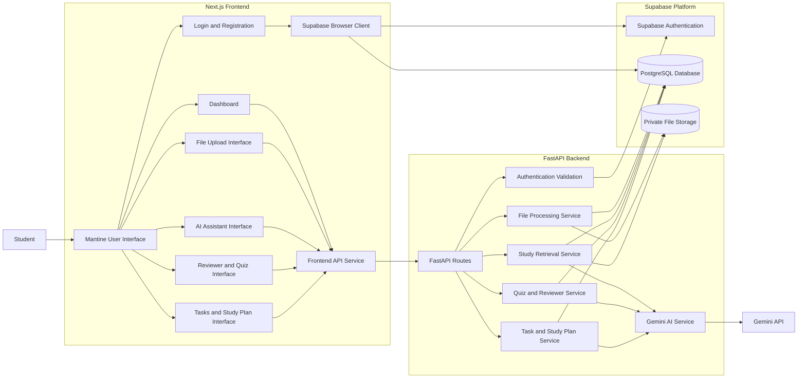

# Current Implemented Foundation

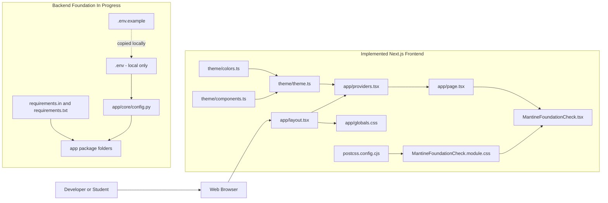

# Frontend Provider Hierarchy

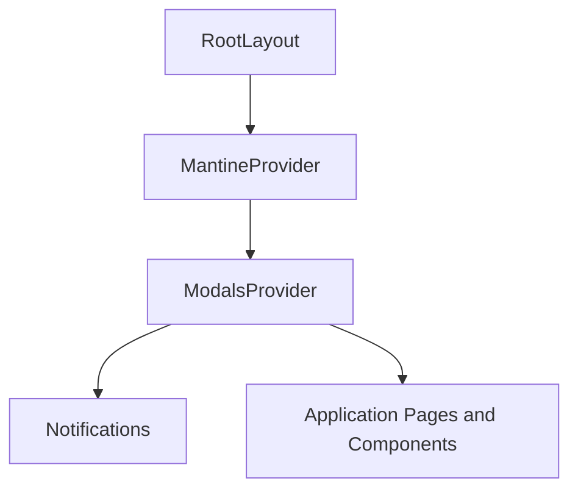

# Frontend Development Flow

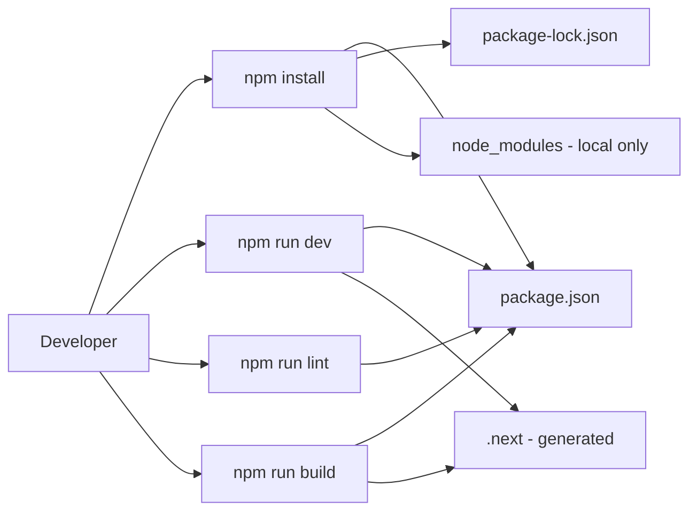

# Frontend-to-Backend Health Interface

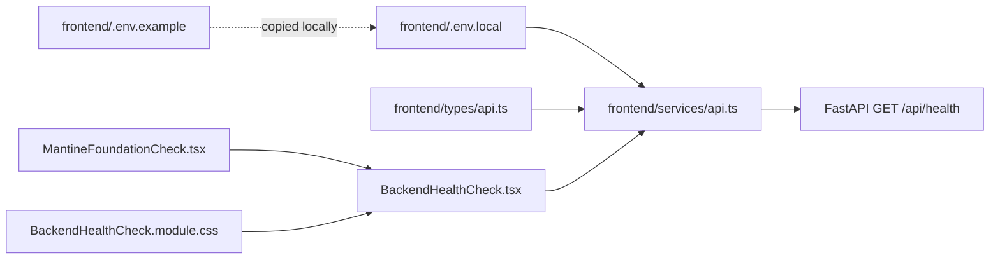

# FastAPI Application Structure

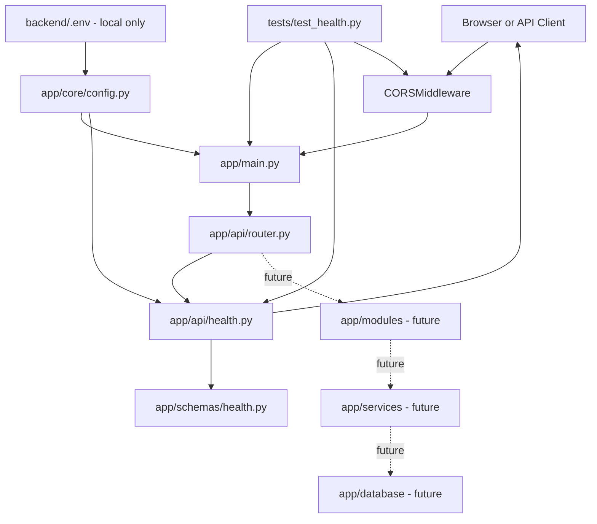

# Implemented Frontend-to-Backend Health Check

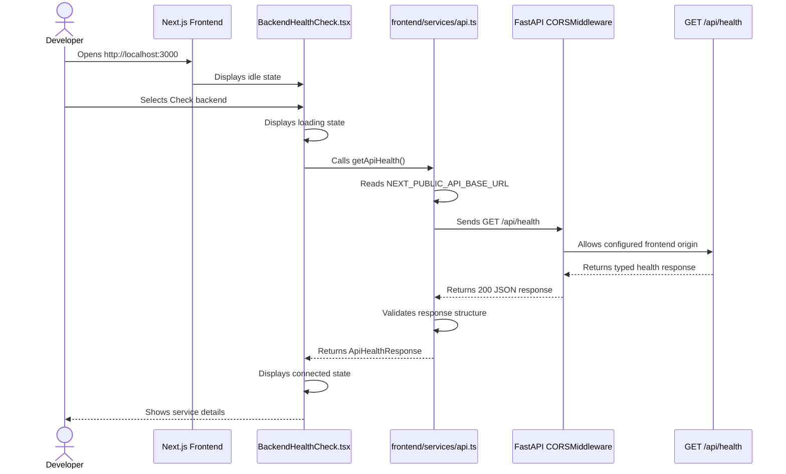

## Implemented Error and Retry Flow

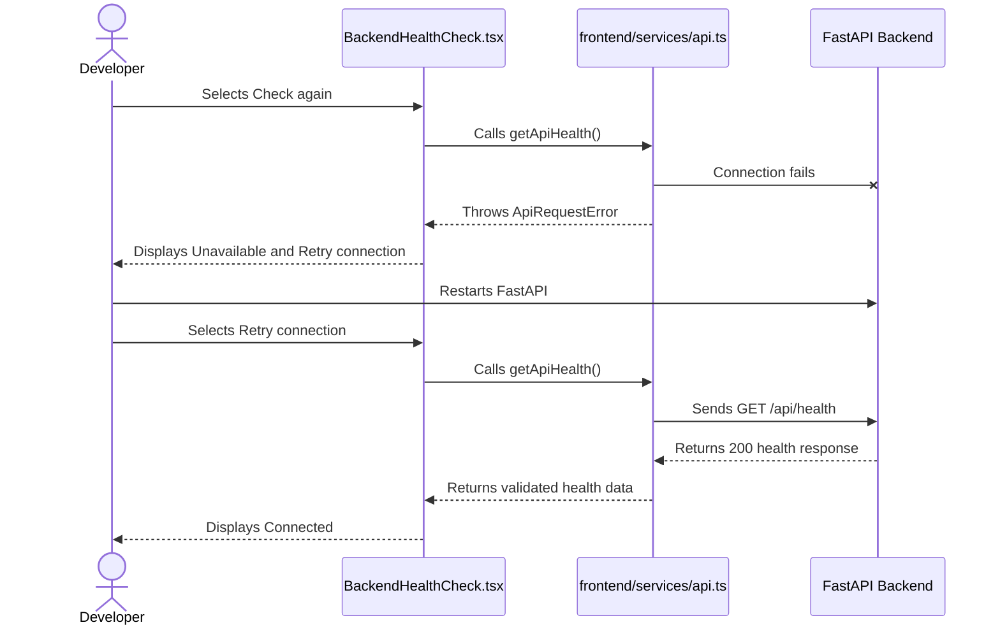

# Planned Data Relationships

This is an initial database outline. It will be finalized during the Supabase database phase.

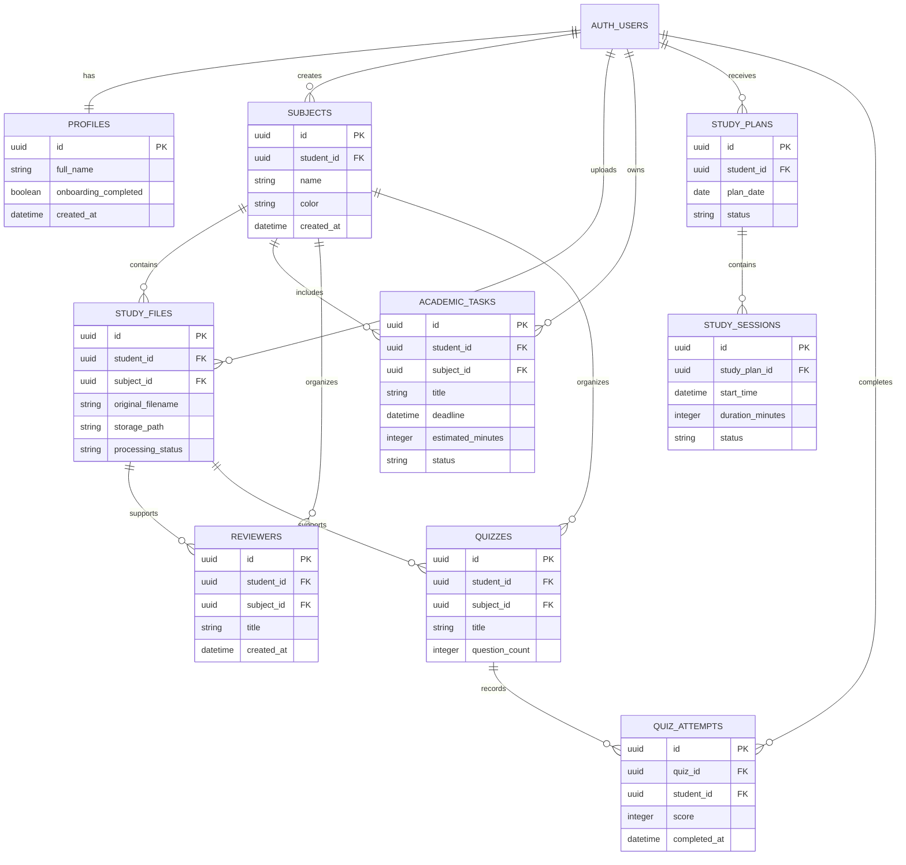

# Repository Ownership

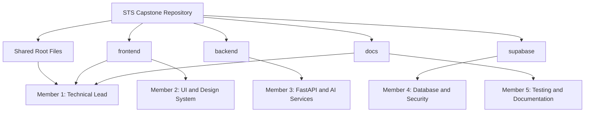

# Repository Tooling and Hosted Supabase Workflow

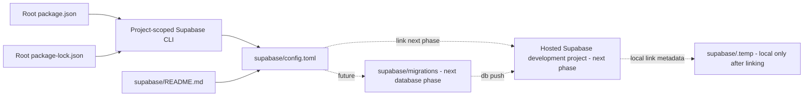

The repository uses a hosted Supabase development project. Docker-based local Supabase services are not part of the current workflow.

# Diagram Update Rules

Update this document when:

1. A new major service is introduced.
2. A planned connection becomes implemented.
3. A new database table is created.
4. A frontend feature begins calling a new endpoint.
5. A backend service starts using Gemini.
6. A module begins reading from Supabase Storage.
7. Ownership of a module changes.
8. A major connection is removed.

# Implemented Supabase Client Foundation

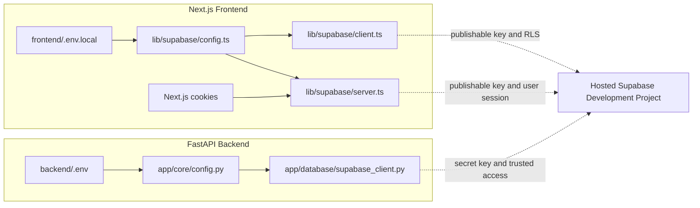

The frontend browser and server clients use the publishable key. The FastAPI client uses the secret key and is restricted to trusted backend code.

# Profiles Database Foundation

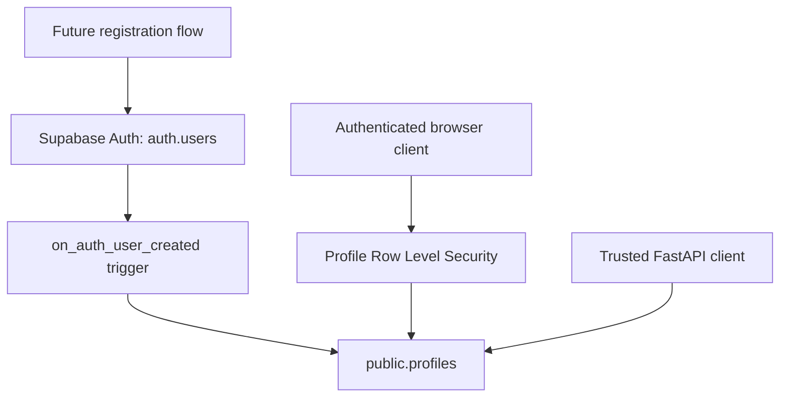

The browser client may access only the signed-in student's profile through Row Level Security. The trusted FastAPI client may perform approved server-side operations using the backend secret key.

# Generated Supabase Database Types

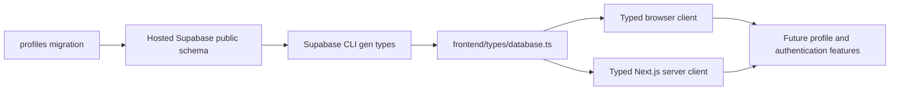

Database migrations remain the source of schema changes. After a migration is applied to the hosted development project, the generated frontend database types must be refreshed and committed with the related code.