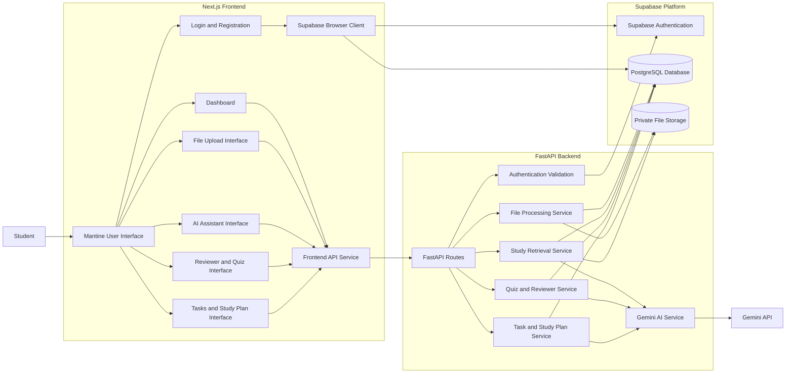
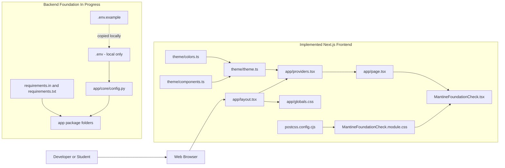
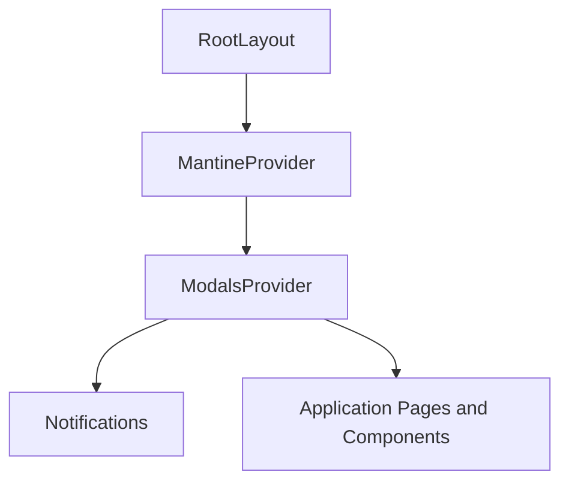
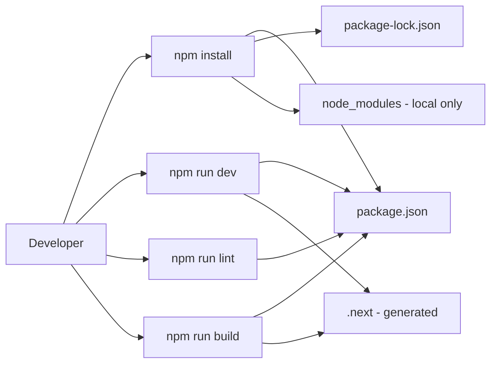
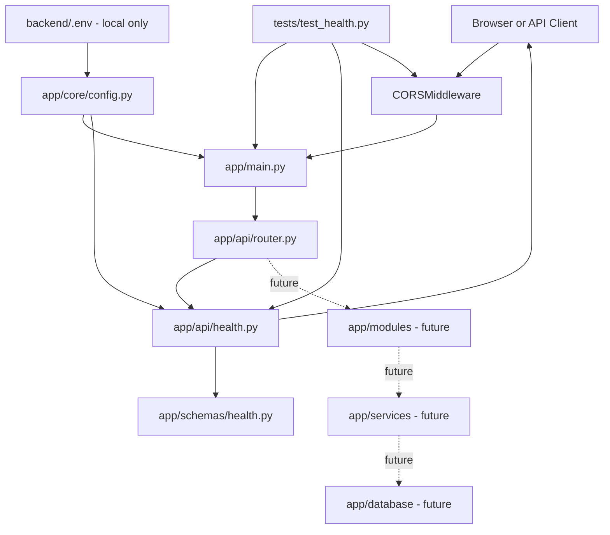
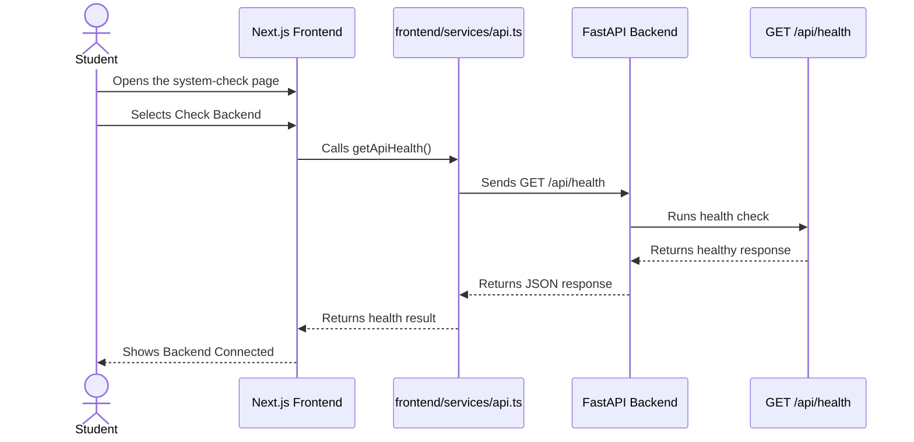
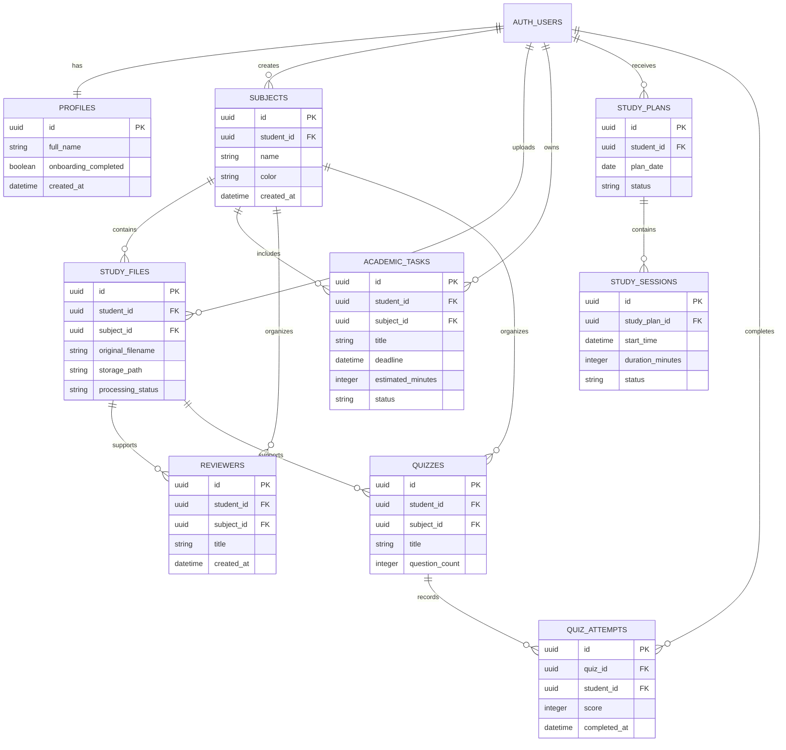
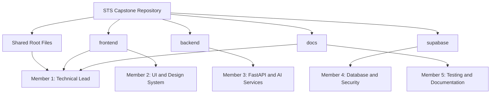

<!-- File: /docs/ARCHITECTURE.md -->

# STS Capstone Project Architecture

This document shows the current implementation and the planned final architecture of the STS Capstone Project.

The diagrams use Mermaid syntax. View this file in a Markdown viewer that supports Mermaid.

# Architecture Status

| Label | Meaning |
|---|---|
| Implemented | The file or connection currently exists and has been tested |
| In Progress | Part of the current development phase |
| Planned | Expected in a future phase but not yet implemented |

# Planned Final System Architecture

The following diagram is the target architecture of the completed application.

# Current Implemented Foundation

# Frontend Provider Hierarchy

# Frontend Development Flow

# FastAPI Application Structure

# Planned Phase 1 Frontend-to-Backend Health Check

This sequence is planned for the next backend and integration phases. The API service and health endpoint are not yet implemented.

# Planned Data Relationships

This is an initial database outline. It will be finalized during the Supabase database phase.

# Repository Ownership

# Diagram Update Rules

Update this document when:

1. A new major service is introduced.
2. A planned connection becomes implemented.
3. A new database table is created.
4. A frontend feature begins calling a new endpoint.
5. A backend service starts using Gemini.
6. A module begins reading from Supabase Storage.
7. Ownership of a module changes.
8. A major connection is removed.