<!-- File: /docs/ARCHITECTURE.md -->
<!-- Purpose: Documents the implemented and planned architecture of the STS Capstone STUDY AI project. -->

# STS Capstone — STUDY AI Architecture

This document describes the current architecture of STUDY AI.

The system currently includes:

- Next.js frontend
- Mantine UI
- Supabase Authentication
- Hosted Supabase PostgreSQL
- Private Supabase Storage
- Student learning-profile onboarding
- Academic output-confidence onboarding
- Subject management
- Study-material uploads
- Automatic file processing
- Document text extraction
- AI-oriented chunking
- Gemini embeddings
- Supabase pgvector storage
- Semantic retrieval
- Grounded RAG answering
- Protected FastAPI RAG API
- Student-facing Study Assistant
- Saved Study Assistant conversations
- Bounded conversation memory
- Deterministic conversation summaries
- Reviewer generation from a subject or study file
- Structured reviewer content with topics, key points, and definitions
- Reviewer source tracking
- Saved reviewer persistence
- Protected FastAPI reviewer API
- Saved reviewer management and regeneration
- Large-material multi-pass reviewer generation
- Deterministic reviewer source batching
- Partial-reviewer synthesis into one final structured reviewer
- Flashcard generation from one ready study file or a whole subject
- Structured question-and-answer Flashcard generation
- Complete Flashcard source tracking
- Saved Flashcard deck persistence
- Individual ordered Flashcard persistence
- Atomic Flashcard deck-and-card creation
- Protected FastAPI Flashcard API
- Saved Flashcard listing, retrieval, and deletion
- Deterministic large-material Flashcard source batching
- Multi-pass Flashcard candidate generation and final synthesis
- Protected student-facing Flashcard workspace
- Interactive question-and-answer Flashcard study viewer
- Saved Flashcard reopening and deletion UI
- AI Quiz generation from a subject or ready study file
- Multiple-choice, true/false, identification, and mixed Quiz modes
- Easy, medium, and hard Quiz difficulty
- Atomic Quiz and private answer-key persistence
- One-question-at-a-time Quiz attempts with immediate grading feedback
- Final Quiz scoring with strong/weak topic analysis
- Saved Quiz history, completed-attempt review, retaking, and deletion
- Student-owned Academic Task CRUD
- Academic output confidence by skill type
- Deterministic Academic Task priority scoring
- Explainable seven-factor priority breakdowns
- Protected Academic Tasks frontend
- Live priority recalculation after task changes

The application now includes protected Reviewer, Flashcard, Quiz, and Academic Tasks frontends.

Future phases may add study-plan generation, calendar scheduling, analytics, deployment, and monitoring improvements.

---

# Phase Status

| Phase | Scope | Status |
|---|---|---|
| Phase 1 | Project foundation, frontend, backend, Supabase, authentication | Implemented |
| Phase 2 | Learning-profile onboarding and profile data | Implemented |
| Phase 3 | Subjects, uploads, extraction, processing worker | Implemented |
| Phase 4 | AI provider, chunking, embeddings, vector persistence, retrieval | Implemented |
| Phase 5A–5F | Retrieval orchestration, grounded RAG API, Study Assistant | Implemented |
| Phase 5G | Saved conversations, memory, summaries, conversation history UI | Implemented |
| Phase 6A | Reviewer backend foundation, persistence, generation, sources, protected API | Implemented |
| Phase 6B | Reviewer frontend, authenticated generation UI, structured result display | Implemented |
| Phase 6C | Saved reviewer management and regeneration | Implemented |
| Phase 6D | Large-material multi-pass reviewer generation | Implemented |
| Track A | Flashcard backend, large-material generation, protected frontend, saved-deck access, and interactive study UI | Implemented |
| Track B | Quiz generation, attempts, scoring, history, review, retake, deletion | Implemented |
| Phase 7A–7E | Academic Task persistence, output confidence, CRUD, deterministic priority, frontend, and live integration | Implemented |
| Later phases | Study plans, scheduling, analytics, deployment | Planned |

---

# High-Level Architecture

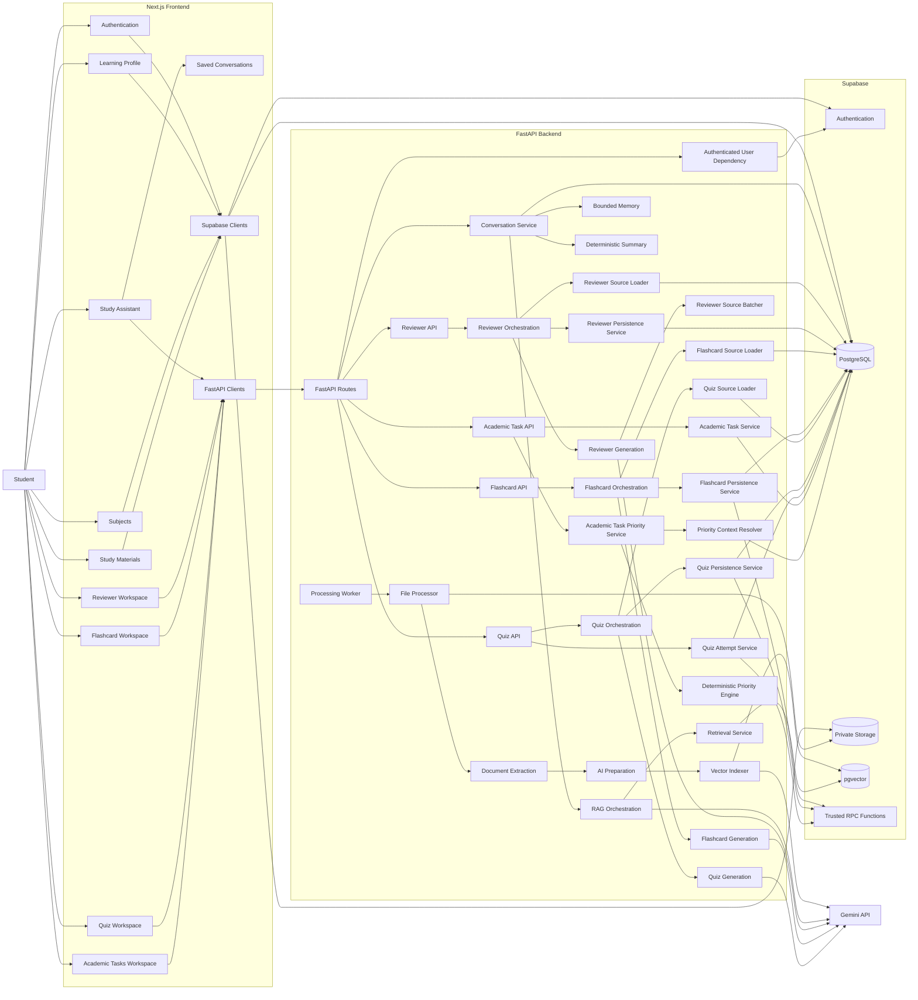

---

# Frontend Architecture

The frontend uses:

- Next.js
- TypeScript
- Mantine UI
- CSS Modules
- Tabler Icons
- Supabase browser/server clients
- Typed FastAPI clients
- Vitest
- React Testing Library

The frontend does not contain backend secrets.

---

# Authentication Flow

Supabase Authentication is the identity provider.

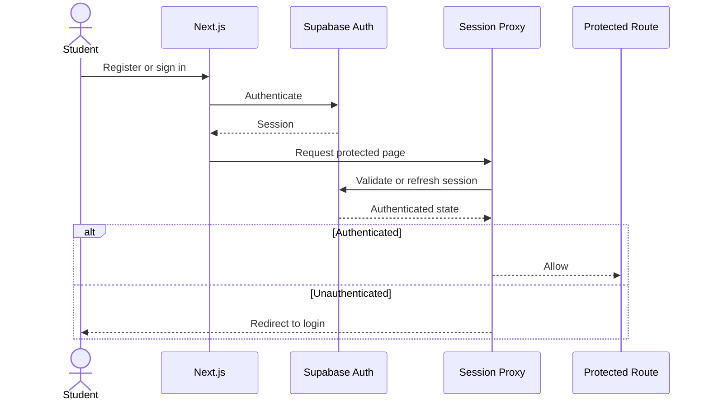

Student identity used by protected FastAPI requests comes from the validated Supabase bearer access token.

The browser must not provide a trusted `user_id`.

---

# Learning Profile Architecture

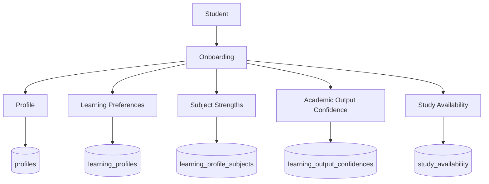

Academic output confidence is stored separately from subject strength.

Implemented output-confidence categories:

```text
writing
computation
research
presentation
creative
reading_analysis
memorization
```

Academic Task priority uses output confidence according to the task's `output_type`.

The legacy subject-level confidence value is not used by the Academic Task priority engine.

---

# Subject and Study-Material Architecture

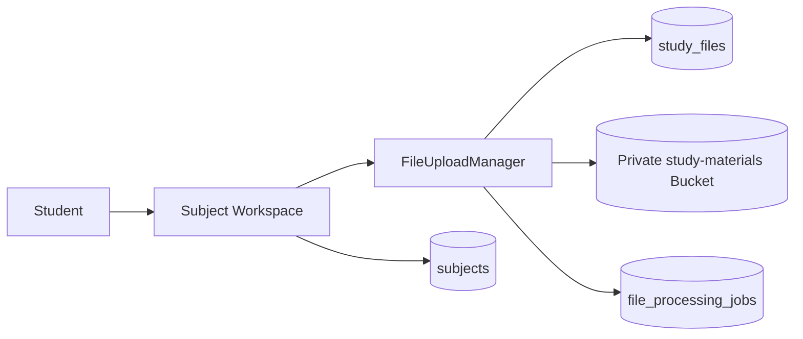

Uploaded study files belong to an authenticated student and subject.

---

# File Processing Lifecycle

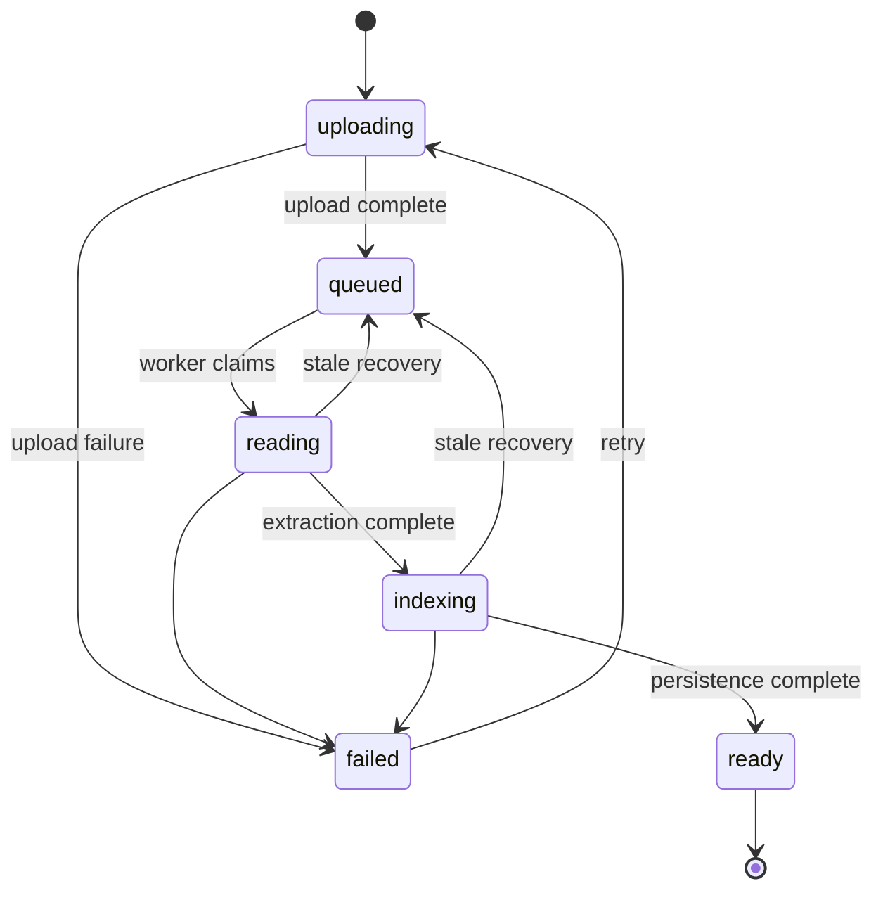

Study-file statuses:

```text
uploading
queued
reading
indexing
ready
failed
```

---

# File Processing Worker

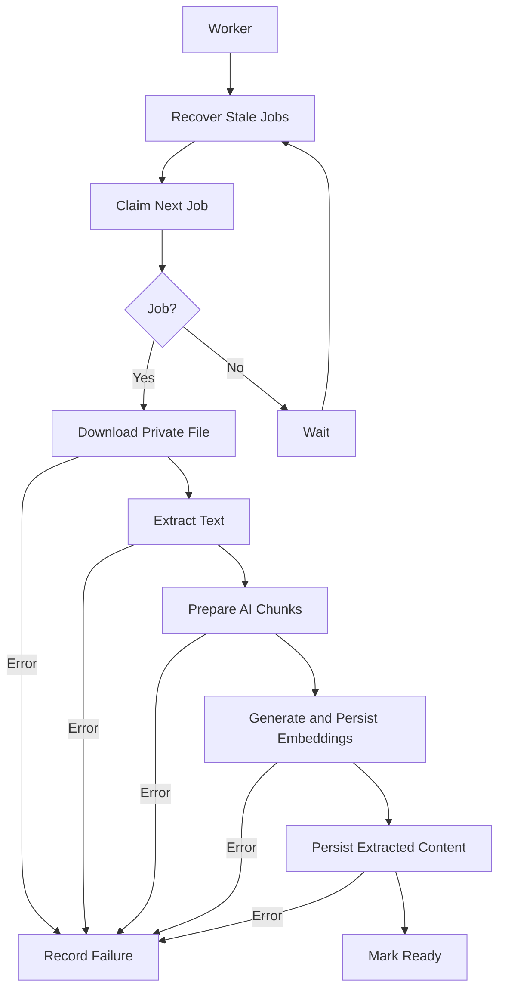

Atomic job claiming uses database locking and `SKIP LOCKED`.

---

# Document Extraction

Implemented extraction:

| Format | Implementation |
|---|---|
| PDF | `pypdf` |
| TXT | UTF-8 decoding |
| PPTX | `python-pptx` |
| XLSX | `openpyxl` |
| XLS | `xlrd` |

Source-aware locators include:

- Page
- Slide
- Worksheet
- Document

JPEG, PNG, and WebP may be stored, but OCR is not currently part of the implemented extraction pipeline.

---

# AI Provider Architecture

Backend AI services depend on provider-independent contracts.

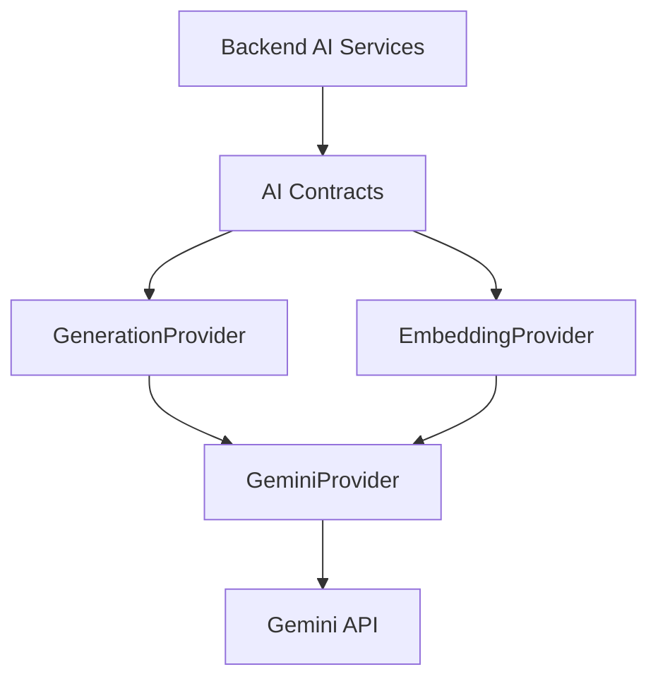

Gemini credentials remain backend-only.

Normal automated tests use fake providers and do not call live Gemini services.

---

# Retrieval Architecture

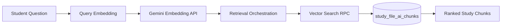

Retrieval supports:

- Student-owned materials only
- Optional subject filtering
- Optional study-file filtering
- Similarity threshold
- Maximum match count
- Safe source metadata

---

# Grounded RAG Architecture

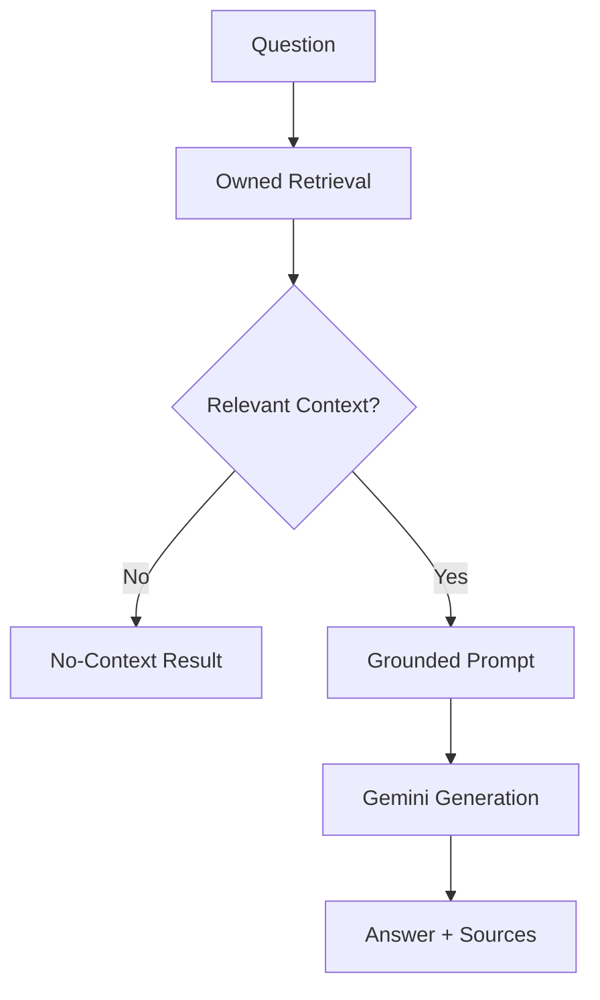

Factual claims must be supported by retrieved study-material content.

Conversation history is context only and does not become factual evidence.

---

# Study Assistant

The protected Study Assistant route is:

```text
/study-assistant
```

The Study Assistant supports:

- Subject filtering
- Study-file filtering
- Grounded answers
- Source cards
- No-context responses
- Saved conversation history
- Conversation switching
- New conversations
- Follow-up questions

Implemented persistence:

```text
study_conversations
study_messages
```

Conversation memory is bounded.

Older messages may be compressed into a deterministic backend summary without calling Gemini.

---

# Reviewer Architecture

A reviewer can be generated from:

- One ready study file
- All ready study files within one subject

Reviewer generation loads processed source-aware chunks in deterministic file and chunk order rather than similarity-based RAG retrieval.

Generated reviewer content is structured as:

```text
overview
topics
  title
  summary
  key_points
  definitions
```

Reviewer sources preserve the originating study file, chunk index, and available locator metadata.

Protected endpoints include:

```text
POST   /api/reviewers/generate
GET    /api/reviewers
GET    /api/reviewers/{reviewer_id}
DELETE /api/reviewers/{reviewer_id}
POST   /api/reviewers/{reviewer_id}/regenerate
```

Large-material generation uses deterministic source batching and final synthesis.

---

# Track A — Flashcards

Track A implements the complete Flashcard workflow from authenticated study-material selection through AI generation, persistence, interactive studying, and saved-deck management.

Supported generation scopes:

```text
file
subject
```

Supported deck sizes:

```text
Minimum cards: 5
Default cards: 20
Maximum cards: 50
```

Flashcard generation uses complete processed source-aware chunks rather than similarity-based RAG retrieval.

For source material within the single-pass limit:

```text
Complete source bundle
→ Flashcard prompt
→ Gemini
→ Validated Flashcards
→ Persistence
```

For oversized material:

```text
Complete source bundle
→ Deterministic source batches
→ Candidate Flashcard generation
→ Final synthesis
→ Validated final deck
→ Persistence
```

Flashcards use:

```text
flashcard_decks
flashcards
```

Trusted persistence uses:

```text
create_flashcard_deck_with_cards(...)
```

Protected endpoints:

```text
POST   /api/flashcards/generate
GET    /api/flashcards
GET    /api/flashcards/{deck_id}
DELETE /api/flashcards/{deck_id}
```

The protected Flashcard workspace is:

```text
/flashcards
```

The frontend supports:

- Whole-subject generation
- Single-ready-study-material generation
- Configurable card count
- Question-first presentation
- Question/answer flipping
- Previous/next navigation
- Saved deck reopening
- Saved deck deletion

---

# Track B — Quiz Generation and Attempts

Track B implements end-to-end Quiz generation and Quiz-taking from processed study material.

Supported scopes:

```text
file
subject
```

Supported Quiz types:

```text
multiple_choice
true_false
identification
mixed
```

Supported difficulty:

```text
easy
medium
hard
```

Question count:

```text
1 to 50
```

Private answer-key fields:

```text
correct_answer
accepted_answers
explanation
```

are not returned through normal Quiz reads.

Quiz resources:

```text
quizzes
quiz_questions
quiz_attempts
quiz_attempt_answers
```

Trusted RPCs:

```text
create_quiz_with_questions
start_quiz_attempt
submit_quiz_attempt_answer
```

Strong topics use:

```text
accuracy >= 70%
```

Weak topics use:

```text
accuracy < 70%
```

The protected Quiz workspace is:

```text
/quizzes
```

The frontend supports:

- Quiz generation
- One-question-at-a-time attempts
- Immediate grading feedback
- Final score
- Strong/weak topic analysis
- Saved Quiz history
- Completed-attempt review
- Retakes
- Deletion

---

# Phase 7 — Academic Tasks and Deterministic Priority

Phase 7 implements student-owned Academic Task management and deterministic priority scoring.

The protected Academic Tasks workspace is:

```text
/academic-tasks
```

Academic Tasks contain:

```text
subject
title
description
deadline
estimated duration
difficulty
task type
academic output type
workflow status
```

Supported difficulty:

```text
easy
medium
hard
```

Supported task types:

```text
assignment
project
exam
quiz
reading
presentation
research
other
```

Supported academic output types:

```text
writing
computation
research
presentation
creative
reading_analysis
memorization
mixed
other
```

Supported statuses:

```text
pending
in_progress
completed
cancelled
```

## Academic Task Priority Architecture

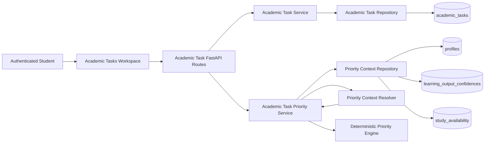

Priority calculation is deterministic backend logic.

It does not use Gemini or another generative AI provider.

## Priority Factors

| Factor | Weight |
|---|---:|
| Deadline proximity | 30% |
| Difficulty | 20% |
| Estimated completion time | 15% |
| Academic output confidence | 15% |
| Previous performance | 10% |
| Available study time | 5% |
| Task status | 5% |

Total configured weight:

```text
100%
```

Higher factor scores increase task urgency.

Completed and cancelled tasks receive:

```text
total priority = 0
```

Previous performance currently uses a neutral fallback until a production performance source is connected to the priority engine.

Missing confidence or unavailable context uses deterministic fallback behavior rather than invented student data.

## Priority API and Ordering

The authoritative prioritized endpoint is:

```text
GET /api/academic-tasks/prioritized
```

The backend sorts by:

```text
1. total priority score descending
2. deadline ascending
3. creation time ascending
4. task ID
```

The frontend does not duplicate the priority formula.

After successful:

```text
create
edit
status change
delete
```

the frontend reloads the prioritized endpoint so ordering and scores remain backend-controlled.

The frontend provides:

```text
Why this priority?
```

which displays the seven factor scores.

## Academic Output Confidence

Academic output confidence is stored in:

```text
public.learning_output_confidences
```

Implemented skill categories:

```text
writing
computation
research
presentation
creative
reading_analysis
memorization
```

For a direct output type, the corresponding confidence value is used.

For `mixed`, the backend may use an aggregate when complete output-confidence data exists.

For unavailable confidence data, deterministic neutral fallback behavior is used.

## Phase 7 Live Integration

Live validation covered:

```text
create task
load task
edit task
change status
priority calculation
priority explanation
priority recalculation
completed-task zero priority
delete task
page refresh persistence
```

See:

```text
docs/ACADEMIC_TASK_PRIORITY.md
```

---

# Implemented Database Resources

```text
auth.users

public.profiles
public.learning_profiles
public.learning_profile_subjects
public.learning_output_confidences
public.study_availability

public.subjects
public.study_files
public.file_processing_jobs
public.study_file_contents
public.study_file_chunks
public.study_file_ai_chunks

public.study_conversations
public.study_messages
public.reviewers

public.flashcard_decks
public.flashcards

public.quizzes
public.quiz_questions
public.quiz_attempts
public.quiz_attempt_answers

public.academic_tasks
```

Private Storage:

```text
study-materials
```

---

# Security Boundaries

1. Supabase backend credentials remain backend-only.
2. Gemini credentials remain backend-only.
3. Processor credentials remain backend-only.
4. Browser code uses only publishable Supabase credentials.
5. Student database access is protected by RLS.
6. Study files remain private.
7. FastAPI derives student identity from bearer authentication.
8. RAG requests cannot override `user_id`.
9. Clients cannot submit arbitrary conversation memory.
10. Conversation summary state is backend-managed.
11. Raw embeddings are not returned to the browser.
12. Public errors must not expose tokens, credentials, SQL details, or provider tracebacks.
13. Flashcard requests cannot choose a trusted `user_id`.
14. Flashcard source loading verifies authenticated ownership and readiness.
15. Browser roles cannot directly call trusted Flashcard persistence RPCs.
16. Normal Quiz responses do not expose private answer-key fields.
17. Quiz grading uses trusted backend operations and RPCs.
18. Completed-attempt review requires authenticated ownership and completed state.
19. Academic Tasks are owner-scoped through authenticated backend operations and RLS.
20. Academic Task requests cannot provide or override a trusted `user_id`.
21. Priority context is loaded by the backend for the authenticated student.
22. Clients cannot provide trusted priority scores, availability, or output-confidence context.

---

# Migration Workflow

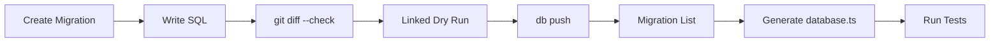

Applied migrations must never be edited.

Corrections require a new timestamped migration.

---

# Phase 5G Migrations

```text
20260806192800_create_study_conversations_and_messages.sql
20260806200500_fix_study_message_outcome_constraint.sql
20260806223000_add_study_conversation_summary_state.sql
20260806234000_restrict_study_conversation_summary_updates.sql
```

---

# Phase 6A Migrations

```text
20260807230500_create_reviewers.sql
20260808053929_create_reviewers_foundation.sql
```

---

# Track A Flashcard Migrations

```text
20260809142000_create_flashcard_foundation.sql
20260809145600_create_flashcard_persistence_rpc.sql
```

---

# Track B Quiz Migrations

```text
20260809204500_create_quizzes_foundation.sql
20260809211600_create_quiz_persistence_rpc.sql
20260809223500_create_quiz_attempt_foundation.sql
20260809225500_create_quiz_attempt_rpcs.sql
```

---

# Phase 7 Academic Task Migrations

```text
20260809054523_create_academic_tasks.sql
20260809153000_add_output_confidence_and_task_output_type.sql
```

The first Phase 7 migration creates the student-owned `academic_tasks` table, validation, triggers, indexes, grants, and Row Level Security.

The second migration creates academic output-confidence persistence and adds `output_type` to Academic Tasks.

---

# Planned Future Features

Future phases may introduce:

- Study-plan generation
- Calendar scheduling
- Study analytics
- Deployment and monitoring improvements

These features must not be documented as implemented until their code, migrations, tests, and security boundaries exist.

---

# Architecture Update Rules

Update this document whenever:

1. A major service is introduced.
2. A new API endpoint is added.
3. A database table is created.
4. A new trusted RPC is created.
5. A major data flow changes.
6. A planned feature becomes implemented.
7. A security boundary changes.
8. A development phase is completed.