<!-- File: /docs/ARCHITECTURE.md -->
<!-- Purpose: Documents the implemented and planned architecture of the STS Capstone Project. -->

# STS Capstone Project Architecture

This document describes the implemented architecture and planned final architecture of the STS Capstone Project.

The diagrams use Mermaid syntax. View this file using a Markdown viewer that supports Mermaid.

---

# Architecture Status

| Label | Meaning |
|---|---|
| Implemented | The component or connection currently exists and has been tested |
| In Progress | The component belongs to the current development phase |
| Planned | The component is expected in a future phase but has not yet been implemented |

---

# Current Phase Status

| Phase | Scope | Status |
|---|---|---|
| Phase 1 | Project foundation, frontend setup, FastAPI health API, Supabase client foundation, and authentication foundation | Implemented |
| Phase 2 | Registration, login, protected routes, student profile, learning-profile onboarding, subjects and confidence, study availability, and onboarding completion | Implemented |
| Phase 3 | Subject management, private file uploads, processing queue, document extraction, automatic processing worker, live status refresh, and stale-job recovery | Implemented |
| Phase 4 | Retrieval, embeddings, AI-assisted study-material generation, and question answering | Planned |
| Later phases | Reviewer generation, flashcards, quizzes, scheduling, study plans, analytics, and deployment | Planned |

---

# Planned Final System Architecture

The following diagram represents the target architecture of the completed application.

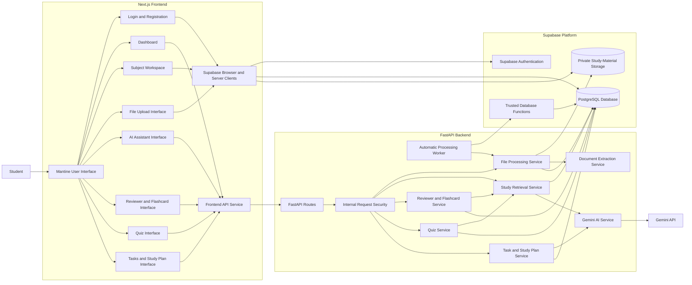

---

# Current Implemented Architecture

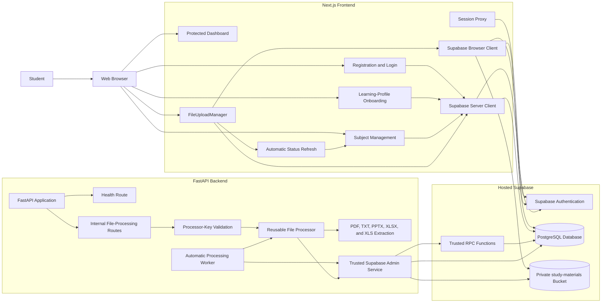

---

# Frontend Provider Hierarchy

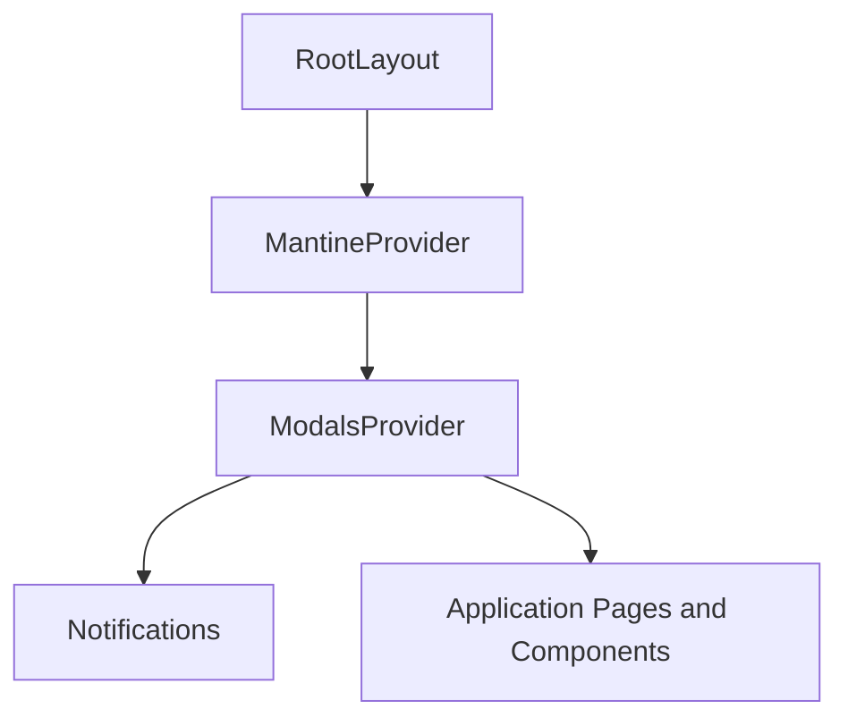

---

# Frontend Development Flow

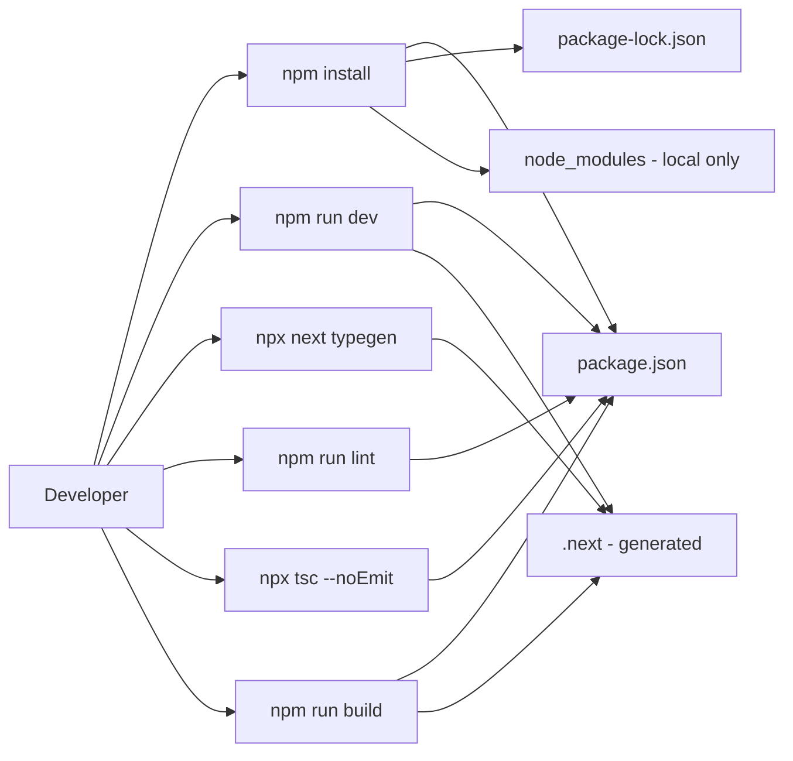

---

# Frontend-to-Backend Health Interface

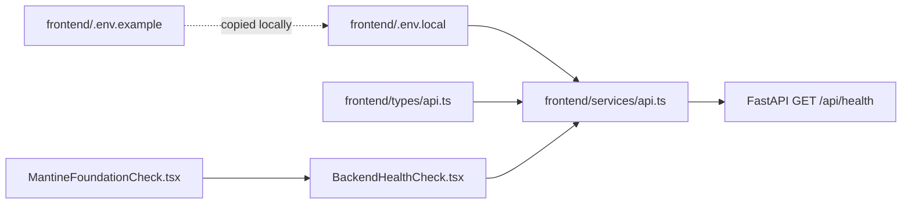

---

# Implemented Frontend-to-Backend Health Check

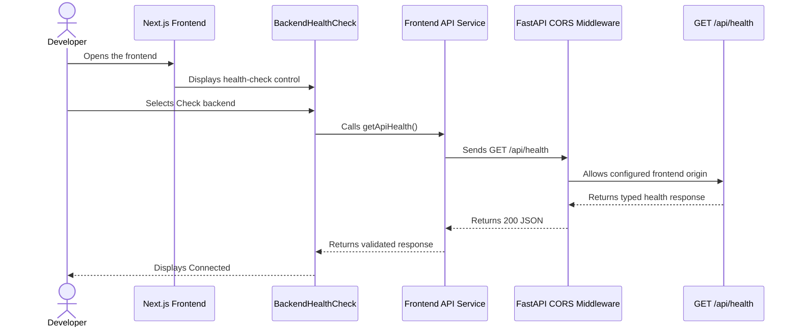

## Implemented Error and Retry Flow

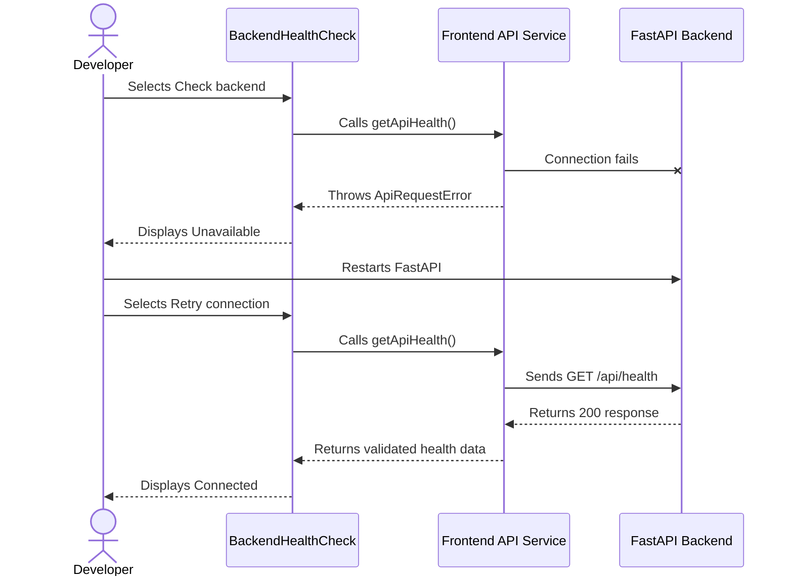

---

# FastAPI Application Structure

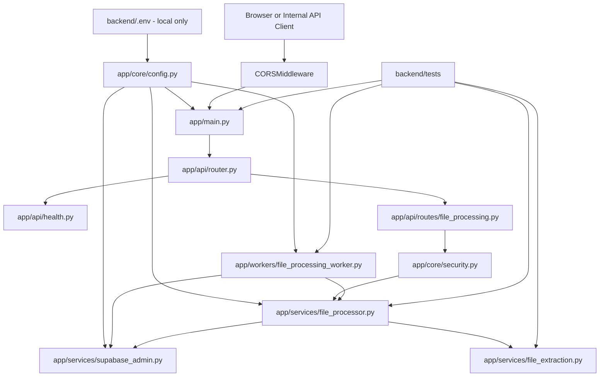

---

# Hosted Supabase Client Foundation

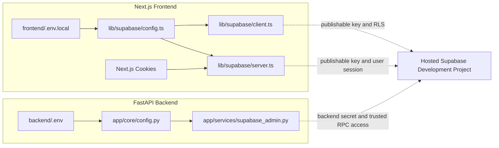

The frontend browser and server clients use the Supabase publishable key. The FastAPI backend uses a backend-only secret key. The backend secret must never be exposed through a `NEXT_PUBLIC` environment variable or committed to Git.

---

# Generated Supabase Database Types

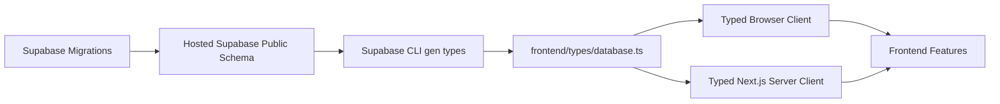

Database migrations are the source of truth for schema changes.

After applying a migration to the hosted development project, regenerate and commit the frontend database types.

```bash
npx supabase gen types typescript \
  --linked \
  --schema public \
  > frontend/types/database.ts
```

---

# Authentication Session Proxy

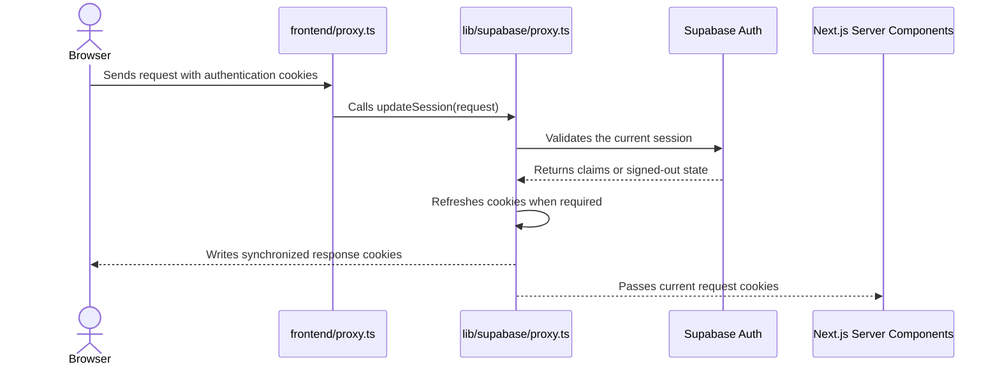

The session proxy refreshes Supabase authentication cookies and supports protected-route decisions.

---

# Registration and Profile Creation

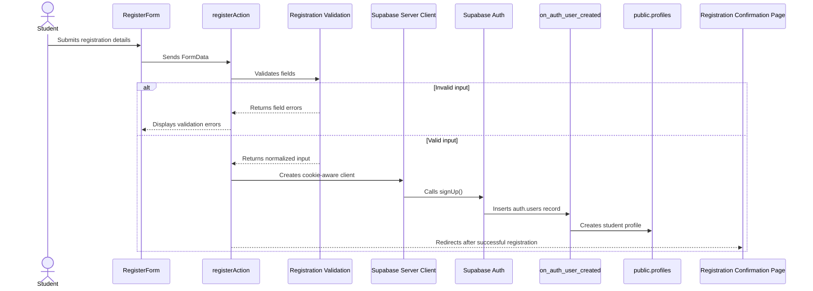

Password values are never returned through browser-visible action state.

---

# Implemented Phase 2 Authentication and Learning-Profile Flow

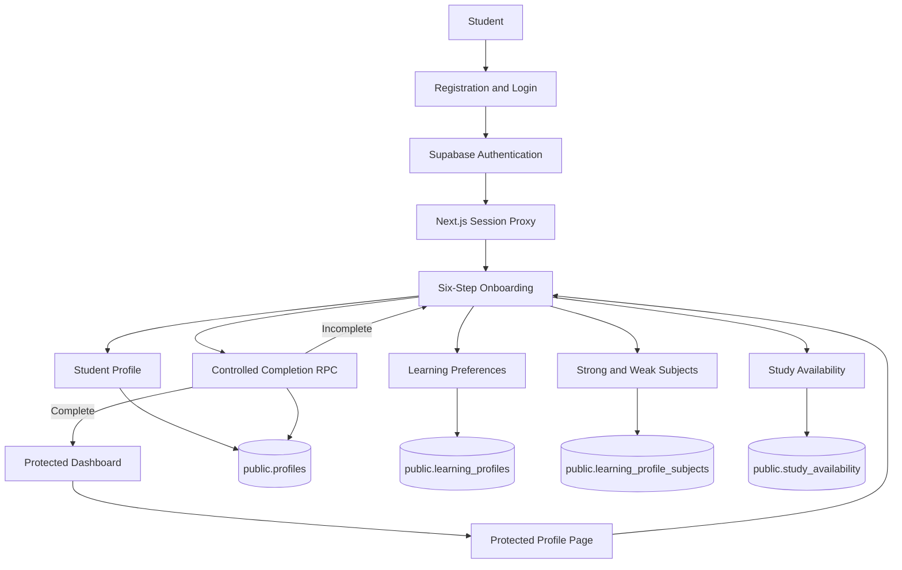

All Phase 2 database connections shown above are implemented.

---

# Phase 3 Subject Management Architecture

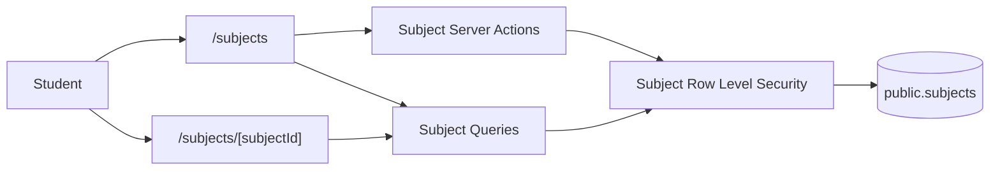

Each student may create, view, edit, and delete only their own subjects.

Study files are connected to a subject through `study_files.subject_id`.

---

# Phase 3 File Upload Architecture

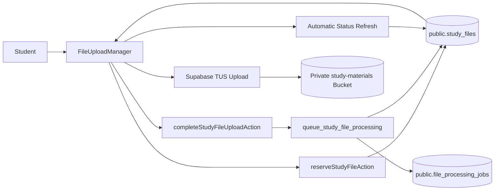

Supported upload formats include:

- PDF
- Plain text
- PowerPoint PPT and PPTX
- Excel XLS and XLSX
- JPEG
- PNG
- WebP

The upload size limit is 20 MB.

Image upload is supported by the file-management foundation, while text extraction for images is planned for a later OCR phase.

---

# File Upload Sequence

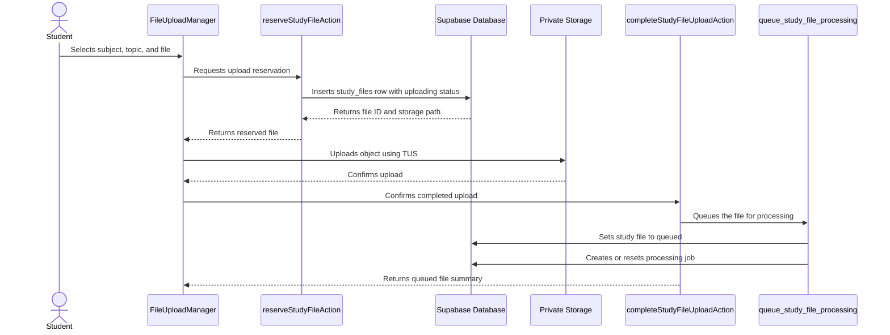

If upload fails, the frontend calls the upload-failure action and marks the file as `failed`.

Failed uploads may be retried using the same original filename.

---

# File Processing Status Lifecycle

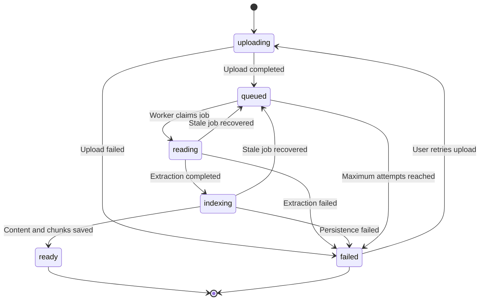

The active frontend processing statuses are:

```text
uploading
queued
reading
indexing
```

Terminal statuses are:

```text
ready
failed
```

---

# Automatic File-Processing Worker

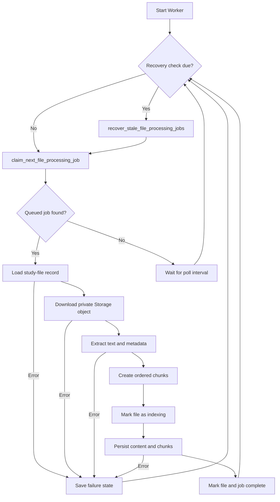

The development worker is started with:

```bash
cd ~/stsp-capstone/backend

source .venv/bin/activate

python -m app.workers.file_processing_worker \
  --poll-seconds 2 \
  --recovery-interval-seconds 30 \
  --stale-after-minutes 30 \
  --max-attempts 3
```

---

# Atomic Job Claim Flow

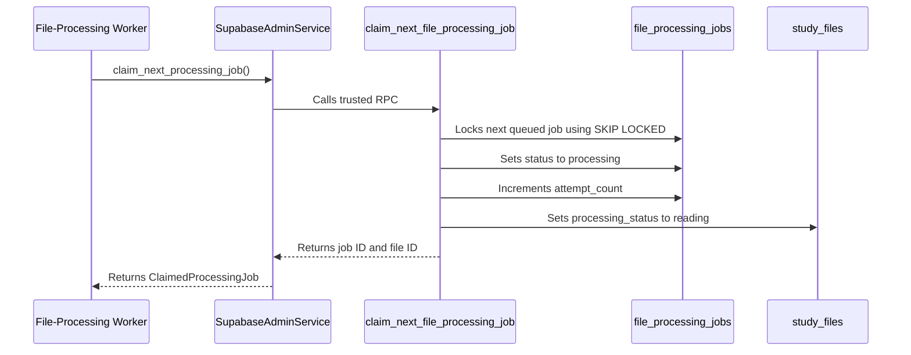

The atomic claim function prevents multiple workers from claiming the same queued job.

---

# Supported Document Extraction

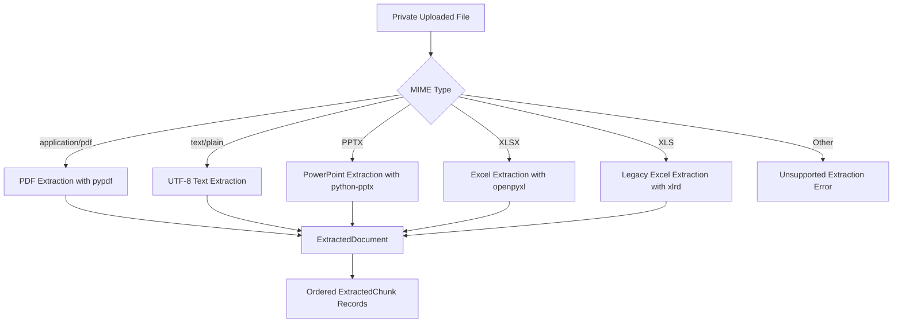

Chunk locator types are:

| File type | Locator type |
|---|---|
| PDF | `page` |
| TXT | `document` |
| PPTX | `slide` |
| XLSX | `sheet` |
| XLS | `sheet` |

---

# Processing Persistence Flow

```mermaid
sequenceDiagram
    participant Processor as FileProcessorService
    participant Admin as SupabaseAdminService
    participant Indexing as mark_study_file_indexing
    participant Complete as complete_study_file_processing
    participant Files as study_files
    participant Jobs as file_processing_jobs
    participant Content as study_file_contents
    participant Chunks as study_file_chunks

    Processor->>Admin: mark_indexing(file_id)
    Admin->>Indexing: Calls trusted RPC
    Indexing->>Files: Sets processing_status to indexing

    Processor->>Admin: complete_processing(document, chunks)
    Admin->>Complete: Sends extracted content and chunks

    Complete->>Content: Replaces extracted file content
    Complete->>Chunks: Replaces ordered chunks
    Complete->>Files: Sets processing_status to ready
    Complete->>Files: Sets processed_at
    Complete->>Jobs: Sets status to completed
    Complete->>Jobs: Sets completed_at
```

The persistence workflow is performed through controlled database functions to keep the related tables synchronized.

---

# Stale Processing-Job Recovery

```mermaid
flowchart TD
    CHECK["Worker Recovery Interval"]
    RPC["recover_stale_file_processing_jobs"]
    STALE{"Processing job older than threshold?"}
    ATTEMPTS{"Attempts below maximum?"}
    REQUEUE_JOB["Set job to queued"]
    REQUEUE_FILE["Set file to queued"]
    FAIL_JOB["Set job to failed"]
    FAIL_FILE["Set file to failed"]
    CONTINUE["Continue normal worker loop"]

    CHECK --> RPC
    RPC --> STALE

    STALE -->|No| CONTINUE
    STALE -->|Yes| ATTEMPTS

    ATTEMPTS -->|Yes| REQUEUE_JOB
    REQUEUE_JOB --> REQUEUE_FILE
    REQUEUE_FILE --> CONTINUE

    ATTEMPTS -->|No| FAIL_JOB
    FAIL_JOB --> FAIL_FILE
    FAIL_FILE --> CONTINUE
```

Recovery prevents files from remaining permanently stuck in `reading` or `indexing` when a worker stops unexpectedly.

---

# Internal File-Processing API

```mermaid
flowchart LR
    INTERNAL_CLIENT["Trusted Internal Client"]
    PROCESSOR_KEY["X-Processor-Key Header"]
    SECURITY["require_processor_key"]
    VALIDATE["POST /api/internal/file-processing/{file_id}/validate-source"]
    PROCESS["POST /api/internal/file-processing/{file_id}/process"]
    SERVICE["FileProcessorService"]
    SUPABASE["SupabaseAdminService"]

    INTERNAL_CLIENT --> PROCESSOR_KEY
    PROCESSOR_KEY --> SECURITY

    SECURITY --> VALIDATE
    SECURITY --> PROCESS

    VALIDATE --> SERVICE
    PROCESS --> SERVICE
    SERVICE --> SUPABASE
```

These endpoints are not general public upload endpoints.

They require the backend-only `X-Processor-Key` value and are intended for trusted internal processing operations.

---

# Frontend Processing-Status Refresh

```mermaid
sequenceDiagram
    actor Student
    participant Manager as FileUploadManager
    participant Router as Next.js Router
    participant Page as Subject Server Page
    participant Database as Supabase Database
    participant Worker as Processing Worker

    Student->>Manager: Uploads file
    Manager->>Manager: Stores queued file in local state
    Manager->>Router: Starts router.refresh polling

    loop While status is uploading, queued, reading, or indexing
        Router->>Page: Refreshes server component data
        Page->>Database: Reads current study_files rows
        Database-->>Page: Returns current processing status
        Page-->>Manager: Sends refreshed initialFiles
        Manager->>Manager: Synchronizes local file state
    end

    Worker->>Database: Sets file to ready or failed
    Router->>Page: Performs next refresh
    Page->>Database: Reads terminal status
    Database-->>Manager: Returns ready or failed
    Manager->>Manager: Stops polling
```

Polling pauses while the browser tab is hidden and resumes when the tab becomes visible.

---

# Secure Preview and Download Flow

```mermaid
sequenceDiagram
    actor Student
    participant Manager as FileUploadManager
    participant Action as createStudyFileAccessAction
    participant Database as study_files
    participant Storage as Private Storage

    Student->>Manager: Selects Preview or Download
    Manager->>Action: Sends study-file ID and requested mode
    Action->>Database: Verifies authenticated ownership
    Database-->>Action: Returns owned file record
    Action->>Storage: Creates short-lived signed URL
    Storage-->>Action: Returns signed URL
    Action-->>Manager: Returns temporary access URL
    Manager-->>Student: Opens preview or starts download
```

Preview and download controls are available only when the file status is `ready`.

---

# Implemented Database Relationships

```mermaid
erDiagram
    AUTH_USERS ||--|| PROFILES : has
    AUTH_USERS ||--|| LEARNING_PROFILES : has
    AUTH_USERS ||--o{ LEARNING_PROFILE_SUBJECTS : defines
    AUTH_USERS ||--o{ STUDY_AVAILABILITY : schedules
    AUTH_USERS ||--o{ SUBJECTS : creates
    AUTH_USERS ||--o{ STUDY_FILES : uploads
    AUTH_USERS ||--o{ FILE_PROCESSING_JOBS : owns
    AUTH_USERS ||--o{ STUDY_FILE_CONTENTS : owns
    AUTH_USERS ||--o{ STUDY_FILE_CHUNKS : owns

    SUBJECTS ||--o{ STUDY_FILES : contains

    STUDY_FILES ||--|| FILE_PROCESSING_JOBS : processed_by
    STUDY_FILES ||--o| STUDY_FILE_CONTENTS : produces
    STUDY_FILES ||--o{ STUDY_FILE_CHUNKS : produces

    PROFILES {
        uuid id PK
        string full_name
        boolean onboarding_completed
        integer onboarding_current_step
        datetime onboarding_completed_at
        datetime created_at
        datetime updated_at
    }

    LEARNING_PROFILES {
        uuid user_id PK
        integer preferred_study_duration_minutes
        string_array preferred_study_times
        string_array common_study_challenges
        integer estimated_task_completion_minutes
        string_array preferred_learning_methods
        datetime created_at
        datetime updated_at
    }

    LEARNING_PROFILE_SUBJECTS {
        uuid id PK
        uuid user_id FK
        string subject_name
        string strength_type
        integer confidence_level
        datetime created_at
        datetime updated_at
    }

    STUDY_AVAILABILITY {
        uuid id PK
        uuid user_id FK
        integer iso_weekday
        time start_time
        time end_time
        datetime created_at
        datetime updated_at
    }

    SUBJECTS {
        uuid id PK
        uuid user_id FK
        string name
        string color
        datetime created_at
        datetime updated_at
    }

    STUDY_FILES {
        uuid id PK
        uuid user_id FK
        uuid subject_id FK
        string topic
        string original_filename
        string storage_path
        string mime_type
        integer size_bytes
        string processing_status
        string failure_code
        string failure_message
        datetime processed_at
        datetime created_at
        datetime updated_at
    }

    FILE_PROCESSING_JOBS {
        uuid id PK
        uuid user_id FK
        uuid study_file_id FK
        string status
        integer attempt_count
        datetime started_at
        datetime completed_at
        string error_code
        string error_message
        datetime created_at
        datetime updated_at
    }

    STUDY_FILE_CONTENTS {
        uuid id PK
        uuid user_id FK
        uuid study_file_id FK
        text extracted_text
        integer character_count
        integer page_count
        integer slide_count
        integer sheet_count
        jsonb extraction_metadata
        datetime created_at
        datetime updated_at
    }

    STUDY_FILE_CHUNKS {
        uuid id PK
        uuid user_id FK
        uuid study_file_id FK
        integer chunk_index
        text content
        string locator_type
        string locator_label
        integer token_count
        jsonb metadata
        datetime created_at
        datetime updated_at
    }
```

---

# Planned Future Data Relationships

The following entities are planned for later AI and study-planning phases.

```mermaid
erDiagram
    AUTH_USERS ||--o{ ACADEMIC_TASKS : owns
    AUTH_USERS ||--o{ STUDY_PLANS : receives
    AUTH_USERS ||--o{ REVIEWERS : owns
    AUTH_USERS ||--o{ FLASHCARD_SETS : owns
    AUTH_USERS ||--o{ QUIZZES : owns
    AUTH_USERS ||--o{ QUIZ_ATTEMPTS : completes

    SUBJECTS ||--o{ ACADEMIC_TASKS : includes
    SUBJECTS ||--o{ REVIEWERS : organizes
    SUBJECTS ||--o{ FLASHCARD_SETS : organizes
    SUBJECTS ||--o{ QUIZZES : organizes

    STUDY_PLANS ||--o{ STUDY_SESSIONS : contains
    QUIZZES ||--o{ QUIZ_ATTEMPTS : records
```

These future entities must be introduced through new migrations. Existing applied migrations must not be edited.

---

# Repository Tooling and Hosted Supabase Workflow

```mermaid
flowchart LR
    PACKAGE["Root package.json"]
    LOCK["Root package-lock.json"]
    CLI["Project-Scoped Supabase CLI"]
    CONFIG["supabase/config.toml"]
    MIGRATIONS["supabase/migrations"]
    HOSTED["Hosted Supabase Development Project"]
    TYPES["frontend/types/database.ts"]
    TEMP["supabase/.temp - local only"]

    PACKAGE --> CLI
    LOCK --> CLI

    CLI --> CONFIG
    CONFIG --> HOSTED

    MIGRATIONS -->|db push| HOSTED
    HOSTED -->|gen types| TYPES
    HOSTED -. local link metadata .-> TEMP
```

The project uses a hosted Supabase development project.

Docker-based local Supabase services are not required for the current development workflow.

---

# Migration Workflow

```mermaid
flowchart TD
    CREATE["Create New Migration"]
    EDIT["Write SQL"]
    DIFF["git diff --check"]
    DRY_RUN["supabase db push --linked --dry-run"]
    PUSH["supabase db push --linked"]
    VERIFY["supabase migration list --linked"]
    TYPES["Regenerate Database Types"]
    TEST["Run Frontend and Backend Checks"]
    COMMIT["Commit Migration and Related Code"]

    CREATE --> EDIT
    EDIT --> DIFF
    DIFF --> DRY_RUN
    DRY_RUN --> PUSH
    PUSH --> VERIFY
    VERIFY --> TYPES
    TYPES --> TEST
    TEST --> COMMIT
```

Previously applied migrations must never be edited.

Schema corrections must be made through a new migration.

---

# Repository Ownership

```mermaid
flowchart TD
    REPO["STS Capstone Repository"]

    REPO --> ROOT["Shared Root Files"]
    REPO --> FRONTEND_FOLDER["frontend"]
    REPO --> BACKEND_FOLDER["backend"]
    REPO --> SUPABASE_FOLDER["supabase"]
    REPO --> DOCS_FOLDER["docs"]

    ROOT --> LEAD["Technical Lead"]

    FRONTEND_FOLDER --> LEAD
    FRONTEND_FOLDER --> UI_MEMBER["UI and Frontend Member"]

    BACKEND_FOLDER --> BACKEND_MEMBER["FastAPI and AI Services Member"]

    SUPABASE_FOLDER --> DATABASE_MEMBER["Database and Security Member"]

    DOCS_FOLDER --> LEAD
    DOCS_FOLDER --> TEST_MEMBER["Testing and Documentation Member"]
```

All team members must follow the repository Git workflow and avoid editing another member's active feature files without coordination.

---

# Security Boundaries

```mermaid
flowchart TD
    PUBLIC_BROWSER["Browser"]
    PUBLISHABLE["Supabase Publishable Key"]
    RLS["Row Level Security"]
    USER_DATA["Student-Owned Data"]

    BACKEND["FastAPI Backend"]
    SECRET["Supabase Backend Secret"]
    PROCESSOR_KEY["Processor Internal Key"]
    TRUSTED_RPC["Trusted RPC Functions"]

    PUBLIC_BROWSER --> PUBLISHABLE
    PUBLISHABLE --> RLS
    RLS --> USER_DATA

    BACKEND --> SECRET
    BACKEND --> PROCESSOR_KEY
    SECRET --> TRUSTED_RPC
    PROCESSOR_KEY --> TRUSTED_RPC
```

Security requirements:

1. The Supabase backend secret is stored only in `backend/.env`.
2. The processor internal key is stored only in `backend/.env`.
3. Neither value may use a `NEXT_PUBLIC_` prefix.
4. Local `.env` files must not be committed.
5. Browser access to database records is restricted by Row Level Security.
6. Private Storage objects are accessed through authenticated uploads or short-lived signed URLs.
7. Internal FastAPI processing endpoints require `X-Processor-Key`.
8. Logs, screenshots, commits, and documentation must not contain real secrets.

---

# Diagram Update Rules

Update this document when:

1. A new major frontend or backend service is introduced.
2. A planned connection becomes implemented.
3. A new database table or Storage bucket is created.
4. A new trusted database function is added.
5. A frontend feature begins calling a new endpoint.
6. The backend starts using Gemini or another AI provider.
7. A module begins generating or querying embeddings.
8. Ownership of a module changes.
9. A major connection is removed.
10. A development phase is completed.
---

## Phase 4B — AI Provider Foundation

Phase 4B introduces a provider-independent AI layer between backend application services and external AI models.

Backend services must use the shared generation and embedding contracts instead of importing the Google Gen AI SDK directly.

```mermaid
flowchart TD
    Services["Backend and Future RAG Services"]
    Contracts["AI Contracts and Provider Protocols"]
    Generation["GenerationProvider"]
    Embedding["EmbeddingProvider"]
    Provider["GeminiProvider"]
    Settings["Typed Settings and Private .env"]
    GenerationModel["Gemini 3.6 Flash"]
    EmbeddingModel["Gemini Embedding 2"]
    Errors["Controlled AI Provider Errors"]
    OfflineTests["Offline Tests with Fake Clients"]
    SmokeTests["Explicitly Controlled Live Smoke Tests"]

    Services --> Contracts
    Contracts --> Generation
    Contracts --> Embedding

    Generation --> Provider
    Embedding --> Provider

    Settings --> Provider

    Provider --> GenerationModel
    Provider --> EmbeddingModel
    Provider --> Errors

    OfflineTests -. inject fake clients .-> Provider
    SmokeTests --> Provider
```

### Generation Request Flow

```mermaid
sequenceDiagram
    participant Service as Backend Service
    participant Request as GenerationRequest
    participant Provider as GeminiProvider
    participant Gemini as Gemini 3.6 Flash

    Service->>Request: Create validated request
    Service->>Provider: await generate(request)
    Provider->>Provider: Apply configured defaults
    Provider->>Gemini: Send controlled generation request
    Gemini-->>Provider: Return generated response
    Provider->>Provider: Validate text and usage metadata
    Provider-->>Service: Return GenerationResult
```

### Embedding Request Flow

```mermaid
sequenceDiagram
    participant Service as Backend or RAG Service
    participant Request as EmbeddingRequest
    participant Provider as GeminiProvider
    participant Gemini as Gemini Embedding 2

    Service->>Request: Create texts and retrieval task type
    Service->>Provider: await embed(request)
    Provider->>Provider: Format document or query text
    Provider->>Gemini: Request configured-dimension vectors
    Gemini-->>Provider: Return embedding response
    Provider->>Provider: Validate count, dimensions, and values
    Provider-->>Service: Return EmbeddingResult
```

### Runtime Rules

1. Importing FastAPI does not automatically instantiate the Gemini client.
2. A Gemini client is created only when an AI operation requires it.
3. API credentials remain in the ignored `backend/.env` file.
4. Normal backend tests use fake clients and do not consume Gemini quota.
5. Live smoke tests require both environment authorization and command-line confirmation.
6. The live smoke-test flag returns to `false` after controlled testing.
7. Future RAG and assistant services must depend on `GenerationProvider` and `EmbeddingProvider`, not directly on `GeminiProvider`.

### Current Phase Boundary

Phase 4B provides only the AI provider foundation.

The following remain for later Phase 4 checkpoints:

- Study-material chunking
- Embedding persistence
- Vector similarity search
- Retrieval-augmented generation
- Source citation construction
- Assistant API routes
- Conversation persistence
- Student-facing assistant integration

## Phase 4C — Offline Study-Material Preparation

Phase 4C adds deterministic AI preparation to the existing file-processing pipeline without calling Gemini or persisting vector embeddings.

The existing source-aware extraction pipeline remains responsible for storing page, slide, worksheet, and document locator information. The new AI preparation pipeline creates normalized AI chunks, embedding batches, and provider-independent embedding requests in memory.

### Component flow

```mermaid
flowchart LR
    subgraph Existing_File_Processing["Existing File Processing"]
        A["Private Supabase Storage"] --> B["FileProcessorService"]
        B --> C["extract_document"]
        C --> D["ExtractedDocument"]

        D --> E["chunk_extracted_document"]
        E --> F["Source-aware ExtractedChunk records"]
        F --> G["complete_study_file_processing RPC"]
        G --> H[("Supabase study-file data")]
    end

    subgraph Offline_AI_Preparation["Phase 4C Offline AI Preparation"]
        D --> I["StudyMaterialPreparer"]
        I --> J["ChunkingRequest"]
        J --> K["TextChunker"]
        K --> L["ChunkingResult"]
        L --> M["EmbeddingBatchPreparer"]
        M --> N["EmbeddingBatch records"]
        N --> O["RETRIEVAL_DOCUMENT requests"]
    end

    O -. "No provider call in Phase 4C" .-> P["GeminiProvider"]
    O -. "No vector persistence in Phase 4C" .-> Q[("Future vector storage")]
```

### Processing sequence

```mermaid
sequenceDiagram
    participant Worker as FileProcessingWorker
    participant Processor as FileProcessorService
    participant Admin as SupabaseAdminService
    participant Extractor as File extraction
    participant Preparer as StudyMaterialPreparer
    participant Chunker as TextChunker
    participant Batcher as EmbeddingBatchPreparer

    Worker->>Processor: process_file(study_file_id)
    Processor->>Admin: Load file and processing job
    Admin-->>Processor: File and job records

    alt File and job are queued
        Processor->>Admin: start_processing(study_file_id)
        Admin-->>Processor: File moved to reading
    else Worker already claimed the job
        Note over Processor,Admin: Continue without starting twice
    end

    Processor->>Admin: download_private_object(storage_path)
    Admin-->>Processor: Private file bytes

    Processor->>Extractor: extract_document(payload, mime_type, filename)
    Extractor-->>Processor: ExtractedDocument

    Processor->>Preparer: prepare(material_id, extracted_text, filename)
    Preparer->>Chunker: chunk(ChunkingRequest)
    Chunker-->>Preparer: ChunkingResult

    Preparer->>Batcher: prepare(ChunkingResult)
    Batcher-->>Preparer: EmbeddingBatch list

    loop Every embedding batch
        Preparer->>Batcher: build_request(batch)
        Batcher-->>Preparer: RETRIEVAL_DOCUMENT request
    end

    Preparer-->>Processor: StudyMaterialPreparation

    Note over Processor,Preparer: No Gemini or vector-storage request occurs

    Processor->>Extractor: chunk_extracted_document(document)
    Extractor-->>Processor: Existing source-aware chunks

    Processor->>Admin: mark_indexing(study_file_id)
    Admin-->>Processor: File moved to indexing

    Processor->>Admin: complete_processing(document, source-aware chunks)
    Admin-->>Processor: Processing completed

    Processor-->>Worker: ProcessedFileResult
```

### Preparation failure flow

```mermaid
flowchart TD
    A["ExtractedDocument"] --> B["StudyMaterialPreparer"]
    B --> C{"Preparation succeeds?"}

    C -->|"Yes"| D["Continue source-aware persistence"]
    C -->|"No"| E["AIChunkingError or validation error"]

    E --> F["FileProcessorPreparationError"]
    F --> G["fail_study_file_processing RPC"]
    G --> H["Error code: PREPARATION_FAILED"]
    H --> I["Worker receives FileProcessorError"]

    I --> J["Job reported as failed"]
```

### Internal preparation structure

```mermaid
classDiagram
    class ChunkingRequest {
        +str material_id
        +str text
        +str source_name
    }

    class StudyMaterialChunk {
        +str material_id
        +int chunk_index
        +str text
        +int start_offset
        +int end_offset
        +str source_name
        +character_count
        +chunk_key
    }

    class ChunkingResult {
        +str material_id
        +int original_character_count
        +tuple chunks
        +str source_name
    }

    class EmbeddingBatch {
        +int batch_index
        +tuple chunks
        +texts
        +chunk_keys
    }

    class EmbeddingRequest {
        +tuple texts
        +EmbeddingTaskType task_type
    }

    class StudyMaterialPreparation {
        +ChunkingResult chunking_result
        +tuple batches
        +tuple embedding_requests
        +material_id
        +chunk_count
        +batch_count
    }

    ChunkingRequest --> StudyMaterialChunk : TextChunker creates
    StudyMaterialChunk --> ChunkingResult : grouped into
    ChunkingResult --> EmbeddingBatch : divided into
    EmbeddingBatch --> EmbeddingRequest : converted to
    ChunkingResult --> StudyMaterialPreparation
    EmbeddingBatch --> StudyMaterialPreparation
    EmbeddingRequest --> StudyMaterialPreparation
```

### Separation of chunk models

The system intentionally maintains two chunk models during Phase 4C.

#### Existing `ExtractedChunk`

The existing extraction chunk contains source-locator information:

- Chunk index
- Content
- Locator type
- Locator label
- Estimated token count
- Section metadata

Examples include:

- PDF page number
- PowerPoint slide number
- Excel worksheet name
- Complete text document

These chunks continue to be persisted through the existing `complete_study_file_processing` RPC.

#### New `StudyMaterialChunk`

The AI preparation chunk contains embedding-oriented information:

- Material ID
- Contiguous chunk index
- Normalized chunk text
- Start character offset
- End character offset
- Optional source filename
- Deterministic chunk key

These chunks are prepared in memory during Phase 4C and are not yet persisted.

Maintaining separate chunk models prevents the new AI preparation pipeline from breaking the existing source-aware database contract.

### Configuration flow

```mermaid
flowchart LR
    A["backend/.env or defaults"] --> B["Settings"]

    B --> C["AI_CHUNK_TARGET_CHARACTERS"]
    B --> D["AI_CHUNK_OVERLAP_CHARACTERS"]
    B --> E["AI_CHUNK_MIN_CHARACTERS"]
    B --> F["AI_EMBEDDING_BATCH_SIZE"]
    B --> G["AI_MAX_CHUNKS_PER_MATERIAL"]

    C --> H["TextChunker"]
    D --> H
    E --> H
    G --> H

    F --> I["EmbeddingBatchPreparer"]

    H --> J["Deterministic ChunkingResult"]
    I --> K["Deterministic EmbeddingBatch list"]
```

The configuration validates that:

- The chunk target is between 500 and 12,000 characters.
- The overlap is between 0 and 4,000 characters.
- The overlap is smaller than the target.
- The minimum chunk size is between 1 and 12,000 characters.
- The minimum chunk size does not exceed the target.
- The embedding batch size is between 1 and 100.
- The maximum chunk count is between 1 and 10,000.

### External-call boundary

Phase 4C creates the following objects:

```text
ChunkingResult
EmbeddingBatch
EmbeddingRequest
StudyMaterialPreparation
```

Phase 4C intentionally does not execute:

```text
GeminiProvider.embed(...)
Vector persistence
Similarity search
Retrieval API requests
```

The live AI smoke-test setting remains disabled during normal Phase 4C validation:

```env
AI_LIVE_SMOKE_TESTS_ENABLED=false
```

### Phase 4C file connections

```mermaid
flowchart TD
    A["app/core/config.py"] --> B["app/ai/text_chunker.py"]
    A --> C["app/ai/embedding_batcher.py"]

    D["app/ai/chunking.py"] --> B
    D --> C
    D --> E["app/ai/preparation.py"]

    F["app/ai/contracts.py"] --> C
    F --> E

    B --> G["app/services/study_material_preparer.py"]
    C --> G
    E --> G

    G --> H["app/services/file_processor.py"]

    I["app/services/file_extraction.py"] --> H
    J["app/services/supabase_admin.py"] --> H

    H --> K["app/workers/file_processing_worker.py"]

    L["tests/test_text_chunker.py"] --> B
    M["tests/test_embedding_batcher.py"] --> C
    N["tests/test_study_material_preparer.py"] --> G
    O["tests/test_file_processor_preparation.py"] --> H
```

### Phase boundary

The next phase may introduce:

1. A vector-ready database schema.
2. Gemini embedding execution.
3. Safe and idempotent embedding persistence.
4. Embedding retry handling.
5. Similarity-search database functions.
6. Retrieval services and API endpoints.

Those changes must preserve the existing source-aware extraction records, maintain user-data isolation, and keep backend credentials outside frontend code.

<!-- PHASE 4D VECTOR ARCHITECTURE START -->
# Implemented Phase 4D AI Vector Indexing Architecture

The following connection is implemented and has passed both offline tests and a controlled live smoke test.

```mermaid
flowchart LR
    STORAGE[("Private Study File Storage")]
    WORKER["FileProcessingWorker"]
    PROCESSOR["FileProcessorService"]
    EXTRACTOR["File Extraction"]
    PREPARER["StudyMaterialPreparer"]
    SOURCE_CHUNKS["Source-Aware Chunks"]
    AI_CHUNKS["AI Chunks and Batches"]
    INDEXER["StudyMaterialVectorIndexer"]
    EMBEDDER["StudyMaterialEmbedder"]
    GEMINI["Gemini Embedding API"]
    VALIDATOR["Vector Validation"]
    ADMIN["SupabaseAdminService"]
    VECTOR_RPC["replace_study_file_ai_chunks"]
    AI_TABLE[("study_file_ai_chunks")]
    COMPLETE_RPC["complete_study_file_processing"]
    CONTENT_TABLE[("study_file_contents")]
    SOURCE_TABLE[("study_file_chunks")]
    READY["Study File Ready"]

    STORAGE --> WORKER
    WORKER --> PROCESSOR
    PROCESSOR --> EXTRACTOR

    EXTRACTOR --> SOURCE_CHUNKS
    EXTRACTOR --> PREPARER
    PREPARER --> AI_CHUNKS

    SOURCE_CHUNKS --> PROCESSOR
    AI_CHUNKS --> INDEXER

    INDEXER --> EMBEDDER
    EMBEDDER --> GEMINI
    GEMINI --> VALIDATOR
    VALIDATOR --> INDEXER

    INDEXER --> ADMIN
    ADMIN --> VECTOR_RPC
    VECTOR_RPC --> AI_TABLE

    AI_TABLE --> COMPLETE_RPC
    SOURCE_CHUNKS --> COMPLETE_RPC
    EXTRACTOR --> COMPLETE_RPC

    COMPLETE_RPC --> CONTENT_TABLE
    COMPLETE_RPC --> SOURCE_TABLE
    COMPLETE_RPC --> READY
```

## Phase 4D Processing Sequence

```mermaid
sequenceDiagram
    participant Worker as FileProcessingWorker
    participant Processor as FileProcessorService
    participant Storage as Supabase Storage
    participant Preparer as StudyMaterialPreparer
    participant Database as Supabase Processing RPCs
    participant Indexer as StudyMaterialVectorIndexer
    participant Embedder as StudyMaterialEmbedder
    participant Gemini as Gemini API
    participant VectorRPC as Vector Persistence RPC

    Worker->>Processor: process_file(study_file_id)
    Processor->>Database: start or accept processing job
    Processor->>Storage: download private object
    Storage-->>Processor: file bytes
    Processor->>Processor: extract document and source chunks
    Processor->>Preparer: prepare normalized AI chunks
    Preparer-->>Processor: StudyMaterialPreparation
    Processor->>Database: mark_study_file_indexing
    Processor->>Indexer: index_preparation()
    Indexer->>Embedder: embed_preparation()
    Embedder->>Gemini: retrieval_document embedding request
    Gemini-->>Embedder: 768-dimensional vectors
    Embedder-->>Indexer: validated embedding result
    Indexer->>VectorRPC: replace_study_file_ai_chunks
    VectorRPC-->>Indexer: persisted chunk count
    Indexer-->>Processor: vector-indexing result
    Processor->>Database: complete_study_file_processing
    Database-->>Processor: file ready and job completed
    Processor-->>Worker: ProcessedFileResult
```

## Implemented Vector Data Relationships

```mermaid
erDiagram
    AUTH_USERS ||--o{ STUDY_FILES : owns
    AUTH_USERS ||--o{ STUDY_FILE_AI_CHUNKS : owns
    STUDY_FILES ||--|| FILE_PROCESSING_JOBS : has
    STUDY_FILES ||--o| STUDY_FILE_CONTENTS : produces
    STUDY_FILES ||--o{ STUDY_FILE_CHUNKS : produces
    STUDY_FILES ||--o{ STUDY_FILE_AI_CHUNKS : indexes

    STUDY_FILE_AI_CHUNKS {
        uuid id PK
        uuid user_id FK
        uuid study_file_id FK
        integer chunk_index
        text content
        integer start_offset
        integer end_offset
        text source_name
        text embedding_model
        integer embedding_dimensions
        text embedding_task_type
        vector embedding
        jsonb chunk_metadata
        timestamptz created_at
        timestamptz updated_at
    }
```

## Implemented Security Boundary

```mermaid
flowchart LR
    USER["Authenticated Student"]
    BROWSER["Supabase Browser Client"]
    OWN_ROWS["Own AI Chunk Rows"]
    BACKEND["Trusted FastAPI Backend"]
    SERVICE_ROLE["Supabase Service Role"]
    RPC["replace_study_file_ai_chunks"]
    TABLE[("study_file_ai_chunks")]

    USER --> BROWSER
    BROWSER -->|"RLS-protected SELECT only"| OWN_ROWS
    OWN_ROWS --> TABLE

    BACKEND --> SERVICE_ROLE
    SERVICE_ROLE -->|"EXECUTE"| RPC
    RPC -->|"Validated INSERT / UPDATE / DELETE"| TABLE

    BROWSER -. "No direct vector writes" .-> TABLE
    USER -. "Cannot execute trusted RPC" .-> RPC
```

The retrieval-query embedding, vector similarity-search endpoint, and grounded AI-answer flow remain planned for the next retrieval phase.
<!-- PHASE 4D VECTOR ARCHITECTURE END -->
