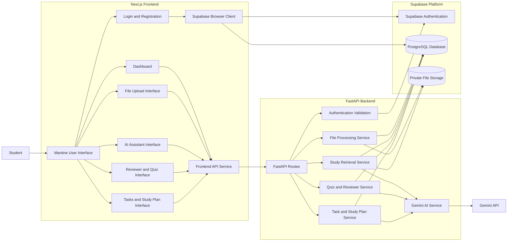
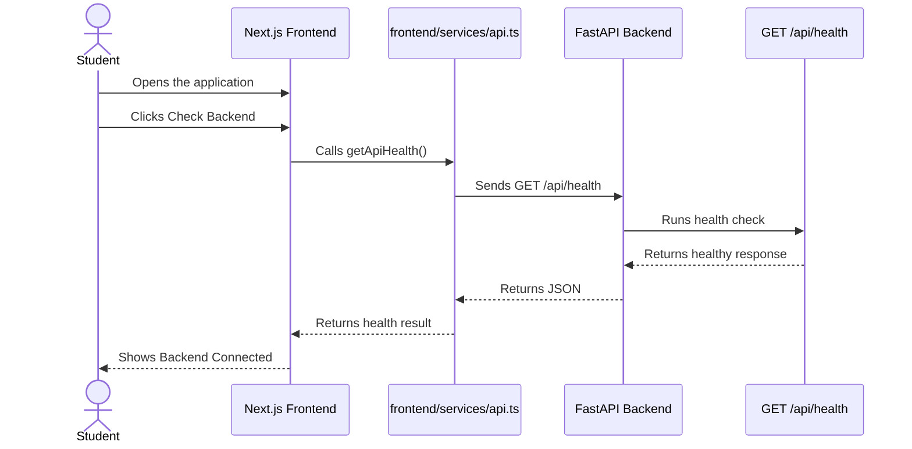
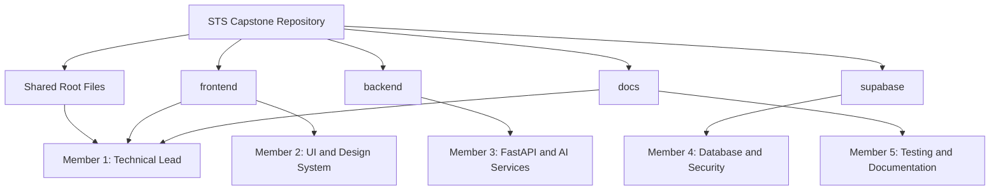
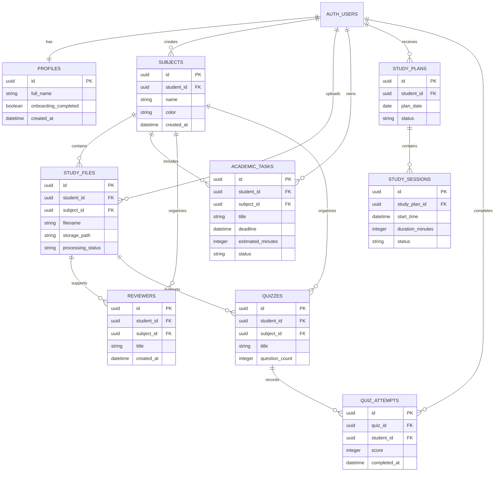
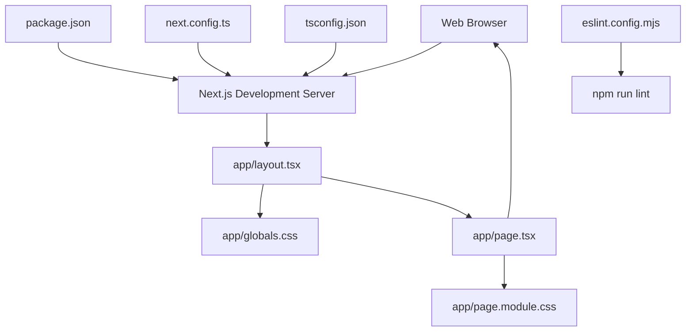
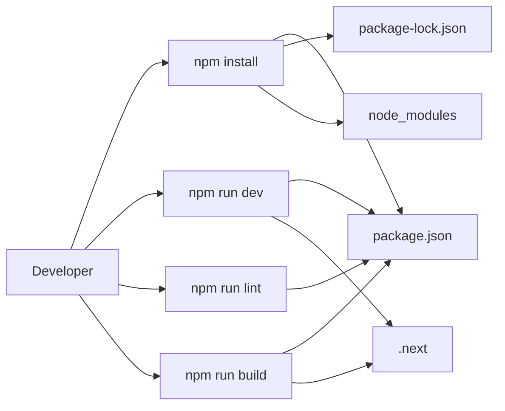

<!-- File: /docs/ARCHITECTURE.md -->

# STS Capstone Project Architecture

This document shows how the main parts of the application connect.

The diagrams use Mermaid syntax. View this file using a Markdown viewer that supports Mermaid diagrams.

## Main System Architecture

## Initial Phase 1 Connection

## Repository Ownership

## Planned Data Relationships

This is an initial database outline. It will be finalized during the Supabase database phase.

## Diagram Update Rules

Update this document when:

1. A new major service is introduced.
2. A new database table is created.
3. A frontend feature begins calling a new endpoint.
4. A backend service starts using Gemini.
5. A module begins reading from Supabase Storage.
6. Ownership of a module changes.
7. A major connection is removed.

## Phase 1C Frontend Foundation

## Frontend Development Commands

