<!-- File: /docs/ARCHITECTURE.md -->
<!-- Purpose: Documents the implemented and planned architecture of the STS Capstone STUDY AI project. -->

# STS Capstone — STUDY AI Architecture

This document describes the current architecture of STUDY AI.

The system currently includes:

- Next.js frontend
- Mantine UI
- Supabase Authentication
- Hosted Supabase PostgreSQL
- Private Supabase Storage
- Student learning-profile onboarding
- Subject management
- Study-material uploads
- Automatic file processing
- Document text extraction
- AI-oriented chunking
- Gemini embeddings
- Supabase pgvector storage
- Semantic retrieval
- Grounded RAG answering
- Protected FastAPI RAG API
- Student-facing Study Assistant
- Saved Study Assistant conversations
- Bounded conversation memory
- Deterministic conversation summaries
- Reviewer generation from a subject or study file
- Structured reviewer content with topics, key points, and definitions
- Reviewer source tracking
- Saved reviewer persistence
- Protected FastAPI reviewer API
- Saved reviewer management and regeneration
- Large-material multi-pass reviewer generation
- Deterministic reviewer source batching
- Partial-reviewer synthesis into one final structured reviewer
- Flashcard generation from one ready study file or a whole subject
- Structured question-and-answer Flashcard generation
- Complete Flashcard source tracking
- Saved Flashcard deck persistence
- Individual ordered Flashcard persistence
- Atomic Flashcard deck-and-card creation
- Protected FastAPI Flashcard API
- Saved Flashcard listing, retrieval, and deletion

The application now also includes a protected Reviewer frontend for generating structured reviewers from a whole subject or one ready study material.

Future phases may add the student-facing Flashcard frontend, quizzes, study planning, scheduling, analytics, and deployment improvements.
---

# Phase Status

| Phase | Scope | Status |
|---|---|---|
| Phase 1 | Project foundation, frontend, backend, Supabase, authentication | Implemented |
| Phase 2 | Learning-profile onboarding and profile data | Implemented |
| Phase 3 | Subjects, uploads, extraction, processing worker | Implemented |
| Phase 4 | AI provider, chunking, embeddings, vector persistence, retrieval | Implemented |
| Phase 5A–5F | Retrieval orchestration, grounded RAG API, Study Assistant | Implemented |
| Phase 5G | Saved conversations, memory, summaries, conversation history UI | Implemented |
| Phase 6A | Reviewer backend foundation, persistence, generation, sources, protected API | Implemented |
| Phase 6B | Reviewer frontend, authenticated generation UI, structured result display | Implemented |
| Phase 6C | Saved reviewer management and regeneration | Implemented |
| Phase 6D | Large-material multi-pass reviewer generation | Implemented |
| Track A Backend | Flashcard persistence, source loading, structured AI generation, orchestration, protected API | Implemented |
| Later phases | Flashcard frontend, quizzes, study plans, analytics, deployment | Planned |

---

# High-Level Architecture

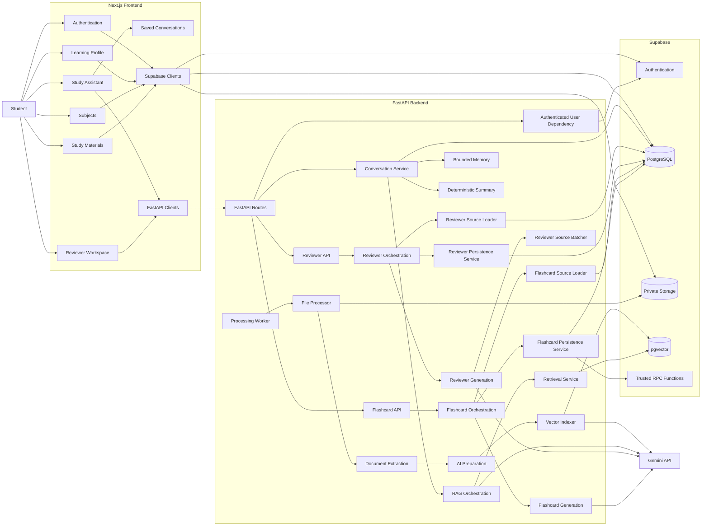

---

# Frontend Architecture

The frontend uses:

- Next.js
- TypeScript
- Mantine UI
- CSS Modules
- Tabler Icons
- Supabase browser/server clients
- Typed FastAPI clients
- Vitest
- React Testing Library

The frontend does not contain backend secrets.

---

# Authentication Flow

Supabase Authentication is the identity provider.

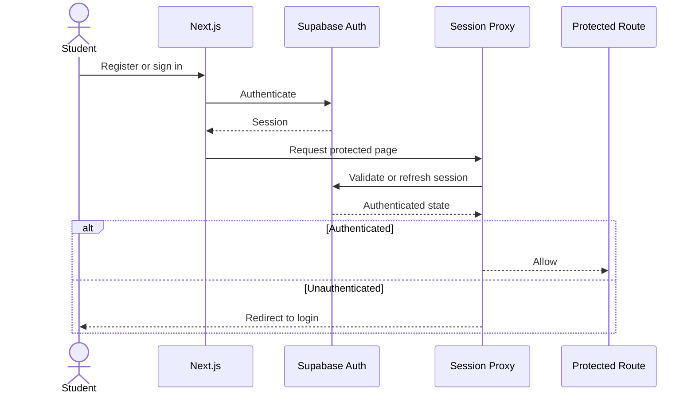

Student identity used by protected FastAPI requests comes from the validated Supabase bearer access token.

The browser must not provide a trusted `user_id`.

---

# Learning Profile Architecture

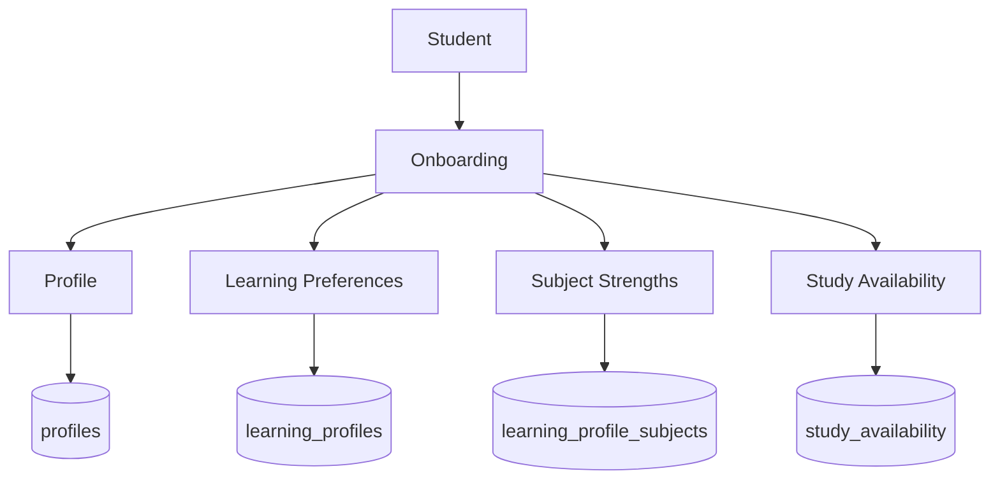

---

# Subject and Study-Material Architecture

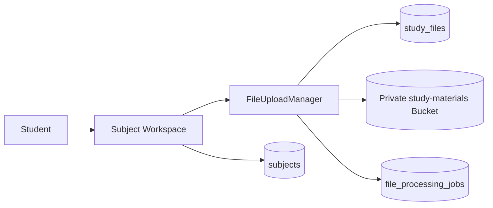

Uploaded study files belong to an authenticated student and subject.

---

# File Processing Lifecycle

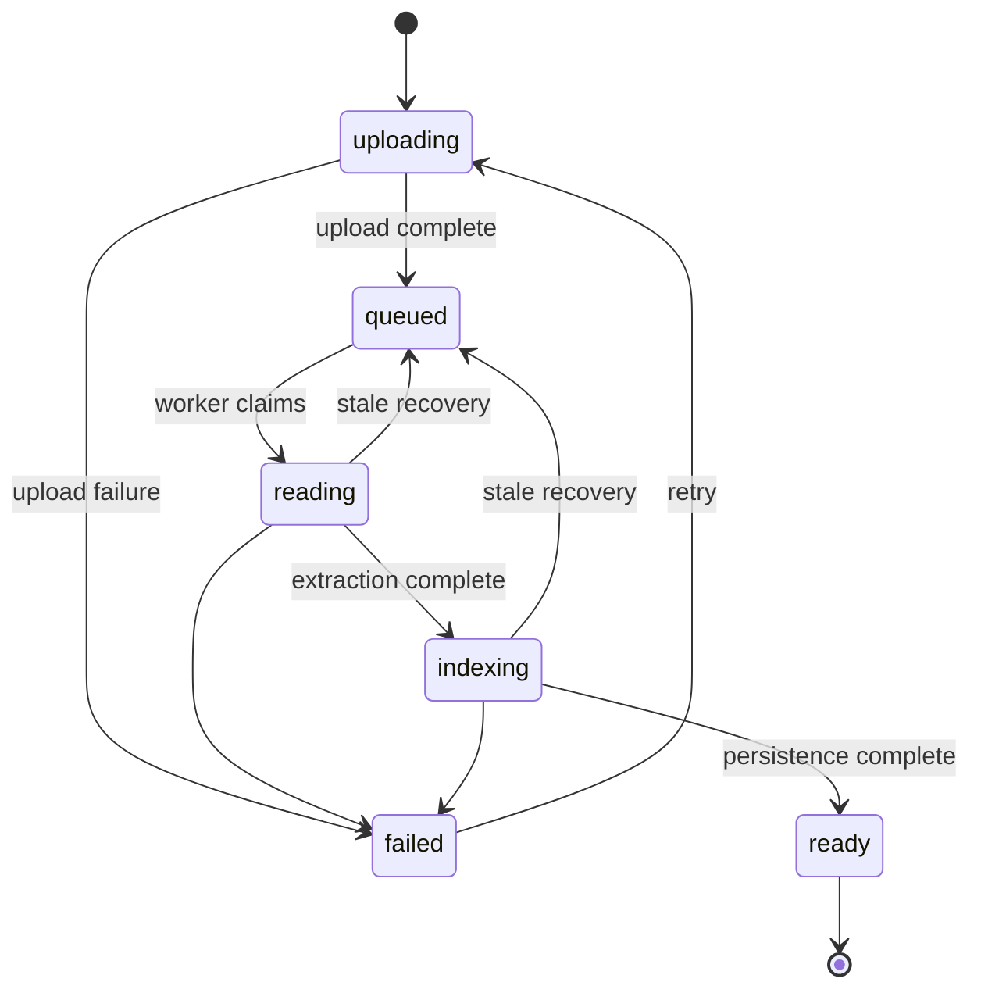

Study-file statuses:

```text
uploading
queued
reading
indexing
ready
failed
```

---

# File Processing Worker

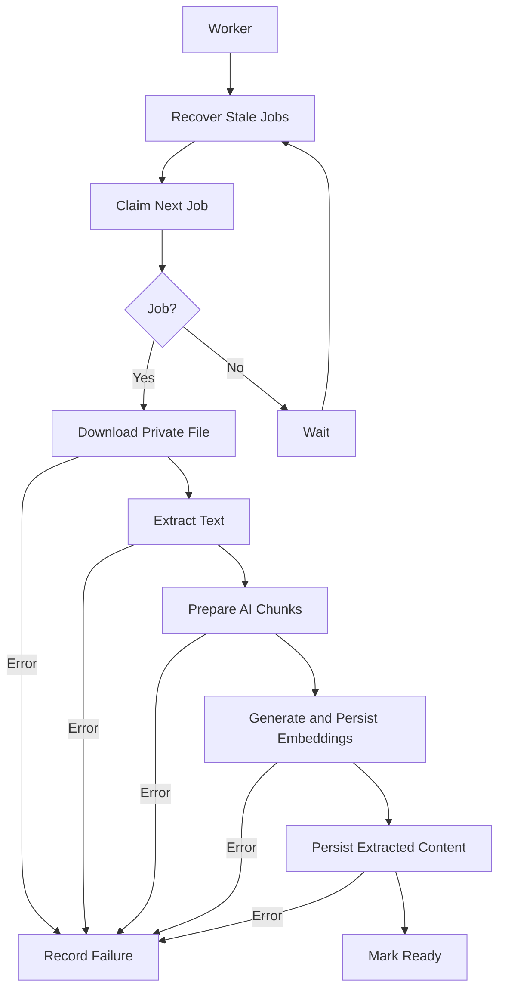

Atomic job claiming uses database locking and `SKIP LOCKED`.

---

# Document Extraction

Implemented extraction:

| Format | Implementation |
|---|---|
| PDF | `pypdf` |
| TXT | UTF-8 decoding |
| PPTX | `python-pptx` |
| XLSX | `openpyxl` |
| XLS | `xlrd` |

Source-aware locators include:

- Page
- Slide
- Worksheet
- Document

JPEG, PNG, and WebP may be stored, but OCR is not currently part of the implemented extraction pipeline.

---

# AI Provider Architecture

Backend AI services depend on provider-independent contracts.

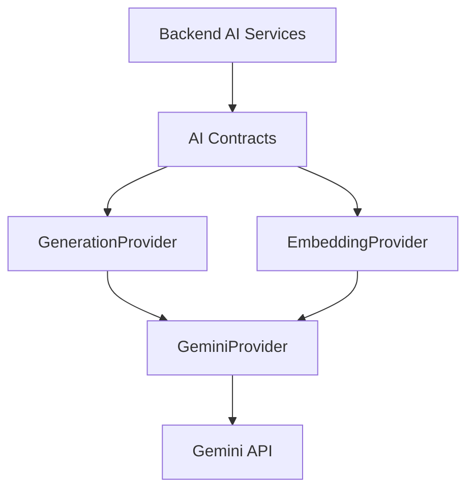

Gemini credentials remain inside `backend/.env`.

Normal automated tests use fake providers and do not call live Gemini services.

---

# AI Preparation and Vector Indexing

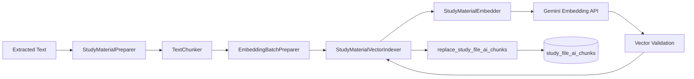

Current vector configuration uses:

```text
Embedding dimensions: 768
Distance strategy: cosine
Index strategy: HNSW
```

---

# Retrieval Architecture

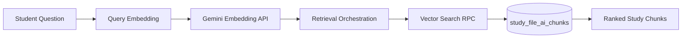

Retrieval supports:

- Student-owned materials only
- Optional subject filtering
- Optional study-file filtering
- Similarity threshold
- Maximum match count
- Safe source metadata

---

# Grounded RAG Architecture

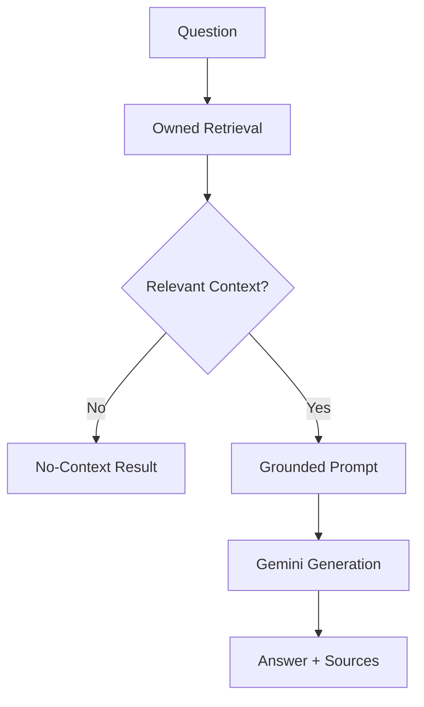

Factual claims must be supported by retrieved study-material content.

---

# Protected RAG API

Main endpoint:

```text
POST /api/rag/answer
```

Authentication:

```text
Authorization: Bearer <Supabase access token>
```

The request may contain:

- `question`
- `conversation_id`
- `subject_id`
- `study_file_id`
- Retrieval tuning values

It must not contain a trusted `user_id`.

---

# Study Assistant Frontend

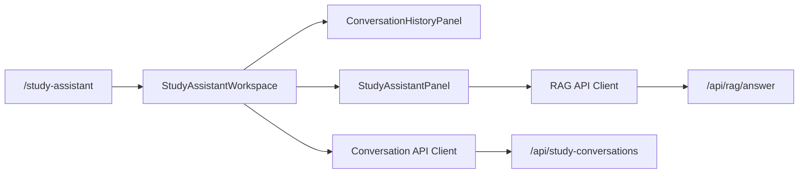

The Study Assistant supports:

- Subject filtering
- Study-file filtering
- Grounded answers
- Source cards
- No-context responses
- Saved conversation history
- Conversation switching
- New conversations
- Follow-up questions

---

# Reviewer Frontend

The protected Reviewer workspace is available at:

```text
/reviewers
```

The frontend follows the same authenticated FastAPI-client pattern used by the Study Assistant.

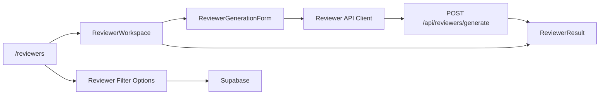

The Reviewer frontend supports:

- Whole-subject reviewer generation
- Single-study-material reviewer generation
- `short`, `medium`, and `long` reviewer lengths
- Authenticated subject loading
- Ready study-material filtering
- Loading and safe error states
- Structured overview display
- Topic summaries
- Key points
- Important definitions
- Grounded source references

Only study files that have completed processing and are in the `ready` state are available for file-scope generation.

Generated reviewers are persisted by the backend before being returned to the frontend.

Saved-reviewer history, reopening, deletion controls, and regeneration remain deferred to the next Reviewer phase.

# Phase 5G Conversation Persistence

Implemented tables:

```text
study_conversations
study_messages
```

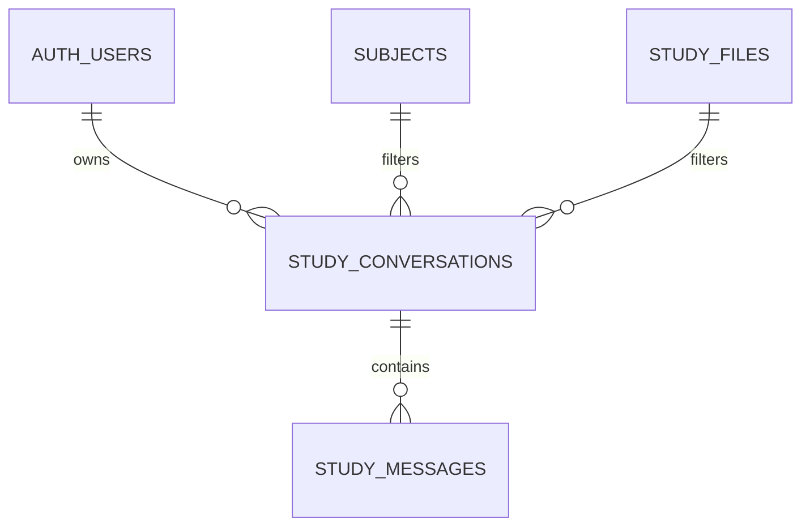

A conversation stores:

- Owner
- Title
- Optional subject
- Optional study file
- Summary state
- Creation time
- Update time
- Last message time

A saved message stores:

- Role
- Content
- Assistant outcome
- Safe citation metadata
- Creation time

---

# Conversation-Aware RAG

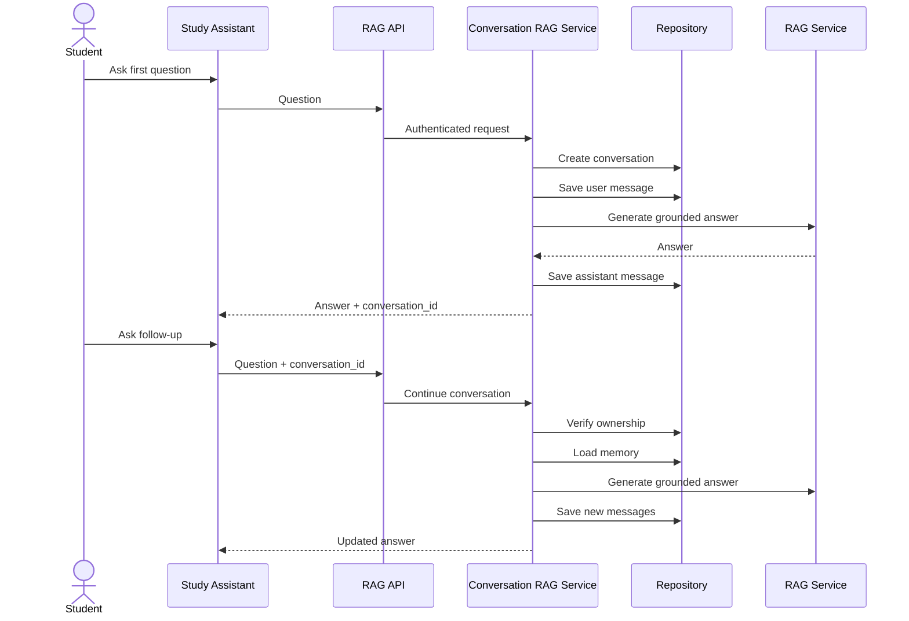

---

# Bounded Conversation Memory

Current limits:

| Limit | Value |
|---|---:|
| Maximum memory items | 10 |
| Maximum memory characters | 8,000 |
| Recent messages without summary | 10 |
| Recent messages with summary | 9 |
| Maximum summary size | 4,000 characters |
| Summary version | 1 |

When a summary exists:

```text
1 summary
+
9 recent messages
=
10 maximum memory items
```

---

# Deterministic Conversation Summary

Older messages may be compressed into a deterministic backend summary.

The summary builder:

- Does not call Gemini
- Does not use another AI provider
- Produces deterministic output
- Removes citation markers
- Has a 4,000-character limit
- Keeps the newest relevant summary entries

Internal summary fields:

```text
summary_text
summarized_message_count
summary_updated_at
summary_version
```

These fields must not be consumed or modified by the frontend.

---

# Evidence Boundary

Conversation memory helps interpret follow-up questions.

It does not become factual evidence.

Correct factual evidence flow:

```text
Question
→ Query Embedding
→ Owned Vector Retrieval
→ Retrieved Study Material
→ Grounded Prompt
→ Gemini Answer
→ Citations
```

Conversation history is context only.

---

# Implemented Database Resources

```text
auth.users

public.profiles
public.learning_profiles
public.learning_profile_subjects
public.study_availability

public.subjects
public.study_files
public.file_processing_jobs
public.study_file_contents
public.study_file_chunks
public.study_file_ai_chunks

public.study_conversations
public.study_messages
public.reviewers

public.flashcard_decks
public.flashcards
```

Private Storage:

```text
study-materials
```

---

# Security Boundaries

1. Supabase backend credentials remain backend-only.
2. Gemini credentials remain backend-only.
3. Processor credentials remain backend-only.
4. Browser code uses only publishable Supabase credentials.
5. Student database access is protected by RLS.
6. Study files remain private.
7. FastAPI derives identity from bearer authentication.
8. RAG requests cannot override `user_id`.
9. Clients cannot submit arbitrary conversation memory.
10. Clients cannot submit summary state.
11. Conversation summaries are backend-managed.
12. Raw embeddings are not returned to the browser.
13. Raw retrieved chunks are not persisted as conversation source metadata.
14. Public errors must not expose tokens or credentials.
15. Flashcard API requests cannot provide a trusted `user_id`.
16. Flashcard source loading verifies authenticated ownership and subject linkage.
17. Only ready study material may be used for Flashcard generation.
18. Browser roles cannot directly call the trusted Flashcard creation RPC.
19. Generated Flashcard decks are persisted only after successful structured AI validation.
20. Flashcard deck deletion cascades to its individual Flashcards.

---

# Migration Workflow

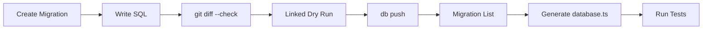

Applied migrations must never be edited.

Corrections require a new timestamped migration.

---

# Phase 5G Migrations

```text
20260806192800_create_study_conversations_and_messages.sql

20260806200500_fix_study_message_outcome_constraint.sql

20260806223000_add_study_conversation_summary_state.sql

20260806234000_restrict_study_conversation_summary_updates.sql
```

---
# Phase 6A Migrations

```text
20260807230500_create_reviewers.sql
20260808053929_create_reviewers_foundation.sql
```

This migration creates the owned `reviewers` table, reviewer scope and length constraints, ownership validation, timestamps, indexes, and Row Level Security policies.

---
# Track A Flashcard Migrations

```text
20260809142000_create_flashcard_foundation.sql
20260809145600_create_flashcard_persistence_rpc.sql
```
The foundation migration creates:

```text
flashcard_decks
flashcards
```
It also implements:

authenticated ownership linkage
subject/file scope validation
requested card-count validation
ordered card positions
safe generation metadata
indexes
timestamps
Row Level Security
restricted browser privileges

The second migration creates:

```text
create_flashcard_deck_with_cards(...)
```
This trusted service_role RPC atomically creates the parent deck and all ordered child Flashcards in one database transaction.

Browser anon and authenticated roles cannot execute the persistence RPC directly.

---

# Phase 6A Reviewer Backend

Phase 6A introduces the backend foundation for generated study reviewers.

A reviewer can currently be generated from:

- One ready study file
- All ready study files within one subject

Reviewer generation does not use similarity-based RAG retrieval. It loads the processed source-aware chunks in deterministic file and chunk order so that the reviewer can represent the selected material broadly rather than only answering a similarity-based question.

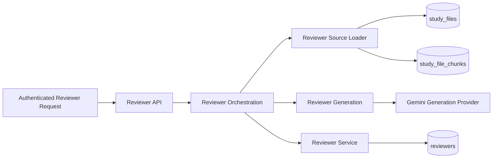

Generated reviewer content is structured as:

```text
overview
topics
  title
  summary
  key_points
  definitions
```

Saved reviewer metadata includes:

```text
scope_type
subject_id
study_file_id
reviewer_length
sources
generation_model
generation_count
generated_at
```

Reviewer sources preserve the originating study file, chunk index, and available locator metadata.

Current protected endpoints are:

```text
POST   /api/reviewers/generate
GET    /api/reviewers
GET    /api/reviewers/{reviewer_id}
DELETE /api/reviewers/{reviewer_id}
```

The authenticated user's identity comes from the validated bearer token. Reviewer requests cannot choose a trusted `user_id`.

Reviewer insert and generation operations are performed through the trusted backend. Browser clients do not receive direct insert or update access to reviewer records.

Phase 6A did not include a student-facing reviewer workspace. That workspace is now implemented in Phase 6B.

Saved reviewer management and regeneration were implemented in Phase 6C.

Large-material multi-pass reviewer generation was implemented in Phase 6D.

Quiz generation remains deferred to a later Phase 6 feature.

# Phase 6B Reviewer Frontend

Phase 6B connects the Phase 6A Reviewer backend to the protected Next.js application.

Implemented frontend route:

```text
/reviewers
```

The Reviewer workspace provides:

```text
ReviewerWorkspace
├── ReviewerGenerationForm
└── ReviewerResult
```

Generation options include:

```text
Scope:
- Whole subject
- Single study material

Length:
- Short
- Medium
- Long
```

The frontend loads authenticated subjects and only study files with:

```text
processing_status = ready
```

The browser sends reviewer-generation requests through the authenticated Reviewer API client using the student's Supabase access token.

Live integration verified:

- Single study material + Medium reviewer
- Whole subject + Medium reviewer
- Whole subject + Short reviewer
- Multi-file subject generation
- Reviewer persistence
- Structured overview rendering
- Topic/key-point rendering
- Important-term rendering
- Source-location rendering

During live integration, short whole-subject generation exposed an output truncation issue. The Short generation output budget was increased from 2,048 to 4,096 tokens so the provider has enough room to complete valid structured JSON while the prompt still requests concise content.

Reviewer response validation still remains strict, and malformed provider output continues to receive only one controlled repair attempt.

Phase 6B originally excluded saved reviewer management, regeneration, and large-material multi-pass generation. These capabilities were implemented later in Phase 6C and Phase 6D.

Quiz generation remains deferred.

---

# Phase 6D Large-Material Reviewer Generation

Phase 6D extends the existing reviewer-generation pipeline so study material that exceeds the normal single-pass prompt limit can still be processed without silently truncating source content.

The existing source loader continues to load the complete authenticated source bundle. Large-material handling begins only inside the reviewer generation layer.

## Generation Strategy

Reviewer generation uses two paths:

```text
Source bundle at or below single-pass limit
→ Complete reviewer prompt
→ Gemini
→ Validated ReviewerContent
```

For oversized source bundles:

```text
Complete source bundle
→ ReviewerSourceBatcher
→ Ordered source batches
→ Partial reviewer generation
→ Final synthesis prompt
→ Gemini
→ Validated ReviewerContent
```

The default limits are:

| Limit                              |             Value |
| ---------------------------------- | ----------------: |
| Normal single-pass source limit    | 80,000 characters |
| Default large-material batch limit | 60,000 characters |
| Maximum configurable batch limit   | 80,000 characters |

The batcher splits only at existing source-chunk boundaries. It does not truncate a chunk, remove chunks, duplicate chunks, or change their original order.

## Large-Material Flow

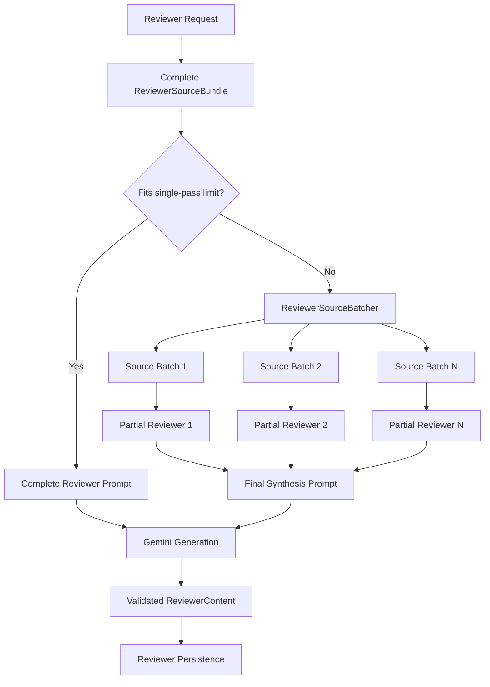

Each partial batch prompt identifies itself as one ordered portion of a larger source collection. The model is instructed to use only concepts supported by that batch and not assume information from unseen batches.

The synthesis prompt receives the ordered validated partial reviewers and combines them into one final reviewer. It removes unnecessary repetition while preserving important distinctions between concepts.

## Compatibility With Existing Reviewer Generation

Materials within the normal source limit continue through the original single-pass reviewer flow.

This means Phase 6D does not change normal reviewer behavior simply because batching support exists.

Existing behaviors remain enforced:

* Short, medium, and long reviewer lengths
* Strict JSON response validation
* One controlled repair attempt for malformed output
* Provider identity validation
* Structured overview, topics, key points, and definitions
* File-level and subject-level scopes
* Authenticated ownership validation
* Complete source tracking
* Existing reviewer persistence

## Source Metadata

Even when generation uses multiple batches, the final `ReviewerGenerationResult` reports metadata for the complete original source bundle:

```text
source_character_count
source_chunk_count
source_file_count
```

The orchestration layer therefore continues to verify generation against the same complete source material loaded for the authenticated reviewer request.

Saved reviewer source metadata also continues to reference the original source chunks rather than the generated partial reviewers.

## Database Impact

Phase 6D introduces no new table, migration, or RLS policy.

It reuses:

```text
study_files
study_file_chunks
reviewers
```

The change is contained within the backend reviewer generation pipeline.

## Phase 6D Validation

Phase 6D added dedicated automated coverage for:

* Small-material single-pass compatibility
* Character-bounded source batching
* Stable batch indices
* Preservation of every source chunk
* Preservation of chunk order
* Oversized individual-chunk rejection
* Partial batch prompt generation
* Batch metadata
* Large-material partial generation
* Final reviewer synthesis
* Complete-source generation metadata

Backend regression validation after Phase 6D:

```text
727 passed
```

Reviewer-focused validation:

```text
106 passed
```

Phase 6D Ruff validation also passes.
---

```markdown
---

# Track A — Flashcard Backend

The implemented Flashcard backend generates saved question-and-answer study decks from authenticated student study material.

Supported generation scopes are:

```text
One ready study file
All ready study files within one subject
```
Flashcard generation uses the complete processed source-aware chunks rather than similarity-based RAG retrieval.

flowchart LR
    REQUEST["Authenticated Flashcard Request"]

    API["Flashcard API"]
    ORCHESTRATION["Flashcard Orchestration"]

    SOURCE["Flashcard Source Loader"]
    GENERATION["Flashcard Generation"]
    PERSISTENCE["Flashcard Service"]

    FILES[("study_files")]
    CHUNKS[("study_file_chunks")]

    RPC["create_flashcard_deck_with_cards"]
    DECKS[("flashcard_decks")]
    CARDS[("flashcards")]

    GEMINI["Gemini Generation Provider"]

    REQUEST --> API
    API --> ORCHESTRATION

    ORCHESTRATION --> SOURCE
    SOURCE --> FILES
    SOURCE --> CHUNKS

    ORCHESTRATION --> GENERATION
    GENERATION --> GEMINI

    ORCHESTRATION --> PERSISTENCE
    PERSISTENCE --> RPC

    RPC --> DECKS
    RPC --> CARDS

Flashcard Generation Contract

Generated content uses:
```text
cards
  question
  answer
```

The first implementation supports:
```text
Minimum cards: 5
Default cards: 20
Maximum cards: 50
```
Generation behavior includes:

file-level and subject-level generation
authenticated source ownership validation
ready-file validation
complete ordered source loading
an 80,000-character single-pass source ceiling
strict JSON output validation
exact requested-card-count validation
duplicate-card rejection
one controlled repair attempt
provider identity validation
no outside-knowledge instruction
prompt-injection boundary for uploaded source text

Material above the current single-pass source limit is rejected safely rather than silently truncated. Large-material Flashcard generation remains a later Track A phase.

Flashcard Persistence

Flashcards use two normalized tables:

```text
flashcard_decks
    ↓ one-to-many
flashcards
```
`flashcard_decks` stores:

```text
owner
subject
optional study file
scope
title
requested card count
safe sources
generation model
generation count
timestamps
```

Each `flashcards` row stores:

```text
deck_id
position
question
answer
```
The trusted backend persists the deck and all cards atomically through:

```text
create_flashcard_deck_with_cards(...)
```

# Protected Flashcard API

Implemented endpoints:

```text
POST   /api/flashcards/generate
GET    /api/flashcards
GET    /api/flashcards/{deck_id}
DELETE /api/flashcards/{deck_id}
```
The authenticated user's UUID comes from the validated Supabase bearer token.

A Flashcard request cannot choose a trusted user_id.

Saved-deck reads and deletes remain explicitly owner-scoped.

# Current Track A Boundary

The Flashcard backend is implemented.

The student-facing Flashcard frontend, study/flip-card interface, saved-deck management UI, and large-material multi-pass Flashcard generation remain to be implemented in later Track A phases.


# Planned Future Features

Future phases may introduce:

- Flashcard frontend and interactive study interface
- Large-material multi-pass Flashcard generation
- Quizzes
- Academic task integration
- Study-plan generation
- Calendar scheduling
- Study analytics
- Deployment and monitoring improvements

These features must not be documented as implemented until their code, migrations, tests, and security boundaries exist.

---

# Architecture Update Rules

Update this document whenever:

1. A major service is introduced.
2. A new API endpoint is added.
3. A database table is created.
4. A new trusted RPC is created.
5. A major data flow changes.
6. A planned feature becomes implemented.
7. A security boundary changes.
8. A development phase is completed.