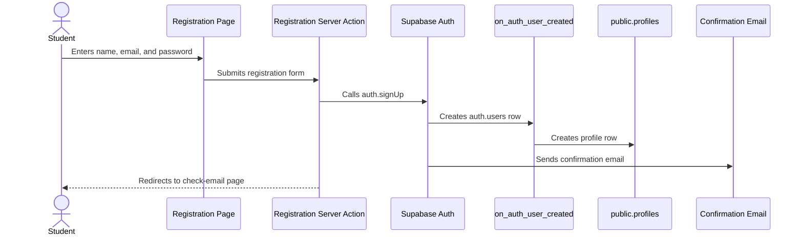
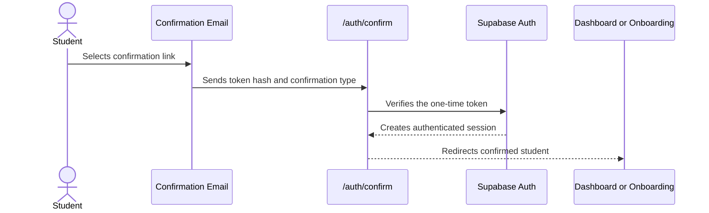
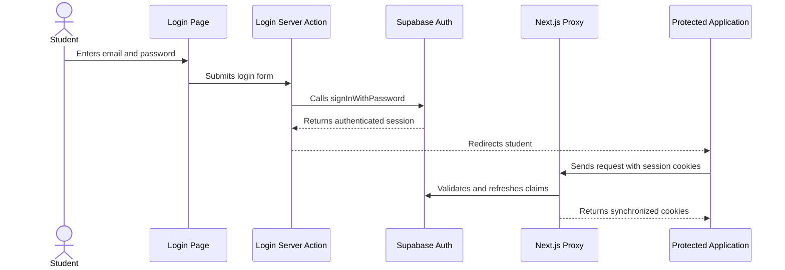

<!-- File: /docs/authentication.md -->
<!-- Purpose: Documents the authentication routes, session flow, security boundaries, and implementation phases. -->

# Authentication Architecture

The STS Capstone Project uses Supabase Auth with email and password.

Authentication sessions are stored in cookies through the Supabase SSR package and refreshed through the Next.js Proxy.

## Authentication Components

```text
Supabase Auth
├── Email and password registration
├── Email confirmation
├── Password-based login
├── Session refresh
└── Logout

Next.js Frontend
├── Public authentication pages
├── Server Actions
├── Email-confirmation Route Handler
├── Session Proxy
├── Protected route checks
└── Authenticated Supabase clients

Supabase Database
├── auth.users
├── public.profiles
├── New-user profile trigger
└── Profile Row Level Security
```

## Planned Public Routes

| Route | Purpose |
|---|---|
| `/login` | Allows an existing student to sign in |
| `/register` | Creates a new student account |
| `/register/check-email` | Tells the student to confirm their email |
| `/auth/confirm` | Verifies the email-confirmation token |
| `/auth/auth-code-error` | Shows a friendly confirmation-link error |

## Planned Protected Routes

```text
/dashboard
/subjects
/files
/tasks
/study-plan
/calendar
/progress
/assistant
/analytics
/settings
```

Unauthenticated visitors attempting to open a protected page will be redirected to:

```text
/login
```

The original route may be stored in a safe `next` query parameter so that the student can return after signing in.

## Registration Flow



## Email-Confirmation Flow



## Login Flow



## Session Security Rules

1. Use the Supabase publishable key in the frontend.
2. Never expose the Supabase secret key to browser code.
3. Store frontend sessions in secure authentication cookies managed by Supabase SSR.
4. Use validated claims or a fresh user lookup for authorization decisions.
5. Do not trust client-submitted user identifiers.
6. Keep profile access protected through Row Level Security.
7. Redirect unauthenticated users away from protected application pages.
8. Do not include passwords, tokens, or session values in logs.

## Authentication Route Decisions

| Situation | Expected destination |
|---|---|
| New account awaiting confirmation | `/register/check-email` |
| Successful email confirmation | `/dashboard` or `/onboarding` |
| Successful login | `/dashboard` or `/onboarding` |
| Invalid confirmation link | `/auth/auth-code-error` |
| Unauthenticated protected-route access | `/login` |
| Authenticated visit to login/register | `/dashboard` or `/onboarding` |
| Successful logout | `/login` |

## Onboarding Gate

After authentication, the application will read:

```text
public.profiles.onboarding_completed
```

Expected behavior:

```text
false → /onboarding
true  → /dashboard
```

The onboarding redirect will be implemented after the core registration and login flow is working.

## Current Implementation Status

```text
Phase 1H.1: Authentication architecture complete
Phase 1H.2: Session Proxy foundation complete
Phase 1H.3: Shared validation and action-state types complete
Phase 1H.4: Registration Server Action and interface complete
Phase 1H.5: Email-confirmation callback pending
Phase 1H.6: Password login pending