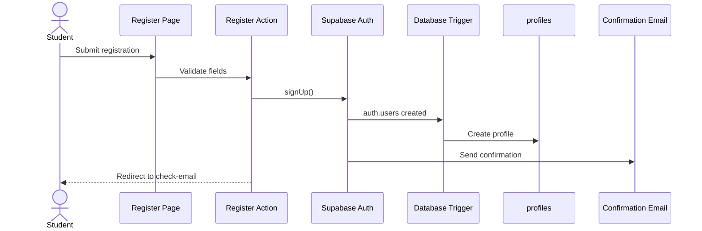
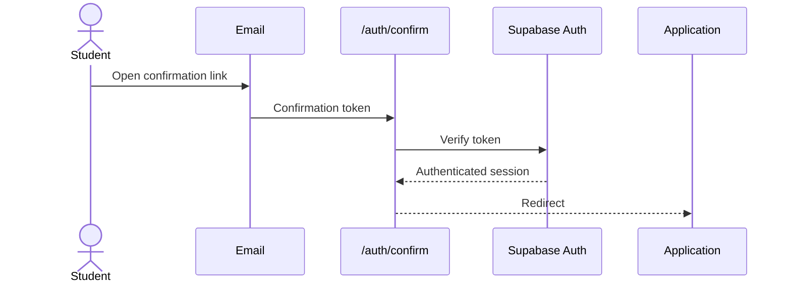
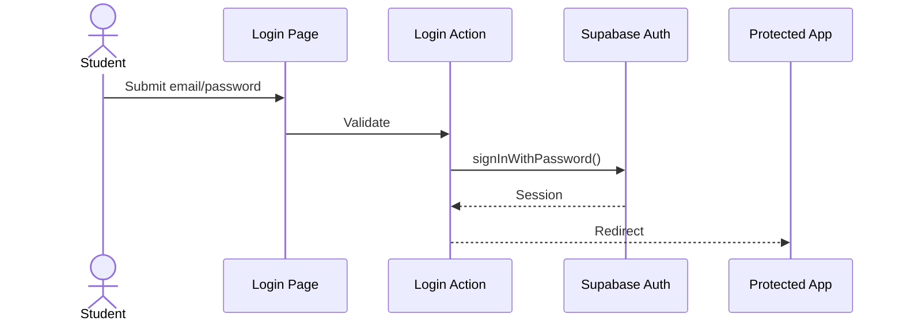
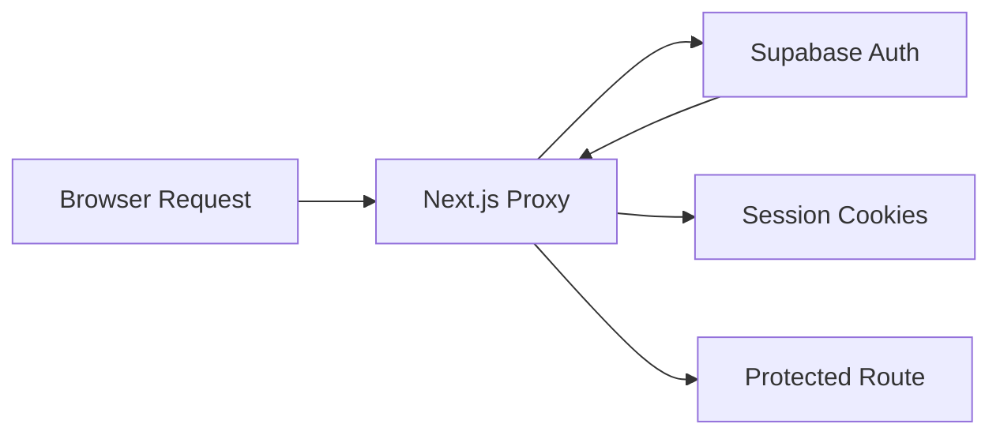
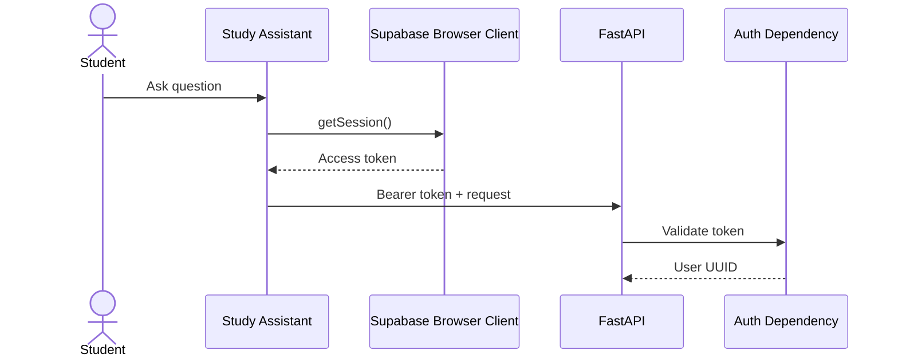

<!-- File: /docs/authentication.md -->
<!-- Purpose: Documents authentication, sessions, protected routes, onboarding gates, and API authorization. -->

# Authentication Architecture

STUDY AI uses Supabase Authentication with email and password.

Authentication is implemented using:

- Supabase Auth
- Supabase SSR
- Cookie-based sessions
- Next.js session proxy
- Protected Server Components
- Authenticated Supabase clients
- Supabase bearer tokens for protected FastAPI endpoints

---

# Implemented Public Routes

| Route | Purpose |
|---|---|
| `/login` | Student sign in |
| `/register` | Student registration |
| `/register/check-email` | Email-confirmation instructions |
| `/auth/confirm` | Email-confirmation callback |
| `/auth/auth-code-error` | Safe confirmation failure page |

---

# Implemented Protected Routes

Important protected routes include:

```text
/dashboard
/profile
/onboarding
/subjects
/study-assistant
```

The legacy `/files` route may redirect to the subject-based file workspace.

Unauthenticated access redirects to:

```text
/login
```

---

# Registration Flow



---

# Email Confirmation



---

# Login Flow



---

# Session Refresh

The Next.js proxy refreshes the Supabase session when required.



---

# Onboarding Gate

Authentication proves who the student is.

The onboarding gate determines whether the student's learning profile is complete.

The application checks:

```text
public.profiles.onboarding_completed
```

Expected behavior:

```text
false → /onboarding
true  → protected application
```

---

# FastAPI Authentication

Protected FastAPI endpoints use:

```http
Authorization: Bearer <Supabase access token>
```

Examples:

```text
POST /api/rag/answer
GET /api/study-conversations
GET /api/study-conversations/{conversation_id}
PATCH /api/study-conversations/{conversation_id}
DELETE /api/study-conversations/{conversation_id}
```

The backend validates the bearer token and derives the authenticated student's UUID.

The request body cannot override the authenticated user.

---

# Study Assistant Authentication

The browser obtains the current Supabase session and sends its access token to FastAPI.



The frontend must never use the user UUID itself as authorization.

---

# Conversation Authorization

Saved conversations belong to one authenticated user.

The backend verifies ownership before:

- Listing
- Loading
- Updating
- Deleting
- Continuing a conversation through RAG

A student cannot access another student's messages by guessing a conversation UUID.

---

# Authentication Security Rules

1. Use only the Supabase publishable key in browser code.
2. Keep Supabase backend credentials server-side.
3. Keep Gemini credentials server-side.
4. Keep processor credentials server-side.
5. Store sessions using Supabase SSR cookies.
6. Do not trust client-submitted user IDs.
7. Protect student database rows using RLS.
8. Protect private Storage using ownership policies.
9. Do not log passwords.
10. Do not log complete access tokens.
11. Do not include tokens in error messages.
12. Require authentication for Study Assistant conversation APIs.

---

# Logout

Logout removes the authenticated session.

Expected destination:

```text
/login
```

After logout, protected pages must no longer be directly accessible.

---

# Current Authentication Status

```text
Registration: Implemented
Email confirmation: Implemented
Password login: Implemented
Cookie session handling: Implemented
Session refresh: Implemented
Logout: Implemented
Protected routes: Implemented
Onboarding gate: Implemented
Study Assistant bearer authentication: Implemented
Conversation ownership authorization: Implemented
```

---

# Authentication Testing

Validated behavior includes:

- Registration
- Email confirmation
- Password login
- Invalid credentials
- Session persistence
- Logout
- Protected-route redirects
- Onboarding redirects
- Bearer-token FastAPI authentication
- Missing-token rejection
- Invalid-token rejection
- Conversation ownership checks
- No client-side user-ID override