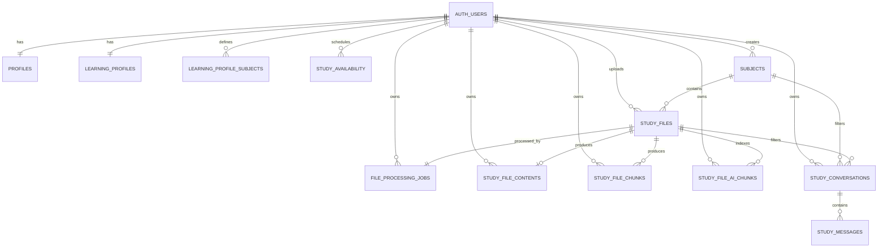

<!-- File: /docs/database.md -->
<!-- Purpose: Documents implemented Supabase tables, relationships, Storage, RLS, vector storage, conversations, and database functions. -->

# Database Documentation

STUDY AI uses hosted Supabase PostgreSQL.

Supabase provides:

- Authentication
- PostgreSQL
- Row Level Security
- Private Storage
- Trusted database functions
- pgvector
- Generated TypeScript database definitions

---

# Database Status

| Area | Status |
|---|---|
| Authentication | Implemented |
| Profiles | Implemented |
| Learning profile | Implemented |
| Subjects | Implemented |
| Study files | Implemented |
| Processing queue | Implemented |
| Extracted content | Implemented |
| Source-aware chunks | Implemented |
| AI-vector chunks | Implemented |
| Semantic retrieval | Implemented |
| Saved conversations | Implemented |
| Conversation messages | Implemented |
| Conversation summary state | Implemented |
| Reviewer table | Implemented |
| Flashcard/quiz tables | Planned |
| Tasks/study plans | Planned |

---

# Authentication

Supabase stores student identities in:

```text
auth.users
```

The application does not maintain its own password table.

---

# Generated Types

Generated frontend definitions:

```text
frontend/types/database.ts
```

Generate after schema changes:

```bash
npx supabase gen types typescript \
  --linked \
  --schema public \
  > frontend/types/database.ts
```

Do not manually edit the generated file.

---

# Core Student Tables

## `public.profiles`

Stores:

- Student name
- Onboarding status
- Current onboarding step
- Completion timestamps

Primary ownership relationship:

```text
profiles.id = auth.users.id
```

---

## `public.learning_profiles`

Stores:

- Preferred study duration
- Preferred study times
- Study challenges
- Estimated task-completion time
- Preferred learning methods

Ownership:

```text
learning_profiles.user_id = auth.uid()
```

---

## `public.learning_profile_subjects`

Stores:

- Subject name
- Strength type
- Confidence level

These records are onboarding profile information and are separate from academic workspace subjects.

---

## `public.study_availability`

Stores recurring weekly study periods.

Important validation:

- ISO weekday 1–7
- Start before end
- Overlap prevention

---

# Subject and File Tables

## `public.subjects`

Stores academic subject workspaces.

Important fields:

```text
id
user_id
name
color
created_at
updated_at
```

---

## `public.study_files`

Stores metadata for uploaded materials.

Important fields:

```text
id
user_id
subject_id
topic
original_filename
storage_path
mime_type
size_bytes
processing_status
failure_code
failure_message
processed_at
created_at
updated_at
```

Processing states:

```text
uploading
queued
reading
indexing
ready
failed
```

---

## `public.file_processing_jobs`

Stores background processing state.

Important fields:

```text
id
user_id
study_file_id
status
attempt_count
started_at
completed_at
error_code
error_message
created_at
updated_at
```

Job states:

```text
queued
processing
completed
failed
```

---

## `public.study_file_contents`

Stores complete extracted text and file-specific extraction metadata.

Important fields:

```text
id
user_id
study_file_id
extracted_text
character_count
page_count
slide_count
sheet_count
extraction_metadata
created_at
updated_at
```

---

## `public.study_file_chunks`

Stores source-aware extracted chunks.

Important fields:

```text
id
user_id
study_file_id
chunk_index
content
locator_type
locator_label
token_count
metadata
created_at
updated_at
```

Locator examples:

```text
page
slide
sheet
document
```

---

# AI Vector Storage

## `public.study_file_ai_chunks`

Stores deterministic AI-oriented chunks and embeddings used for semantic retrieval.

Important fields include:

| Field | Purpose |
|---|---|
| `id` | Vector-row identifier |
| `user_id` | Owner |
| `study_file_id` | Source file |
| `chunk_index` | AI chunk order |
| `content` | Normalized chunk text |
| `start_offset` | Start character offset |
| `end_offset` | End character offset |
| `source_name` | Safe source filename |
| `embedding_model` | Embedding model |
| `embedding_dimensions` | Vector dimensions |
| `embedding_task_type` | Document embedding task type |
| `embedding` | `vector(768)` |
| `chunk_metadata` | Safe metadata |
| `created_at` | Creation timestamp |
| `updated_at` | Update timestamp |

Vector characteristics:

```text
Dimensions: 768
Distance: cosine
Index: HNSW
```

Students may read only owned rows.

Vector writes are performed through trusted backend operations.

---

# Saved Study Assistant Conversations

## `public.study_conversations`

Stores one owned Study Assistant conversation.

| Column | Purpose |
|---|---|
| `id` | Conversation UUID |
| `user_id` | Owner |
| `title` | Conversation title |
| `subject_id` | Optional subject filter |
| `study_file_id` | Optional study-file filter |
| `summary_text` | Backend-managed summary |
| `summarized_message_count` | Messages represented by summary |
| `summary_updated_at` | Summary refresh timestamp |
| `summary_version` | Summary format version |
| `created_at` | Created timestamp |
| `updated_at` | Updated timestamp |
| `last_message_at` | Latest message timestamp |

Validation includes:

- Title length 1–120 trimmed characters
- Summary maximum 4,000 characters
- Non-negative summarized count
- Valid summary-state combinations
- Owned subject filters
- Owned study-file filters

---

## `public.study_messages`

Stores chronological messages.

| Column | Purpose |
|---|---|
| `id` | Message UUID |
| `conversation_id` | Parent conversation |
| `role` | `user` or `assistant` |
| `content` | Message text |
| `outcome` | `answered`, `no_context`, or null |
| `sources` | Safe citation metadata |
| `created_at` | Message timestamp |

User message rule:

```text
role = user
outcome = null
sources = []
```

Assistant message rule:

```text
role = assistant
outcome = answered or no_context
```

---

# Conversation Summary State

Internal fields:

```text
summary_text
summarized_message_count
summary_updated_at
summary_version
```

Rules:

```text
Maximum summary: 4,000 characters
Memory limit: 8,000 characters
Memory item limit: 10
Recent messages with summary: 9
Recent messages without summary: 10
Summary version: 1
```

Authenticated browser clients cannot directly update summary state.

Summary updates are backend-managed.

---

# Relationships



---

# Private Storage

Bucket:

```text
study-materials
```

The bucket is private.

Recommended object path:

```text
USER_ID/SUBJECT_ID/FILE_ID/SAFE_FILENAME
```

Students may access only objects belonging to their own authenticated folder.

---

# Row Level Security

RLS protects student-owned data.

Typical ownership rule:

```text
user_id = auth.uid()
```

Students must not be able to read or modify:

- Another student's profile
- Another student's learning profile
- Another student's subjects
- Another student's study files
- Another student's extracted content
- Another student's source chunks
- Another student's vector chunks
- Another student's saved conversations
- Another student's messages
- Another student's private Storage objects

---

# Trusted Processing Functions

Implemented database functions include:

```text
queue_study_file_processing
claim_next_file_processing_job
start_study_file_processing
mark_study_file_indexing
complete_study_file_processing
fail_study_file_processing
recover_stale_file_processing_jobs
replace_study_file_ai_chunks
complete_learning_profile_onboarding
```

Applied database functions are application contracts.

Changes require a new migration.

---

# Saved Reviewers

`public.reviewers` stores generated study reviewers owned by authenticated students.

Important columns:

| Column | Purpose |
|---|---|
| `id` | Reviewer UUID |
| `user_id` | Authenticated owner |
| `subject_id` | Subject used for generation |
| `study_file_id` | Optional file when using file scope |
| `scope_type` | `subject` or `file` |
| `title` | Saved reviewer title |
| `reviewer_length` | `short`, `medium`, or `long` |
| `content` | Structured reviewer JSON |
| `sources` | Source-file and chunk metadata |
| `generation_model` | AI model used |
| `generation_count` | Number of generations for the saved reviewer |
| `generated_at` | Latest generation timestamp |
| `created_at` | Creation timestamp |
| `updated_at` | Latest record update |

Reviewer `content` is stored as a JSON object containing:

```text
overview
topics
  title
  summary
  key_points
  definitions

# File Deletion Behavior

Deleting a study file must remove or invalidate:

- Private Storage object
- Study-file metadata
- Processing job
- Extracted content
- Source-aware chunks
- AI-vector chunks

Foreign-key cascades should be used where configured.

---

# Conversation Deletion

Deleting a conversation removes its connected messages through cascade behavior.

---

# Phase 5G Migrations

| Migration | Purpose |
|---|---|
| `20260806192800_create_study_conversations_and_messages.sql` | Conversations, messages, ownership, indexes, RLS |
| `20260806200500_fix_study_message_outcome_constraint.sql` | Correct assistant outcome rules |
| `20260806223000_add_study_conversation_summary_state.sql` | Add bounded summary state |
| `20260806234000_restrict_study_conversation_summary_updates.sql` | Restrict client summary updates |

---

# Phase 6A Migration

| Migration | Purpose |
|---|---|
| `20260807230500_create_reviewers.sql` | Retained no-op migration entry matching remote migration history |
| `20260808053929_create_reviewers_foundation.sql` | Creates reviewer table, ownership/scope validation, indexes, timestamps, triggers, privileges, and RLS |
```

---

# Remaining Planned Tables

Future phases may add:

```text
academic_tasks
study_plans
study_sessions
flashcard_sets
flashcards
quizzes
quiz_questions
quiz_attempts
```

Saved AI conversations are already implemented using:

```text
study_conversations
study_messages
```

Vector storage is already implemented using:

```text
study_file_ai_chunks
```

Do not create duplicate `chat_*` or `document_embeddings` tables for the same purpose.

---

# Migration Workflow

Create:

```bash
npx supabase migration new descriptive_name
```

Validate:

```bash
git diff --check

npx supabase db push \
  --linked \
  --dry-run
```

Apply:

```bash
npx supabase db push --linked
```

Verify:

```bash
npx supabase migration list --linked

npx supabase db push \
  --linked \
  --dry-run
```

Generate frontend types:

```bash
npx supabase gen types typescript \
  --linked \
  --schema public \
  > frontend/types/database.ts
```

Previously applied migrations must never be edited.

---

# Database Change Rules

1. Create a new migration.
2. Never edit an applied migration.
3. Dry-run before applying.
4. Verify migration history.
5. Regenerate database types.
6. Run backend tests.
7. Run frontend tests.
8. Test RLS.
9. Update database documentation.
10. Update API contracts when an RPC changes.
11. Never document real credentials.