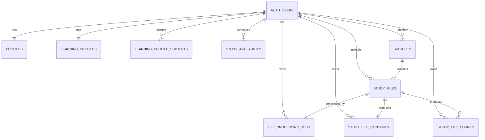

<!-- File: /docs/database.md -->
<!-- Purpose: Documents the implemented Supabase tables, relationships, storage, security policies, and database functions. -->

# Database Documentation

The STS Capstone Project uses hosted Supabase PostgreSQL for application data.

Supabase provides:

- Student authentication
- PostgreSQL application tables
- Private file storage
- Row Level Security
- Database triggers
- Trusted database functions
- Generated TypeScript database definitions

---

# Database Status

| Area | Status |
|---|---|
| Authentication | Implemented |
| Student profiles | Implemented |
| Learning-profile onboarding | Implemented |
| Subject management | Implemented |
| Private file storage | Implemented |
| File-processing queue | Implemented |
| Extracted file content | Implemented |
| File chunks | Implemented |
| Automatic processing recovery | Implemented |
| AI embeddings and retrieval | Planned |
| Reviewers, flashcards, and quizzes | Planned |
| Tasks and study plans | Planned |

---

# Database Ownership

| Area | Owner |
|---|---|
| Database structure | Database and Security Member |
| Row Level Security | Database and Security Member |
| Backend trusted database access | FastAPI and AI Services Member |
| Frontend authenticated access | Technical Lead and Frontend Member |
| Database testing and documentation | Testing and Documentation Member |

---

# Authentication Table

Supabase stores student accounts in:

```text
auth.users
```

The application must not create its own password table.

Passwords are handled only by Supabase Authentication.

---

# Generated Database Types

Frontend database definitions are generated from the linked hosted Supabase schema.

Generated file:

```text
frontend/types/database.ts
```

Regenerate the file after applying a migration:

```bash
cd ~/stsp-capstone

npx supabase gen types typescript \
  --linked \
  --schema public \
  > frontend/types/database.ts
```

Database migrations remain the source of truth. Generated TypeScript definitions must not be manually edited.

---

# Phase 1 and Phase 2 Tables

## `public.profiles`

Stores application-level information for each authenticated student.

Each profile uses the same UUID as its corresponding `auth.users` record.

| Column | Type | Description |
|---|---|---|
| `id` | UUID | Matches `auth.users.id` |
| `full_name` | Text | Student display name |
| `onboarding_completed` | Boolean | Indicates whether required onboarding is complete |
| `onboarding_current_step` | Integer | Current or most recently completed onboarding step |
| `onboarding_completed_at` | Timestamp | Date and time onboarding was completed |
| `created_at` | Timestamp | Date the profile was created |
| `updated_at` | Timestamp | Date the profile was last changed |

Relationship:

```text
auth.users
    │
    │ one-to-one
    ▼
public.profiles
```

A database trigger creates the profile when a new Supabase Auth user is created.

---

## `public.learning_profiles`

Stores one general learning-profile record for each student.

| Column | Type | Description |
|---|---|---|
| `user_id` | UUID | Student who owns the learning profile |
| `preferred_study_duration_minutes` | Integer | Preferred length of a study session |
| `preferred_study_times` | Text array | Preferred times of day for studying |
| `common_study_challenges` | Text array | Challenges commonly experienced by the student |
| `estimated_task_completion_minutes` | Integer | Student estimate for completing an academic task |
| `preferred_learning_methods` | Text array | Preferred learning or review methods |
| `created_at` | Timestamp | Date the record was created |
| `updated_at` | Timestamp | Date the record was last changed |

Relationship:

```text
auth.users
    │
    │ one-to-one
    ▼
public.learning_profiles
```

---

## `public.learning_profile_subjects`

Stores strong and weak subjects together with student confidence values.

| Column | Type | Description |
|---|---|---|
| `id` | UUID | Unique learning-profile subject record |
| `user_id` | UUID | Student who owns the record |
| `subject_name` | Text | Name entered during onboarding |
| `strength_type` | Text | Indicates whether the subject is strong or weak |
| `confidence_level` | Integer | Confidence value from 1 to 5 |
| `created_at` | Timestamp | Date the record was created |
| `updated_at` | Timestamp | Date the record was last changed |

A student may have multiple strong and weak subject records.

These onboarding records are separate from the main `public.subjects` workspace table.

---

## `public.study_availability`

Stores recurring weekly periods during which a student is available to study.

| Column | Type | Description |
|---|---|---|
| `id` | UUID | Unique availability period |
| `user_id` | UUID | Student who owns the period |
| `iso_weekday` | Integer | ISO weekday from 1 to 7 |
| `start_time` | Time | Beginning of the available period |
| `end_time` | Time | End of the available period |
| `created_at` | Timestamp | Date the period was created |
| `updated_at` | Timestamp | Date the period was last changed |

Validation rules include:

- `iso_weekday` must be from 1 to 7.
- `start_time` must be earlier than `end_time`.
- Overlapping periods for the same student and weekday are rejected.

---

# Learning-Profile Onboarding Completion

The controlled function:

```text
public.complete_learning_profile_onboarding()
```

verifies that the signed-in student has the required information before onboarding can be marked complete.

Required information includes:

- A complete student profile
- General learning preferences
- Common study challenges
- At least one strong subject
- At least one weak subject
- At least one available study period

After successful validation, the function updates:

```text
onboarding_completed = true
onboarding_completed_at = current timestamp
onboarding_current_step = 6
```

Database triggers reset onboarding completion when required learning-profile information is edited or removed.

---

# Phase 3 Tables

## `public.subjects`

Stores the student's actual academic subject workspaces.

| Column | Type | Description |
|---|---|---|
| `id` | UUID | Unique subject identifier |
| `user_id` | UUID | Student who owns the subject |
| `name` | Text | Subject name |
| `color` | Text | Subject display color |
| `created_at` | Timestamp | Date the subject was created |
| `updated_at` | Timestamp | Date the subject was last changed |

Relationship:

```text
auth.users
    │
    │ one-to-many
    ▼
public.subjects
```

A student may create multiple subjects.

Subject names are validated and are isolated by Row Level Security.

---

## `public.study_files`

Stores metadata and processing status for uploaded study materials.

The actual file bytes are stored in the private Supabase Storage bucket.

| Column | Type | Description |
|---|---|---|
| `id` | UUID | Unique study-file record |
| `user_id` | UUID | Student who owns the file |
| `subject_id` | UUID | Subject connected to the file |
| `topic` | Text | Topic entered by the student |
| `original_filename` | Text | Original filename shown in the interface |
| `storage_path` | Text | Private Supabase Storage path |
| `mime_type` | Text | Uploaded file MIME type |
| `size_bytes` | Integer | Uploaded file size |
| `processing_status` | Text | Current upload or processing state |
| `failure_code` | Text or null | Machine-readable failure code |
| `failure_message` | Text or null | Student-facing failure information |
| `processed_at` | Timestamp or null | Date processing completed |
| `created_at` | Timestamp | Date the file record was created |
| `updated_at` | Timestamp | Date the file record was last changed |

Relationship:

```text
public.subjects
    │
    │ one-to-many
    ▼
public.study_files
```

Supported upload formats include:

- PDF
- TXT
- PPT
- PPTX
- XLS
- XLSX
- JPEG
- PNG
- WebP

The maximum supported upload size is 20 MB.

Text extraction is currently implemented for:

- PDF
- TXT
- PPTX
- XLSX
- XLS

Image upload is supported, but image text extraction is reserved for a later OCR phase.

---

## `public.file_processing_jobs`

Stores the background-processing job connected to each uploaded study file.

| Column | Type | Description |
|---|---|---|
| `id` | UUID | Unique processing-job identifier |
| `user_id` | UUID | Student who owns the related file |
| `study_file_id` | UUID | Study file being processed |
| `status` | Text | Current queue or worker state |
| `attempt_count` | Integer | Number of times the job has been claimed |
| `started_at` | Timestamp or null | Date the latest processing attempt started |
| `completed_at` | Timestamp or null | Date the job reached a terminal state |
| `error_code` | Text or null | Machine-readable processing error |
| `error_message` | Text or null | Processing error details |
| `created_at` | Timestamp | Date the job was created |
| `updated_at` | Timestamp | Date the job was last changed |

A processing job is connected to one study file.

Relationship:

```text
public.study_files
    │
    │ one-to-one
    ▼
public.file_processing_jobs
```

---

## `public.study_file_contents`

Stores the complete text and extraction metadata produced from a study file.

| Column | Type | Description |
|---|---|---|
| `id` | UUID | Unique extracted-content record |
| `user_id` | UUID | Student who owns the content |
| `study_file_id` | UUID | Source study file |
| `extracted_text` | Text | Complete extracted text |
| `character_count` | Integer | Number of extracted characters |
| `page_count` | Integer or null | PDF page count |
| `slide_count` | Integer or null | PowerPoint slide count |
| `sheet_count` | Integer or null | Spreadsheet sheet count |
| `extraction_metadata` | JSONB | File-type-specific extraction metadata |
| `created_at` | Timestamp | Date the content was created |
| `updated_at` | Timestamp | Date the content was last changed |

Relationship:

```text
public.study_files
    │
    │ one-to-zero-or-one
    ▼
public.study_file_contents
```

A content record is replaced when a failed file is successfully reprocessed.

---

## `public.study_file_chunks`

Stores ordered sections of extracted text for later retrieval and AI processing.

| Column | Type | Description |
|---|---|---|
| `id` | UUID | Unique chunk identifier |
| `user_id` | UUID | Student who owns the chunk |
| `study_file_id` | UUID | Source study file |
| `chunk_index` | Integer | Zero-based order of the chunk |
| `content` | Text | Extracted chunk content |
| `locator_type` | Text | Type of source location |
| `locator_label` | Text | Human-readable source location |
| `token_count` | Integer | Estimated or calculated chunk token count |
| `metadata` | JSONB | Additional chunk metadata |
| `created_at` | Timestamp | Date the chunk was created |
| `updated_at` | Timestamp | Date the chunk was last changed |

Relationship:

```text
public.study_files
    │
    │ one-to-many
    ▼
public.study_file_chunks
```

Chunk locator types are:

| File type | Locator type |
|---|---|
| PDF | `page` |
| TXT | `document` |
| PPTX | `slide` |
| XLSX | `sheet` |
| XLS | `sheet` |

The combination of `study_file_id` and `chunk_index` must remain unique.

---

# Implemented Relationships



---

# Study-File Processing Statuses

## `study_files.processing_status`

Allowed file states are:

```text
uploading
queued
reading
indexing
ready
failed
```

| Database Value | Student-Facing Text | Meaning |
|---|---|---|
| `uploading` | Uploading | File reservation exists and the object is being uploaded |
| `queued` | Queued | Upload completed and processing is waiting for a worker |
| `reading` | Reading your file | A worker claimed the file and is extracting content |
| `indexing` | Creating study index | Extracted content is being prepared and persisted |
| `ready` | Ready | Content and chunks were saved successfully |
| `failed` | Needs attention | Uploading or processing failed |

Active statuses are:

```text
uploading
queued
reading
indexing
```

Terminal statuses are:

```text
ready
failed
```

---

## `file_processing_jobs.status`

Processing-job states are:

```text
queued
processing
completed
failed
```

| Job Status | Meaning |
|---|---|
| `queued` | Available for a worker to claim |
| `processing` | Claimed by a worker |
| `completed` | Processing completed successfully |
| `failed` | Processing ended in failure |

The job status and file processing status are updated together through trusted database functions.

---

# Private Storage

The private Supabase Storage bucket is:

```text
study-materials
```

The bucket is not public.

Study files are accessed through:

- Authenticated TUS upload
- Authenticated ownership checks
- Short-lived signed preview URLs
- Short-lived signed download URLs
- Trusted backend Storage access

Recommended object-path structure:

```text
USER_ID/SUBJECT_ID/FILE_ID/SAFE_FILENAME
```

The first path segment identifies the authenticated student.

Storage policies ensure that students can access only objects inside their own folder.

---

# Row Level Security

Row Level Security is enabled for student-owned application tables.

The basic ownership rule is:

```text
user_id = auth.uid()
```

For `public.profiles`, ownership is checked using:

```text
id = auth.uid()
```

Students must not be able to:

- Read another student's profile
- Read another student's learning profile
- Read another student's subject-confidence records
- Read another student's availability periods
- Read another student's academic subjects
- Read another student's file metadata
- Read another student's extracted content
- Read another student's file chunks
- Update another student's records
- Delete another student's records
- Access another student's private Storage objects

Trusted backend operations use the backend-only Supabase secret and controlled database functions.

The backend secret must never be:

- Exposed to the browser
- Stored in frontend environment variables
- Given a `NEXT_PUBLIC_` prefix
- Committed to Git
- Included in screenshots or documentation

---

# File-Processing Database Functions

## Queue File Processing

```text
public.queue_study_file_processing(uuid)
```

Purpose:

- Verifies that an uploaded study file may be queued
- Sets `study_files.processing_status` to `queued`
- Creates or resets the connected processing job
- Clears old failure information
- Prevents duplicate active jobs for the same study file

---

## Claim the Next Processing Job

```text
public.claim_next_file_processing_job()
```

Purpose:

- Finds the next queued job
- Locks the job using an atomic database operation
- Uses `SKIP LOCKED` to prevent duplicate worker claims
- Changes the job status to `processing`
- Increments `attempt_count`
- Sets the study file status to `reading`
- Returns the processing-job ID and study-file ID

This function allows multiple workers to run without claiming the same file.

---

## Start File Processing

```text
public.start_study_file_processing(uuid)
```

Purpose:

- Starts manual or internal processing for a queued file
- Changes the file to `reading`
- Changes the processing job to `processing`
- Records the processing start time

The automatic worker normally receives files already claimed through `claim_next_file_processing_job()`.

---

## Mark File as Indexing

```text
public.mark_study_file_indexing(uuid)
```

Purpose:

- Verifies the file is in an active processing state
- Changes `study_files.processing_status` to `indexing`
- Keeps the connected job in `processing`

---

## Complete File Processing

```text
public.complete_study_file_processing(...)
```

Purpose:

- Replaces the extracted full-text record
- Replaces ordered file chunks
- Saves page, slide, or sheet metadata
- Changes the study file status to `ready`
- Sets `processed_at`
- Changes the processing job status to `completed`
- Sets `completed_at`
- Clears previous errors

The complete operation is handled inside one trusted database transaction.

---

## Fail File Processing

```text
public.fail_study_file_processing(...)
```

Purpose:

- Changes the study file status to `failed`
- Saves `failure_code`
- Saves `failure_message`
- Changes the processing job status to `failed`
- Saves worker error information
- Sets the processing-job completion time

---

## Recover Stale Processing Jobs

```text
public.recover_stale_file_processing_jobs(
  integer,
  integer
)
```

Parameters:

```text
p_stale_after_minutes
p_max_attempts
```

Purpose:

- Finds jobs left in `processing` beyond the stale threshold
- Requeues jobs with remaining attempts
- Changes connected study files back to `queued`
- Marks jobs as failed after the maximum attempt count
- Changes exhausted study files to `failed`
- Returns counts of requeued and failed jobs

Returned values:

```text
requeued_count
failed_count
```

The automatic worker calls this function periodically.

---

# Learning-Profile Database Functions

Implemented learning-profile operations include controlled functions for:

- Saving general learning preferences
- Replacing strong and weak subject records
- Replacing weekly availability periods
- Completing onboarding only after validation

The onboarding completion function is:

```text
public.complete_learning_profile_onboarding()
```

Applied learning-profile functions must be treated as database API contracts. Changes require a new migration and regenerated database types.

---

# Database Trigger Behavior

Implemented triggers include:

- Creating a profile after a new Auth user is created
- Updating `updated_at` values
- Resetting onboarding completion after required profile data changes
- Resetting onboarding completion after required learning-profile data changes
- Resetting onboarding completion after subject-confidence records change
- Resetting onboarding completion after availability periods change

Trigger creation migrations may use safe `drop trigger if exists` statements. A notice saying a trigger did not previously exist is not an error.

---

# Processing Persistence Rules

When a file completes successfully:

1. The full extracted text is stored in `study_file_contents`.
2. Previous chunks for the file are removed or replaced.
3. New ordered chunks are inserted into `study_file_chunks`.
4. The file is marked `ready`.
5. The processing job is marked `completed`.
6. Failure fields are cleared.

When processing fails:

1. The file is marked `failed`.
2. The processing job is marked `failed`.
3. Error information is preserved.
4. Partial replacement content must not be treated as ready.

---

# Deletion Behavior

Deleting a study file must remove:

- The private Storage object
- The `study_files` row
- The connected processing job
- Extracted content
- Extracted chunks

Related database records should be removed through foreign-key cascade rules where configured.

The frontend must verify authenticated ownership before deletion.

---

# Planned Future Tables

The following tables remain planned:

| Table | Purpose |
|---|---|
| `academic_tasks` | Stores deadlines and academic work |
| `study_plans` | Stores generated daily and weekly study plans |
| `study_sessions` | Stores individual scheduled study blocks |
| `reviewers` | Stores generated reviewer documents |
| `flashcard_sets` | Stores generated flashcard collections |
| `flashcards` | Stores individual flashcards |
| `quizzes` | Stores generated quizzes |
| `quiz_questions` | Stores individual quiz questions |
| `quiz_attempts` | Stores scores and completed attempts |
| `chat_conversations` | Stores AI-assistant conversations |
| `chat_messages` | Stores student and AI messages |
| `document_embeddings` | Stores vector representations for retrieval |

These tables must not be treated as implemented until their migration files exist.

---

# Migration Workflow

Create a new migration from the repository root:

```bash
cd ~/stsp-capstone

npx supabase migration new descriptive_migration_name
```

Validate before applying:

```bash
git diff --check

npx supabase db push \
  --linked \
  --dry-run
```

Apply the migration:

```bash
npx supabase db push --linked
```

Verify the remote schema:

```bash
npx supabase migration list --linked

npx supabase db push \
  --linked \
  --dry-run
```

Expected result:

```text
Remote database is up to date.
```

Regenerate frontend database types:

```bash
npx supabase gen types typescript \
  --linked \
  --schema public \
  > frontend/types/database.ts
```

---

# Database Change Rules

When changing the database:

1. Create a new timestamped migration.
2. Never edit a migration that has already been pushed.
3. Use a corrective migration when an applied schema needs adjustment.
4. Run a linked dry run before pushing.
5. Verify the linked migration history after pushing.
6. Regenerate `frontend/types/database.ts`.
7. Update this document.
8. Update `/docs/PROJECT_FILE_MAP.md`.
9. Update `/docs/ARCHITECTURE.md` when relationships or data flow change.
10. Update `/docs/api-contracts.md` when an RPC contract changes.
11. Run frontend and backend checks.
12. Test Row Level Security with at least two student accounts.
13. Never include database passwords or secret keys in documentation.