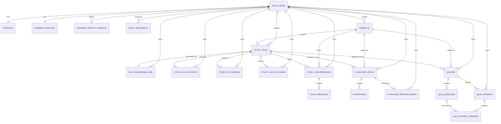
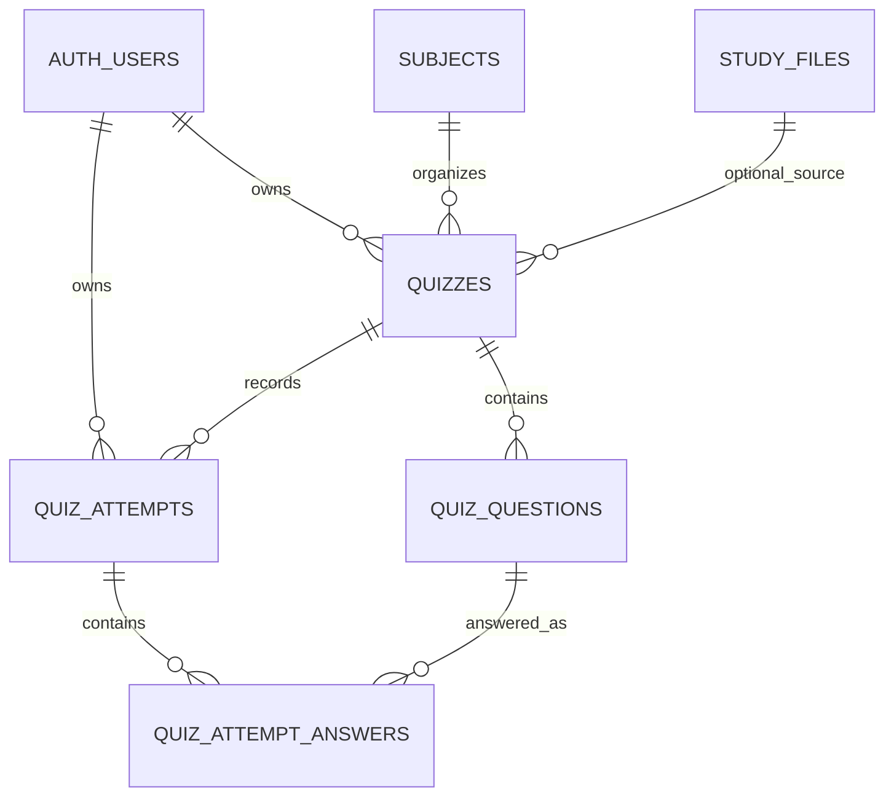

<!-- File: /docs/database.md -->
<!-- Purpose: Documents implemented Supabase tables, relationships, Storage, RLS, vector storage, conversations, and database functions. -->

**# Database Documentation**

STUDY AI uses hosted Supabase PostgreSQL.

Supabase provides:

- Authentication
- PostgreSQL
- Row Level Security
- Private Storage
- Trusted database functions
- pgvector
- Generated TypeScript database definitions

---

**# Database Status**

| Area | Status |
|---|---|
| Authentication | Implemented |
| Profiles | Implemented |
| Learning profile | Implemented |
| Subjects | Implemented |
| Study files | Implemented |
| Processing queue | Implemented |
| Extracted content | Implemented |
| Source-aware chunks | Implemented |
| AI-vector chunks | Implemented |
| Semantic retrieval | Implemented |
| Saved conversations | Implemented |
| Conversation messages | Implemented |
| Conversation summary state | Implemented |
| Reviewer table | Implemented |
| Flashcard decks and cards | Implemented |
| Flashcard review events | Ready in Track E; shared remote application pending |
| Quiz tables and attempt history | Implemented |
| Academic tasks | Implemented |
| Study plans | Implemented |
| Study sessions | Implemented |
---

**# Authentication**

Supabase stores student identities in:

```text
auth.users
```

The application does not maintain its own password table.

---

**# Generated Types**

Generated frontend definitions:

```text
frontend/types/database.ts
```

Generate after schema changes:

```bash
npx supabase gen types typescript \\
  --linked \\
  --schema public \\
  > frontend/types/database.ts
```

Do not manually edit the generated file.

---

**# Core Student Tables**

**##** `public.profiles`

Stores:

- Student name
- Onboarding status
- Current onboarding step
- Completion timestamps

Primary ownership relationship:

```text
profiles.id = auth.users.id
```

---

**##** `public.learning_profiles`

Stores:

- Preferred study duration
- Preferred study times
- Study challenges
- Estimated task-completion time
- Preferred learning methods

Ownership:

```text
learning_profiles.user_id = auth.uid()
```

---

**##** `public.learning_profile_subjects`

Stores:

- Subject name
- Strength type
- Confidence level

These records are onboarding profile information and are separate from academic workspace subjects.

---

**##** `public.study_availability`

Stores recurring weekly study periods.

Important validation:

- ISO weekday 1–7
- Start before end
- Overlap prevention

---

**# Subject and File Tables**

**##** `public.subjects`

Stores academic subject workspaces.

Important fields:

```text
id
user_id
name
color
created_at
updated_at
```

---

**##** `public.study_files`

Stores metadata for uploaded materials.

Important fields:

```text
id
user_id
subject_id
topic
original_filename
storage_path
mime_type
size_bytes
processing_status
failure_code
failure_message
processed_at
created_at
updated_at
```

Processing states:

```text
uploading
queued
reading
indexing
ready
failed
```

---

**##** `public.file_processing_jobs`

Stores background processing state.

Important fields:

```text
id
user_id
study_file_id
status
attempt_count
started_at
completed_at
error_code
error_message
created_at
updated_at
```

Job states:

```text
queued
processing
completed
failed
```

---

**##** `public.study_file_contents`

Stores complete extracted text and file-specific extraction metadata.

Important fields:

```text
id
user_id
study_file_id
extracted_text
character_count
page_count
slide_count
sheet_count
extraction_metadata
created_at
updated_at
```

---

**##** `public.study_file_chunks`

Stores source-aware extracted chunks.

Important fields:

```text
id
user_id
study_file_id
chunk_index
content
locator_type
locator_label
token_count
metadata
created_at
updated_at
```

Locator examples:

```text
page
slide
sheet
document
```

---

**# AI Vector Storage**

**##** `public.study_file_ai_chunks`

Stores deterministic AI-oriented chunks and embeddings used for semantic retrieval.

Important fields include:

| Field | Purpose |
|---|---|
| `id` | Vector-row identifier |
| `user_id` | Owner |
| `study_file_id` | Source file |
| `chunk_index` | AI chunk order |
| `content` | Normalized chunk text |
| `start_offset` | Start character offset |
| `end_offset` | End character offset |
| `source_name` | Safe source filename |
| `embedding_model` | Embedding model |
| `embedding_dimensions` | Vector dimensions |
| `embedding_task_type` | Document embedding task type |
| `embedding` | `vector(768)` |
| `chunk_metadata` | Safe metadata |
| `created_at` | Creation timestamp |
| `updated_at` | Update timestamp |

Vector characteristics:

```text
Dimensions: 768
Distance: cosine
Index: HNSW
```

Students may read only owned rows.

Vector writes are performed through trusted backend operations.

---

**# Saved Study Assistant Conversations**

**##** `public.study_conversations`

Stores one owned Study Assistant conversation.

| Column | Purpose |
|---|---|
| `id` | Conversation UUID |
| `user_id` | Owner |
| `title` | Conversation title |
| `subject_id` | Optional subject filter |
| `study_file_id` | Optional study-file filter |
| `summary_text` | Backend-managed summary |
| `summarized_message_count` | Messages represented by summary |
| `summary_updated_at` | Summary refresh timestamp |
| `summary_version` | Summary format version |
| `created_at` | Created timestamp |
| `updated_at` | Updated timestamp |
| `last_message_at` | Latest message timestamp |

Validation includes:

- Title length 1–120 trimmed characters
- Summary maximum 4,000 characters
- Non-negative summarized count
- Valid summary-state combinations
- Owned subject filters
- Owned study-file filters

---

**##** `public.study_messages`

Stores chronological messages.

| Column | Purpose |
|---|---|
| `id` | Message UUID |
| `conversation_id` | Parent conversation |
| `role` | `user` or `assistant` |
| `content` | Message text |
| `outcome` | `answered`, `no_context`, or null |
| `sources` | Safe citation metadata |
| `created_at` | Message timestamp |

User message rule:

```text
role = user
outcome = null
sources = []
```

Assistant message rule:

```text
role = assistant
outcome = answered or no_context
```

---

**# Conversation Summary State**

Internal fields:

```text
summary_text
summarized_message_count
summary_updated_at
summary_version
```

Rules:

```text
Maximum summary: 4,000 characters
Memory limit: 8,000 characters
Memory item limit: 10
Recent messages with summary: 9
Recent messages without summary: 10
Summary version: 1
```

Authenticated browser clients cannot directly update summary state.

Summary updates are backend-managed.

---

**# Relationships**



---

**# Private Storage**

Bucket:

```text
study-materials
```

The bucket is private.

Recommended object path:

```text
USER_ID/SUBJECT_ID/FILE_ID/SAFE_FILENAME
```

Students may access only objects belonging to their own authenticated folder.

---

**# Row Level Security**

RLS protects student-owned data.

Typical ownership rule:

```text
user_id = auth.uid()
```

Students must not be able to read or modify:

- Another student's profile
- Another student's learning profile
- Another student's subjects
- Another student's study files
- Another student's extracted content
- Another student's source chunks
- Another student's vector chunks
- Another student's saved conversations
- Another student's messages
- Another student's Flashcard decks, cards, or review events
- Another student's Quizzes, attempts, or submitted-answer history
- Another student's private Storage objects

---

**# Trusted Processing Functions**

Implemented database functions include:

```text
queue_study_file_processing
claim_next_file_processing_job
start_study_file_processing
mark_study_file_indexing
complete_study_file_processing
fail_study_file_processing
recover_stale_file_processing_jobs
replace_study_file_ai_chunks
complete_learning_profile_onboarding
create_flashcard_deck_with_cards
create_quiz_with_questions
start_quiz_attempt
submit_quiz_attempt_answer
```

Applied database functions are application contracts.

Changes require a new migration.

---

**# Saved Reviewers**

`public.reviewers` stores generated study reviewers owned by authenticated students.

Important columns:

| Column | Purpose |
|---|---|
| `id` | Reviewer UUID |
| `user_id` | Authenticated owner |
| `subject_id` | Subject used for generation |
| `study_file_id` | Optional file when using file scope |
| `scope_type` | `subject` or `file` |
| `title` | Saved reviewer title |
| `reviewer_length` | `short`, `medium`, or `long` |
| `content` | Structured reviewer JSON |
| `sources` | Source-file and chunk metadata |
| `generation_model` | AI model used |
| `generation_count` | Number of generations for the saved reviewer |
| `generated_at` | Latest generation timestamp |
| `created_at` | Creation timestamp |
| `updated_at` | Latest record update |

Reviewer `content` is stored as a JSON object containing:

```text
overview
topics
  title
  summary
  key_points
  definitions
```
---

**# Saved Flashcards**

Flashcard study persistence uses the existing generated-deck/card tables plus durable Track E review evidence:

```text
public.flashcard_decks
public.flashcards
public.flashcard_review_events
```

**##** `public.flashcard_decks`

Stores one generated Flashcard deck owned by an authenticated student.

Important columns:

| Column | Purpose |
|---|---|
| `id` | Flashcard deck UUID |
| `user_id` | Authenticated owner |
| `subject_id` | Subject used for generation |
| `study_file_id` | Optional source file for file scope |
| `scope_type` | `subject` or `file` |
| `title` | Saved deck title |
| `requested_card_count` | Number of cards requested |
| `sources` | Safe source-file and chunk metadata |
| `generation_model` | AI model used |
| `generation_count` | Generation count for the deck |
| `generated_at` | Generation timestamp |
| `created_at` | Creation timestamp |
| `updated_at` | Latest deck update |

The database constrains Flashcard requests to the supported public card-count range.

Subject/file scope is validated so the selected source remains connected to the authenticated owner.

**##** `public.flashcards`

Stores individual ordered question-and-answer cards.

Important columns:

| Column | Purpose |
|---|---|
| `id` | Flashcard UUID |
| `deck_id` | Parent Flashcard deck |
| `position` | Stable zero-based order within the deck |
| `question` | Flashcard question |
| `answer` | Flashcard answer |
| `created_at` | Creation timestamp |

The relationship is:

```text
flashcard_decks
    1
    |
    | contains
    |
    N
flashcards
```

Deleting a Flashcard deck cascades to its child Flashcards.

**##** `public.flashcard_review_events`

Stores durable student self-assessment evidence created while studying saved Flashcards.

Important columns:

| Column | Purpose |
|---|---|
| `id` | Review-event UUID |
| `user_id` | Authenticated student owner |
| `deck_id` | Reviewed Flashcard deck |
| `card_position` | Stable zero-based card position within the deck |
| `outcome` | `known` or `review_again` |
| `reviewed_at` | Time the student submitted the self-assessment |
| `created_at` | Row creation timestamp |

A review event is valid only for a deck owned by the authenticated student and a card position that exists in that deck.

Conceptually, validation preserves:

```text
flashcard_decks.id = deck_id
flashcard_decks.user_id = user_id
flashcards.deck_id = deck_id
flashcards.position = card_position
```

Supported outcomes:

```text
known
review_again
```

Deleting the parent Flashcard deck cascades to its review events.

The migration that creates this table is present on the Track E branch but remains intentionally unapplied to the shared remote database until linked migration history is re-inspected after synchronizing Track C and Track D into the Analytics branch.

**## Flashcard Security**

The Flashcard deck/card resources and Flashcard review events use Row Level Security and authenticated ownership boundaries.

Authenticated browser clients may:

```text
read owned Flashcard data
delete owned Flashcard decks
```

Browser clients may not directly insert generated Flashcard records.

Authenticated browser clients may read only their own Flashcard review events.

Browser clients cannot directly insert Flashcard review events.

Review-event writes pass through the protected FastAPI backend using the trusted server-side Supabase client.

Card reads are authorized through ownership of the parent Flashcard deck.

Trusted creation is performed through:

```text
create_flashcard_deck_with_cards(...)
```

The function is `SECURITY DEFINER` and is restricted to the backend `service_role`.

The RPC creates the parent deck and all ordered child cards atomically so a partially created deck cannot remain after a failed operation.
---

**# Saved Quizzes**

Track B adds four Quiz resources.

**##** `public.quizzes`

Stores student-safe Quiz metadata.

Important columns:

| Column | Purpose |
|---|---|
| `id` | Quiz UUID |
| `user_id` | Authenticated owner |
| `subject_id` | Subject used for generation |
| `study_file_id` | Optional source file for file scope |
| `scope_type` | `subject` or `file` |
| `title` | Generated Quiz title |
| `quiz_type` | `multiple_choice`, `true_false`, `identification`, or `mixed` |
| `difficulty` | `easy`, `medium`, or `hard` |
| `question_count` | Number of questions |
| `generation_model` | Generation model identity |
| `generation_count` | Generation count |
| `generated_at` | Generation timestamp |
| `created_at` | Creation timestamp |
| `updated_at` | Update timestamp |

Authenticated browser clients may read/delete only owned Quiz metadata according to the configured policies. Quiz creation is performed through the trusted backend RPC.

**##** `public.quiz_questions`

Stores generated Quiz questions and the private answer key.

Important data includes:

```text
id
quiz_id
position
question_type
topic
question
choices
correct_answer
accepted_answers
explanation
```

The student-safe Quiz API returns only:

```text
id
position
question_type
topic
question
choices
```

Private fields:

```text
correct_answer
accepted_answers
explanation
```

are not exposed through normal Quiz reads.

Direct browser access to private Quiz-question answer-key data is restricted. Trusted backend operations use the service role for persistence and grading.

**##** `public.quiz_attempts`

Stores one student's Quiz-taking state.

Important columns:

```text
id
user_id
quiz_id
status
current_position
correct_count
question_count
score_percentage
started_at
completed_at
created_at
updated_at
```

Attempt states:

```text
in_progress
completed
```

Authenticated browser clients may read owned attempt state, while trusted backend operations perform attempt writes.

**##** `public.quiz_attempt_answers`

Stores the safe submitted-answer history for an attempt.

Important columns:

```text
id
attempt_id
quiz_question_id
position
topic
question_type
submitted_answer
is_correct
answered_at
created_at
```

This table stores submitted history and correctness but does not duplicate the private correct answer or explanation.

**## Quiz Relationships**



Deleting a Quiz cascades to its generated questions and related attempt history through the configured foreign-key relationships.

**## Quiz Trusted RPCs**

```text
create_quiz_with_questions
start_quiz_attempt
submit_quiz_attempt_answer
```

`create_quiz_with_questions` atomically persists the Quiz and its generated private questions.

`start_quiz_attempt` creates one fresh attempt for an owned Quiz.

`submit_quiz_attempt_answer` atomically validates the current expected question, loads the private answer key, grades the submitted answer, stores safe answer history, and updates the attempt state.

These RPC operations are trusted backend contracts rather than direct browser-write operations.

**## Quiz RLS and Security**

Quiz security separates student-safe metadata from private grading data.

Key boundaries:

- Students may access only their own Quiz resources.
- Normal Quiz responses do not expose the answer key.
- Browser clients do not directly write attempts or grading state.
- The trusted backend loads private answer-key data for grading.
- Completed-attempt review requires an owned completed attempt.
- An in-progress attempt cannot request the full completed review.
- Deleting one owned Quiz removes its related Quiz data without affecting another student's resources.


**# Study Plans and Study Sessions**

**##** `public.study_plans`

`public.study_plans` stores student-owned manual and generated study plans.

Important columns:

| Column | Purpose |
|---|---|
| `id` | Study-plan UUID |
| `user_id` | Authenticated owner |
| `title` | Plan title |
| `starts_on` | First plan date |
| `ends_on` | Last plan date |
| `status` | Plan lifecycle status |
| `generation_mode` | `manual` or `generated` |
| `generated_at` | Latest generation or regeneration timestamp |
| `created_at` | Creation timestamp |
| `updated_at` | Latest record update |

Supported plan statuses:

```text
draft
active
completed
archived
```

**##** `public.study_sessions`

`public.study_sessions` stores calendar sessions belonging to owned study plans.

Important columns:

| Column | Purpose |
|---|---|
| `id` | Study-session UUID |
| `study_plan_id` | Parent study plan |
| `user_id` | Authenticated owner |
| `subject_id` | Connected owned subject |
| `title` | Session title |
| `starts_at` | Session start timestamp |
| `ends_at` | Session end timestamp |
| `status` | Session lifecycle status |
| `origin` | `manual` or `generated` |
| `notes` | Optional student notes |
| `created_at` | Creation timestamp |
| `updated_at` | Latest record update |

Session statuses:

```text
planned
completed
skipped
```

Session origins:

```text
manual
generated
```

Plan and session ownership is enforced through database relationships and Row Level Security.

**## Generated Session Replacement RPC**

Track D adds:

```text
replace_generated_study_plan_sessions
```

During regeneration, this trusted RPC:

1. Locks the owned generated plan.
2. Validates the replacement schedule.
3. Prevents generated sessions from overlapping manual sessions.
4. Deletes only existing generated sessions.
5. Inserts replacement generated sessions.
6. Preserves manual sessions.
7. Updates the plan generation timestamp.
8. Returns the refreshed plan and complete session list.

Execution is restricted to the trusted `service_role`.

---
**# File Deletion Behavior**

Deleting a study file must remove or invalidate:

- Private Storage object
- Study-file metadata
- Processing job
- Extracted content
- Source-aware chunks
- AI-vector chunks

Foreign-key cascades should be used where configured.

---

**# Conversation Deletion**

Deleting a conversation removes its connected messages through cascade behavior.

---

**# Phase 5G Migrations**

| Migration | Purpose |
|---|---|
| `20260806192800_create_study_conversations_and_messages.sql` | Conversations, messages, ownership, indexes, RLS |
| `20260806200500_fix_study_message_outcome_constraint.sql` | Correct assistant outcome rules |
| `20260806223000_add_study_conversation_summary_state.sql` | Add bounded summary state |
| `20260806234000_restrict_study_conversation_summary_updates.sql` | Restrict client summary updates |

---

**# Phase 6A Migration**

| Migration | Purpose |
|---|---|
| `20260807230500_create_reviewers.sql` | Retained no-op migration entry matching remote migration history |
| `20260808053929_create_reviewers_foundation.sql` | Creates reviewer table, ownership/scope validation, indexes, timestamps, triggers, privileges, and RLS |

---
**# Track D Study Plan Migrations**

| Migration | Purpose |
|---|---|
| `20260810002500_create_study_plans_foundation.sql` | Creates owned `study_plans` and `study_sessions`, validation, relationships, indexes, timestamps, privileges, and RLS |
| `20260811002500_add_study_plan_regeneration_rpc.sql` | Adds transactional generated-session replacement and increases the session-title limit to 200 characters |

These Track D migration files have been applied to the shared linked database during coordinated integration.

---

**# Remaining Planned Tables**

No additional Track A, Track B, Phase 7, or Track D tables remain planned in this section. Future phases may introduce additional persistence when required.

Saved AI conversations are already implemented using:

```text
study_conversations
study_messages
```

Vector storage is already implemented using:

```text
study_file_ai_chunks
```

Flashcard persistence and Track E self-assessment evidence use:

```text
flashcard_decks
flashcards
flashcard_review_events
```

The `flashcard_review_events` migration is ready on Track E but remains unapplied to the shared remote database pending team migration coordination.

Quiz persistence and attempt history are already implemented using:

```text
quizzes
quiz_questions
quiz_attempts
quiz_attempt_answers
```

---

**# Track A Flashcard Migrations**

| Migration | Purpose |
|---|---|
| `20260809142000_create_flashcard_foundation.sql` | Creates `flashcard_decks`, `flashcards`, ownership/scope validation, constraints, indexes, triggers, privileges, and RLS |
| `20260809145600_create_flashcard_persistence_rpc.sql` | Adds atomic trusted Flashcard deck-and-card creation |

---

**# Track E Flashcard Review Migration**

| Migration | Purpose |
|---|---|
| `20260811162000_create_flashcard_review_events.sql` | Creates durable owner-scoped Flashcard self-assessment review events, validation, indexes, privileges, and RLS for Analytics |

This migration is owned by Track E because the persisted review evidence provides the canonical Flashcard-performance source used by Analytics.

The migration file is ready and tested locally. Shared remote application remains intentionally pending until linked migration history is re-inspected after synchronizing Track C and Track D into the Analytics branch.

---

**# Track B Quiz Migrations**

| Migration | Purpose |
|---|---|
| `20260809204500_create_quizzes_foundation.sql` | Creates owned Quiz metadata and private generated Quiz questions |
| `20260809211600_create_quiz_persistence_rpc.sql` | Adds atomic Quiz/question persistence RPC |
| `20260809223500_create_quiz_attempt_foundation.sql` | Creates Quiz attempts and submitted-answer history |
| `20260809225500_create_quiz_attempt_rpcs.sql` | Adds atomic attempt-start and answer-submission/grading RPCs |

The later saved-history and completed-attempt review feature reuses these tables and requires no additional migration.


**# Migration Workflow**

Create:

```bash
npx supabase migration new descriptive_name
```

Validate:

```bash
git diff --check

npx supabase db push \\
  --linked \\
  --dry-run
```

Apply:

```bash
npx supabase db push --linked
```

Verify:

```bash
npx supabase migration list --linked

npx supabase db push \\
  --linked \\
  --dry-run
```

Generate frontend types:

```bash
npx supabase gen types typescript \\
  --linked \\
  --schema public \\
  > frontend/types/database.ts
```

Previously applied migrations must never be edited.

---

**# Database Change Rules**

1. Create a new migration.
2. Never edit an applied migration.
3. Dry-run before applying.
4. Verify migration history.
5. Regenerate database types.
6. Run backend tests.
7. Run frontend tests.
8. Test RLS.
9. Update database documentation.
10. Update API contracts when an RPC changes.
11. Never document real credentials.