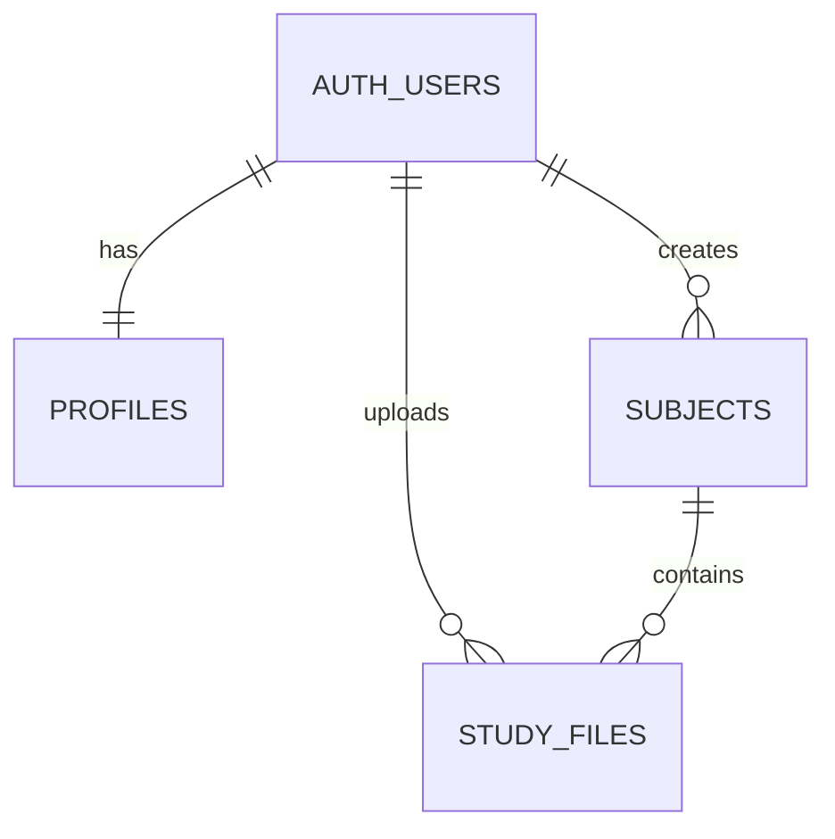

<!-- File: /docs/database.md -->
<!-- Purpose: Documents Supabase tables, relationships, storage, and security rules. -->

# Database Documentation

The STS Capstone Project uses Supabase PostgreSQL for application data.

Supabase also provides:

- Student authentication
- Private file storage
- Row Level Security
- Database triggers
- Application data relationships

# Profiles Database Foundation

The first application-owned table is:

```text
public.profiles
```

# Generated Database Types

The frontend database definitions are generated from the linked hosted Supabase schema.

```text
frontend/types/database.ts


## Database Ownership

| Area | Owner |
|---|---|
| Database structure | Member 4 |
| Row Level Security | Member 4 |
| Backend database access | Member 3 |
| Frontend authentication access | Member 1 |
| Database testing | Member 5 |

## Authentication Table

Supabase stores account credentials inside:

```text
auth.users
```

The application must not create its own password table.

## Initial Application Tables

### `profiles`

Stores application information for each authenticated student.

| Column | Type | Description |
|---|---|---|
| `id` | UUID | Matches the student's `auth.users.id` |
| `full_name` | Text | Student's display name |
| `onboarding_completed` | Boolean | Indicates whether onboarding is finished |
| `created_at` | Timestamp | Date the profile was created |
| `updated_at` | Timestamp | Date the profile was last changed |

Relationship:

```text
auth.users
    │
    │ one-to-one
    ▼
public.profiles
```

### `subjects`

Stores subjects created by a student.

| Column | Type | Description |
|---|---|---|
| `id` | UUID | Unique subject identifier |
| `student_id` | UUID | Owner of the subject |
| `name` | Text | Subject name |
| `color` | Text | Subject display color |
| `created_at` | Timestamp | Date created |
| `updated_at` | Timestamp | Date last changed |

Relationship:

```text
auth.users
    │
    │ one-to-many
    ▼
public.subjects
```

### `study_files`

Stores metadata about uploaded study materials.

The actual file is stored in Supabase Storage. This table stores information about the file.

| Column | Type | Description |
|---|---|---|
| `id` | UUID | Unique file record |
| `student_id` | UUID | Owner of the file |
| `subject_id` | UUID | Subject connected to the file |
| `original_filename` | Text | Name shown to the student |
| `storage_path` | Text | Private storage location |
| `file_type` | Text | PDF, text, or image |
| `processing_status` | Text | Current processing state |
| `created_at` | Timestamp | Date uploaded |
| `updated_at` | Timestamp | Date last changed |

Allowed processing states:

```text
uploading
extracting
indexing
ready
failed
```

Student-facing equivalents may be:

| Database Value | Student-Facing Text |
|---|---|
| `uploading` | Uploading |
| `extracting` | Reading your file |
| `indexing` | Creating study index |
| `ready` | Ready |
| `failed` | Needs attention |

## Initial Relationships



## Row Level Security

Every student-owned table must have Row Level Security enabled.

The basic ownership rule is:

```text
student_id = authenticated user ID
```

A student must not be able to:

- Read another student's profile.
- Read another student's subjects.
- Read another student's uploaded files.
- Update another student's data.
- Delete another student's data.

## Storage

The initial private storage bucket will be:

```text
study-materials
```

Recommended file path format:

```text
STUDENT_USER_ID/SUBJECT_ID/UNIQUE_FILENAME
```

Example:

```text
24fd.../biology/plate-tectonics.pdf
```

The first folder should contain the authenticated user's ID. Storage policies will use it to isolate student files.

## Planned Future Tables

| Table | Purpose |
|---|---|
| `learning_profiles` | Stores onboarding and study preferences |
| `academic_tasks` | Stores deadlines and academic work |
| `study_plans` | Stores generated plans |
| `study_sessions` | Stores individual study blocks |
| `reviewers` | Stores generated reviewer records |
| `quizzes` | Stores generated quizzes |
| `quiz_questions` | Stores individual questions |
| `quiz_attempts` | Stores scores and completion records |
| `chat_conversations` | Stores AI conversations |
| `chat_messages` | Stores user and AI messages |

These tables are planned and must not be treated as implemented until their migration files exist.


## Database Change Rules

When changing the database:

1. Create a new numbered migration file.
2. Do not silently edit an already-deployed migration.
3. Update this document.
4. Update `/docs/PROJECT_FILE_MAP.md`.
5. Update `/docs/ARCHITECTURE.md` when relationships change.
6. Test Row Level Security with at least two student accounts.