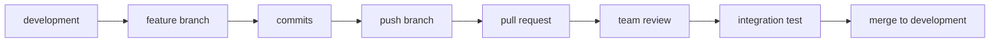

<!-- File: /docs/git-workflow.md -->
<!-- Purpose: Defines the branch, commit, pull-request, and review process. -->

# Git Workflow

This document explains how the team should manage code changes without overwriting each other's work.

## Permanent Branches

### `main`

Contains the stable and tested version of the application.

Rules:

- Do not develop directly on `main`.
- Do not push unfinished work to `main`.
- Merge into `main` only after integration testing.

### `development`

Contains features that have passed individual review and are ready for combined testing.

Rules:

- Feature branches should normally begin from `development`.
- Pull requests should normally target `development`.
- Do not use `development` for unfinished personal work.

## Temporary Branches

Use branches based on the type of work.

### Setup

```text
setup/phase-1-foundation
```

### Features

```text
feature/authentication
feature/file-upload
feature/ai-chat
feature/quiz-generation
feature/task-prioritization
```

### Fixes

```text
fix/login-error-message
fix/file-upload-status
```

### Documentation

```text
docs/complete-foundation-docs
docs/update-api-contracts
```

## Starting New Work

First, return to `development`:

```powershell
git switch development
```

Download the latest team changes:

```powershell
git pull origin development
```

Create a new branch:

```powershell
git switch -c feature/example-feature
```

## Saving Work

Check changed files:

```powershell
git status
```

Stage the changes:

```powershell
git add .
```

Review the staged files:

```powershell
git status
```

Commit:

```powershell
git commit -m "feat: describe the completed feature"
```

Push the branch:

```powershell
git push -u origin feature/example-feature
```

## Commit Message Types

| Type | Purpose |
|---|---|
| `feat` | New feature |
| `fix` | Bug fix |
| `docs` | Documentation only |
| `style` | Visual or formatting changes |
| `refactor` | Code restructuring without changing behavior |
| `test` | Tests |
| `chore` | Setup, configuration, or maintenance |

Examples:

```text
chore: configure Mantine provider
feat: add student registration form
fix: preserve session after refresh
docs: add database relationship guide
test: add backend health endpoint test
```

## Pull Request Process



## Shared Files

The team must coordinate before changing:

- `/.gitignore`
- `/frontend/package.json`
- `/frontend/package-lock.json`
- `/frontend/app/layout.tsx`
- `/frontend/theme/theme.ts`
- `/backend/app/main.py`
- `/backend/app/core/config.py`
- `/backend/requirements.txt`
- `/supabase/migrations/`
- `/docs/PROJECT_FILE_MAP.md`
- `/docs/ARCHITECTURE.md`

## Before Every Commit

Check that none of these are staged:

```text
.env
.env.local
node_modules/
.venv/
.next/
__pycache__/
API keys
passwords
private credentials
```

## Finishing a Branch

After a branch is merged:

```powershell
git switch development
git pull origin development
git branch -d branch-name
```

Deleting the local branch does not delete the completed work from Git history.